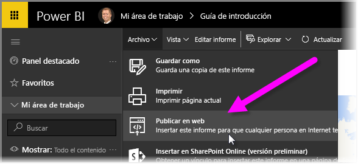
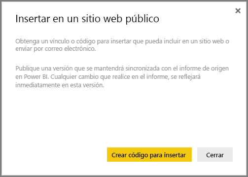
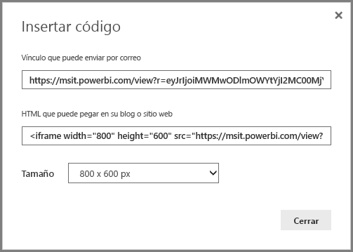
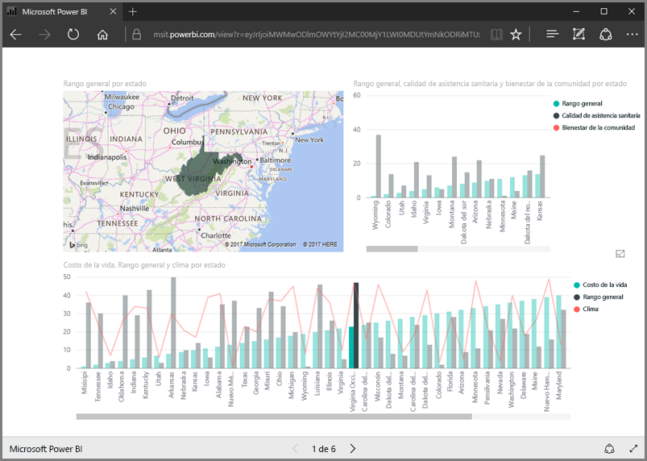
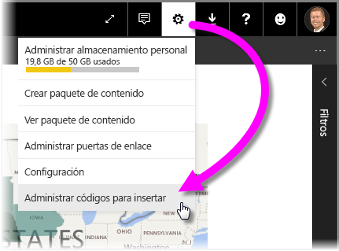
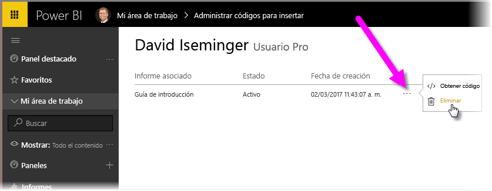

En esta lección, aprenderemos a compartir un informe de Power BI en una página web , o a compartirlo por correo electrónico, en tan solo unos pasos sencillos. Esta característica de Power BI a menudo se conoce como **Publicar en la web** y resulta fácil de usar y administrar.

En Power BI, seleccione el informe que desea compartir para que aparezca en el lienzo. A continuación, en el menú, seleccione **Archivo > Publicar en la web**.

Desde allí, verá un cuadro de diálogo que explica cómo obtener un *código para insertar* que permite incluir el informe en un sitio web o en un correo electrónico.

Cuando se selecciona **Crear código para insertar**, Power BI presenta otro cuadro de diálogo que le indica de nuevo que va a compartir los datos con todos los usuarios de Internet. Asegúrese de que eso está bien.

Power BI presenta un cuadro de diálogo con dos vínculos:

* Un vínculo que se puede compartir por correo electrónico que muestra el informe como una página web
* Un código HTML (un signo más con un vínculo dentro de un IFrame) para que pueda insertar el informe directamente en una página web

En el caso del vínculo HTML, puede elegir alguno de los tamaños predefinidos para el informe que se va a insertar, o puede modificar el código de IFrame usted mismo y personalizar su tamaño.

Solo tiene que pegar el vínculo del correo electrónico en un explorador y consultar el informe como un sitio web. Puede interactuar con esa página web tal y como lo haría si estuviera viendo el informe en Power BI. Las siguientes imágenes muestran una página **Publicar en la web**, después de que el vínculo se copió directamente de ese cuadro de diálogo en un explorador:

Puede insertar ese vínculo de IFrame en una entrada de blog o sitio web o también en Sway.

¿Desea eliminar un código para insertar que ha creado? No hay problema. En Power BI, seleccione el icono de **engranaje** en la esquina superior derecha y, a continuación, seleccione **Administrar códigos para insertar**.

El área de trabajo de Power BI muestra los códigos para insertar que ha creado (en la imagen siguiente, hay solo uno). Al hacer clic en el botón de puntos suspensivos, puede seleccionar para obtener el código para insertar o eliminar el código por completo.

Y eso es todo lo que hay que hacer para publicar el informe de Power BI en la web y compartirlo con los demás. Es muy sencillo.

