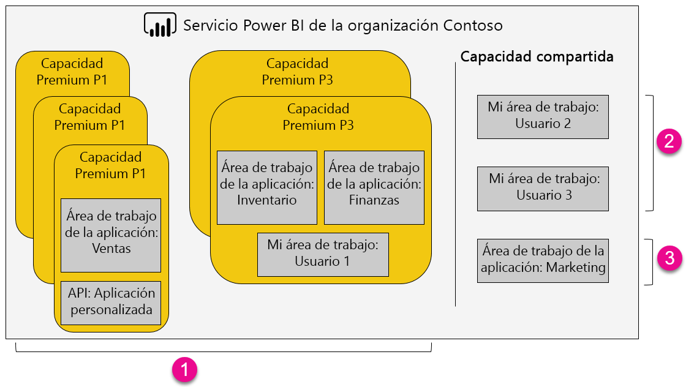

1. Elementos dentro de una capacidad Premium
   
   * El acceso a áreas de trabajo de aplicaciones (como miembros o administradores) y la publicación de aplicaciones requieren una licencia de Power BI Pro.
   * Los lectores de aplicación pueden ser usuarios de Power BI Pro o usuarios con acceso gratuito.
   * El uso compartido requiere una licencia de Power BI Pro pero los destinatarios pueden ser usuarios de Power BI Pro o usuarios con acceso gratuito.
   * Tanto si tiene una licencia de Power BI Pro como si tiene una gratis, los destinatarios del panel pueden establecer alertas de datos.
   * Las API de REST para inserción utilizan una cuenta de servicio, con una licencia de Power BI Pro, en lugar de un usuario.
2. Mi área de trabajo en capacidad compartida
   
   * El uso compartido requiere una licencia Pro. Los destinatarios también necesitan licencias de Pro.
3. Áreas de trabajo de aplicación en capacidad compartida
   
   * Cualquier uso de aplicaciones requiere licencias de Pro.

