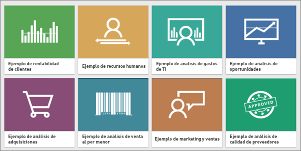
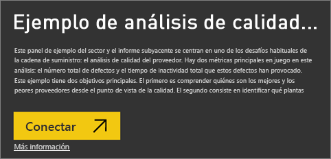
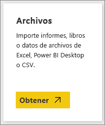
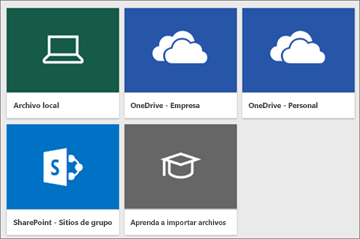
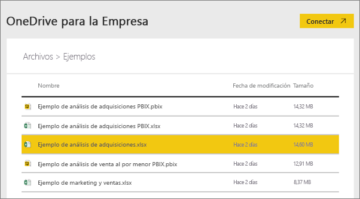
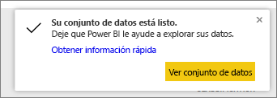

# ¿Qué datos de ejemplo están disponibles para usarse con Power BI?
Supongamos que nunca antes ha utilizado Power BI y quiere probarlo, pero no tiene datos con los que trabajar.  O supongamos que sí tiene un conjunto de datos; pero, como no entiende el funcionamiento de Power BI (todavía), le preocupa dañarlo de algún modo.

No se deje llevar por el pánico. obviEnce ([www.obvience.com](http://www.obvience.com/)) y Microsoft han creado una serie de ejemplos que puede utilizar hasta que adquiera más confianza con Power BI.  Los datos son anónimos e ilustran diferentes sectores: finanzas, recursos humanos, ventas, etc. A medida que vaya consultando la información en línea, encontrará tutoriales y ejemplos en los que se utilizan estos mismos datos, lo que le permitirá entenderlos fácilmente.      

   

Cada uno de los ejemplos está disponible en diferentes formatos: paquete de contenido, libro de Excel y archivo .pbix. Si no sabe qué es todo esto ni cómo se utiliza, no se preocupe: se lo explicaremos más adelante en este artículo. Además, hemos creado un *recorrido* específico para cada ejemplo. Un recorrido es un tipo de artículo en el que se detalla el trasfondo del ejemplo y que contiene instrucciones paso a paso para diferentes escenarios. En estos escenarios, por ejemplo, es posible que tenga que responder las preguntas de su jefe, buscar conocimientos que le hagan más competitivo o crear informes y paneles para compartirlos o explicar un cambio del negocio.   

Antes de comenzar, le rogamos que lea estas directrices legales sobre el uso de los ejemplos. Cuando haya terminado, le presentaremos los ejemplos y le enseñaremos a usarlos.   

## Instrucciones de uso para los libros de Excel de ejemplo de Power BI
Lea esta información antes de usar los ejemplos de Power BI.

© 2015 Microsoft Corporation. Todos los derechos reservados. Los documentos y libros se proporcionan "tal cual". La información y las opiniones expresadas en los libros, incluidas direcciones URL y otras referencias a sitios web de Internet, pueden cambiar sin previo aviso. El usuario asume el riesgo de su uso. Algunos ejemplos son ficticios y únicamente tienen fines ilustrativos. No se pretende establecer ni inferir ninguna asociación real. Microsoft no otorga ninguna garantía, explícita o implícita, con respecto a la información proporcionada aquí.

Los libros no proporcionan ningún derecho legal sobre la propiedad intelectual de ningún producto de Microsoft. Puede copiar y usar este libro para fines de consulta interna.

Los libros y datos relacionados son proporcionados por obviEnce. [www.obvience.com](http://www.obvience.com)

obviEnce es un ISV y una incubadora de propiedad intelectual (PI) centrada en la inteligencia empresarial de Microsoft. obviEnce trabaja en estrecha colaboración con Microsoft para desarrollar prácticas recomendadas y liderazgo intelectual para impulsar e implementar soluciones de inteligencia empresarial de Microsoft.

Los libros y datos son propiedad de obviEnce, LLC y se comparten únicamente con el propósito de demostrar la funcionalidad de Power BI con datos de ejemplo de la industria.

Todos los usos de los libros y datos deben incluir la atribución anterior (que se encuentra también en la hoja de cálculo de información incluida con cada libro). El libro y las visualizaciones se deben ir acompañados del siguiente aviso de copyright: obviEnce ©.

Si hace clic en cualquiera de los siguientes vínculos para descargar los archivos de los libros de Excel o los archivos .pbix, estará aceptando las condiciones anteriores.

## Ejemplos disponibles
Hay ocho ejemplos que puede utilizar.  Cada uno de ellos ilustra un sector diferente.

### Ejemplo de rentabilidad del cliente 
[Realice un recorrido por el ejemplo de rentabilidad del cliente](sample-customer-profitability.md)

En este ejemplo sectorial, se analizan las principales métricas que un director financiero usa con sus ejecutivos, productos y clientes. Puede investigar qué factores afectan a la rentabilidad de la empresa.

### Ejemplo de recursos humanos 
[Realice un recorrido por el ejemplo de recursos humanos](sample-human-resources.md)

En este ejemplo sectorial, se analiza la estrategia de contratación de una empresa a través de las nuevas contrataciones, los empleados activos y los empleados que se han marchado.  Al explorar los datos, puede encontrar tendencias de separaciones voluntarias e inclinaciones en la estrategia de contratación.

### Ejemplo de análisis de gastos de TI 
[Realice un recorrido por el ejemplo de análisis de gastos de TI](sample-it-spend.md)

En este ejemplo sectorial, se analizan los costos planeados frente a los costos reales del departamento de TI de una empresa. Esta comparación nos ayuda a comprender la calidad del planeamiento anual y de la investigación de las áreas con enormes desviaciones del planeamiento que ha realizado la empresa. La empresa de este ejemplo pasa por un ciclo de planeamiento anual y produce trimestralmente un nuevo último cálculo que ayude a analizar los cambios en gasto en TI durante el año fiscal.

### Ejemplo de análisis de oportunidades 
[Realice un recorrido por el ejemplo de análisis de oportunidades](sample-opportunity-analysis.md)

En este ejemplo sectorial, se analiza el canal de ventas de una empresa de software. Los directores de ventas supervisan sus canales de ventas directas y de los socios mediante el seguimiento de las oportunidades y los ingresos por región, magnitud de la negociación y canal.

### Ejemplo de análisis de adquisiciones 
[Realice un recorrido por el ejemplo de análisis de adquisiciones ](sample-procurement.md)

En este ejemplo sectorial, se analizan las principales métricas que un director financiero usa con sus ejecutivos, productos y clientes. Puede investigar qué factores afectan a la rentabilidad de la empresa

### Ejemplo de análisis de minoristas 
[Realice un recorrido por el ejemplo de análisis de minoristas](sample-retail-analysis.md)

En este ejemplo sectorial, se analizan los datos de venta al por menor de ciertos artículos vendidos en diferentes tiendas y distritos. Las métricas comparan el rendimiento de este año con el del año pasado en estas áreas: ventas, unidades, margen bruto y varianza, así como análisis de nuevas tiendas.

### Ejemplo de marketing y ventas 
[Realice un recorrido por el ejemplo de marketing y ventas](sample-sales-and-marketing.md)

En este ejemplo sectorial, se analiza una empresa manufacturera: VanArsdel Ltd. Permite que el director de marketing inspeccione el sector y la cuota de mercado de VanArsdel.  Al examinar el ejemplo puede encontrar la cuota de mercado, el volumen de productos, las ventas y las ideas de la empresa.

### Ejemplo de análisis de calidad de proveedores 
[Realice un recorrido por el ejemplo de análisis de calidad de proveedores](sample-supplier-quality.md)

Este ejemplo sectorial se centra en uno de los desafíos más comunes de la cadena de suministro: el análisis de calidad de los proveedores. Hay dos métricas principales en juego en este análisis: el número total de defectos y el tiempo de inactividad total que estos defectos han provocado. Este ejemplo tiene dos objetivos principales: comprender cuáles son los mejores y los peores proveedores en lo referente a la calidad e identificar qué fábricas realizan mejor el trabajo de encontrar y eliminar los defectos para reducir el tiempo de inactividad.

Ahora ya sabe todo lo que tiene a su disposición. Dedique el tiempo que necesite para aprender a utilizar estos ejemplos.  

## Obtención de los ejemplos
Tal y como mencionamos anteriormente, los ejemplos están disponibles en diferentes formatos: paquetes de contenido, libros de Excel y archivos .pbix. Vamos a ver cómo se usa cada uno de ellos. Comenzaremos por los paquetes de contenido.

## Ejemplos de Power BI como paquetes de contenido
Los paquetes de contenido son el único formato de ejemplo que está disponible dentro de Power BI; no es necesario salir de Power BI para encontrarlos. En esencia, un paquete de contenido es una agrupación de uno o varios paneles, conjuntos de datos e informes que alguien crea y que puede usarse con un servicio Power BI. La gente crea paquetes de contenido para compartirlos con sus compañeros. Todos los paquetes de contenido de ejemplo de Power BI cuentan con un conjunto de datos, un informe y un panel.  Los paquetes de contenido no están disponibles para Power BI Desktop. Para más información sobre los paquetes de contenido, consulte [Intro to content packs in Power BI](service-organizational-content-pack-introduction.md) (Introducción a los paquetes de contenido de Power BI).

### Obtención y apertura de un paquete de contenido de ejemplo en un servicio Power BI
1. Abra el servicio Power BI (app.powerbi.com) e inicie sesión.
2. En la esquina inferior izquierda, seleccione **Obtener datos**.
   
    
3. En la página que aparece, seleccione el icono **Ejemplos**.
   
   
4. Seleccione uno de los ejemplos para abrir su descripción. Elija **Conectar**.  
   
   
5. Power BI importa el paquete de contenido y agrega un nuevo panel, informe y conjunto de datos en el área de trabajo actual. El contenido nuevo viene indicado con un asterisco amarillo. Utilice los ejemplos para realizar una serie de pruebas en Power BI.  
   
   

Ahora que tiene los datos, va por buen camino.  Pruebe alguno de los tutoriales con los paquetes de contenido de ejemplo o, sencillamente, abra un servicio Power BI e investigue.

## Ejemplos de Power BI como archivos de Excel
Todos los paquetes de ejemplo de contenido también están disponibles como libros de Excel. Estos libros se han diseñado para usarse con los servicios Power BI.  

1. Puede descargar los archivos de uno en uno a través de los vínculos siguientes o [descargar un archivo ZIP con todos los archivos de ejemplo](http://go.microsoft.com/fwlink/?LinkId=535020). Si tiene conocimientos avanzados, es posible que prefiera descargar los libros de Excel para explorar o modificar los modelos de datos.
   
   * [Ejemplo de análisis de venta directa](http://go.microsoft.com/fwlink/?LinkId=529778)
   * [Ejemplo de análisis de calidad de proveedores](http://go.microsoft.com/fwlink/?LinkId=529779)
   * [Ejemplo de recursos humanos](http://go.microsoft.com/fwlink/?LinkId=529780)
   * [Ejemplo de rentabilidad del cliente](http://go.microsoft.com/fwlink/?LinkId=529781)
   * [Ejemplo de seguimiento de oportunidad](http://go.microsoft.com/fwlink/?LinkId=529782)
   * [Ejemplo de análisis de gastos de TI](http://go.microsoft.com/fwlink/?LinkId=529783)
   * [Ejemplo de análisis de adquisiciones](http://go.microsoft.com/fwlink/?LinkId=529784)
   * [Ejemplo de marketing y ventas](http://go.microsoft.com/fwlink/?LinkId=529785)
2. Guarde el archivo descargado. Elegir una ubicación u otra presenta algunas diferencias.
   
   *  **Local:** si guarda el archivo en una unidad local del equipo o en otra ubicación de la organización, podrá importar el archivo en Power BI desde esta aplicación. El archivo sigue estando en la unidad local, no se ha importado realmente a Power BI. Lo que sucede en realidad es que se crea un nuevo conjunto de datos en Power BI y los datos y, en algunos casos el modelo de datos, se cargan en el conjunto de datos. Si el archivo contiene algún informe, este aparecerá en el sitio de Power BI en Informes.
   *  **OneDrive - Empresa:** si dispone de OneDrive para la Empresa, la forma más eficaz de mantener sincronizado el trabajo efectuado en Excel, en Power BI o en un archivo .CSV con el conjunto de datos, los informes y los paneles en Power BI es iniciar sesión en OneDrive con la misma cuenta que utiliza para Power BI. Dado que tanto Power BI como OneDrive están en la nube, Power BI se conecta al archivo en OneDrive cada hora aproximadamente. Si se detectan cambios, se actualizarán automáticamente el conjunto de datos, los informes y los paneles en Power BI.
   *  **OneDrive - Personal:** si guarda los archivos en su cuenta personal de OneDrive, disfrutará de muchas de las ventajas que tendría con OneDrive para la Empresa. La principal diferencia estriba en que cuando se conecta al archivo por primera vez (mediante Obtener datos > Archivos > OneDrive – Personal) debe iniciar sesión en OneDrive con la cuenta de Microsoft, que normalmente es distinta de la que usa para iniciar sesión en Power BI. Al iniciar sesión en OneDrive con la cuenta de Microsoft, asegúrese de seleccionar la opción Mantener la sesión iniciada. De este modo, Power BI podrá conectarse al archivo cada hora aproximadamente y asegurarse de que el conjunto de datos está sincronizado.
   *  **SharePoint: sitios de grupo:** guardar los archivos de Power BI en SharePoint: sitios de grupo es muy parecido a guardarlos en OneDrive para la Empresa. La diferencia más importante es cómo se conecta al archivo desde Power BI. Puede especificar una dirección URL o conectarse a la carpeta raíz.
3. Abra el servicio Power BI (app.powerbi.com) e inicie sesión.
   
   > [!TIP]
   > Es posible que, en este punto, desee crear un nuevo panel y ponerle el nombre del archivo que tiene previsto importar.  De lo contrario, cuando importe el conjunto de datos de Excel, Power BI no creará un nuevo panel con el nombre del ejemplo, sino que agregará un icono al panel que esté abierto en ese momento. Si selecciona ese icono, accederá al informe del conjunto de datos. Esta cuestión no tiene demasiada importancia, ya que siempre puede crear un nuevo panel más adelante; sin embargo, si lo crea desde el principio, se ahorrará algunos pasos.
   > 
   > 
4. En la esquina inferior izquierda, seleccione **Obtener datos**.
   
    
5. En la página que aparece, seleccione el icono **Archivos > Obtener**.
   
     
6. Acceda a la ubicación en la que descargó y guardó el ejemplo.
   
   
7. Seleccione el archivo (en este caso, se trata de **Ejemplo de análisis de adquisiciones.xlsx**, que se guardó en OneDrive para la Empresa) y elija **Conectar**.
   
   
8. Indique si desea importar los datos o prefiere abrir el libro en Power BI para verlo exactamente igual que lo vería en línea con Excel.
   
    
9. Si selecciona **Importar**, Power BI importa el libro de ejemplo y lo agrega como un nuevo conjunto de datos llamado **Ejemplo de análisis de adquisiciones**.  Si el libro contiene alguna página, tabla, intervalo o modelo de datos de Power View, Power BI crea también un informe (con el mismo nombre). Si aún no hay ningún panel abierto, Power BI creará uno nuevo. (Si al hacer clic en **Obtener datos** hay un panel abierto, aparecerá un nuevo icono en blanco en este panel.  Al hacer clic en el icono, accederá al informe del conjunto de datos que acaba de agregar). El nuevo contenido tendrá el nombre del ejemplo y aparecerá con un asterisco amarillo.
10. Cuando aparezca la pantalla **Su conjunto de datos está listo**, seleccione **Ver conjunto de datos** u **Obtener información rápida**. Si lo desea, puede usar también la barra de navegación izquierda de Power BI para buscar y abrir el informe o panel relacionado.  
    
     

### (Opcional) Consulta de los ejemplos de Excel desde Excel
¿Le gustaría saber cómo se convierten los datos de un libro de Excel en conjuntos de datos e informes de Power BI? Si abre los ejemplos de Excel ***en Excel*** y analiza las hojas de cálculo, encontrará algunas respuestas.

* La primera vez que abra un libro de ejemplo en Excel, verá dos advertencias. La primera indica que el libro está en Vista protegida. Seleccione **Habilitar edición**. La segunda vez que lo abra, le indicarán que el libro tiene conexiones de datos externos. Seleccione **Habilitar contenido**.
* Cada uno de los libros contiene varias hojas. Como todos estos ejemplos de Excel tienen al menos una hoja de Power View con visualizaciones, cuando importe el archivo de Excel en Power BI, tendrá un conjunto de datos **y** un informe.
  
   Es probable que deba [habilitar el complemento de Power View](https://support.office.com/article/Create-a-Power-View-sheet-in-Excel-2013-B23D768D-7586-47FE-97BD-89B80967A405#__toc328591957).
* Pero ¿dónde están los datos reales? Están en el modelo de datos de Power Pivot. Para ver los datos, en la pestaña **PowerPivot** , seleccione **Administrar el modelo de datos**.
  
    ¿No aparece la ficha de PowerPivot? [Habilite el complemento de Power Pivot](https://support.office.com/article/Start-Power-Pivot-in-Microsoft-Excel-2013-add-in-A891A66D-36E3-43FC-81E8-FC4798F39EA8). 
* La ficha información proporciona información sobre obviEnce, la compañía que creó el ejemplo.

## Ejemplos de Power BI como archivos .pbix
Todos los paquetes de contenido de ejemplo también están disponibles como archivos .pbix de Power BI. Los archivos .pbix están diseñados para usarse con Power BI Desktop.  

1. Descargue uno a uno los archivos utilizando los vínculos siguientes.
   
   * [Ejemplo de análisis de venta directa](http://download.microsoft.com/download/9/6/D/96DDC2FF-2568-491D-AAFA-AFDD6F763AE3/Retail Analysis Sample PBIX.pbix)
   * [Ejemplo de análisis de calidad de proveedores](http://download.microsoft.com/download/8/C/6/8C661638-C102-4C04-992E-9EA56A5D319B/Supplier-Quality-Analysis-Sample-PBIX.pbix)
   * [Ejemplo de recursos humanos](http://download.microsoft.com/download/6/9/5/69503155-05A5-483E-829A-F7B5F3DD5D27/Human Resources Sample PBIX.pbix)
   * [Ejemplo de rentabilidad del cliente](http://download.microsoft.com/download/6/A/9/6A93FD6E-CBA5-40BD-B42E-4DCAE8CDD059/Customer Profitability Sample PBIX.pbix)
   * [Ejemplo de seguimiento de oportunidad](http://download.microsoft.com/download/9/1/5/915ABCFA-7125-4D85-A7BD-05645BD95BD8/Opportunity Analysis Sample PBIX.pbix)
   * [Ejemplo de análisis de gastos de TI](http://download.microsoft.com/download/E/9/8/E98CEB6D-CEBB-41CF-BA2B-1A1D61B27D87/IT Spend Analysis Sample PBIX.pbix)
   * [Ejemplo de análisis de adquisiciones](http://download.microsoft.com/download/D/5/3/D5390069-F723-413B-8D27-5888500516EB/Procurement Analysis Sample PBIX.pbix)
   * [Ejemplo de marketing y ventas](http://download.microsoft.com/download/9/7/6/9767913A-29DB-40CF-8944-9AC2BC940C53/Sales and Marketing Sample PBIX.pbix)
2. Guarde el archivo descargado.
3. En Desktop, seleccione **Archivo > Abrir** y acceda a la ubicación en la que guardó el archivo .pbix de ejemplo.
   
   
4. Seleccione el archivo .pbix para abrirlo en Desktop.

## Pasos siguientes
[Conceptos básicos de Power BI](service-basic-concepts.md)

[Tutorial: Conexión a los ejemplos de Power BI](sample-tutorial-connect-to-the-samples.md)

[Orígenes de datos de Power BI](service-get-data.md)

¿Tiene más preguntas? [Pruebe la comunidad de Power BI](http://community.powerbi.com/)

