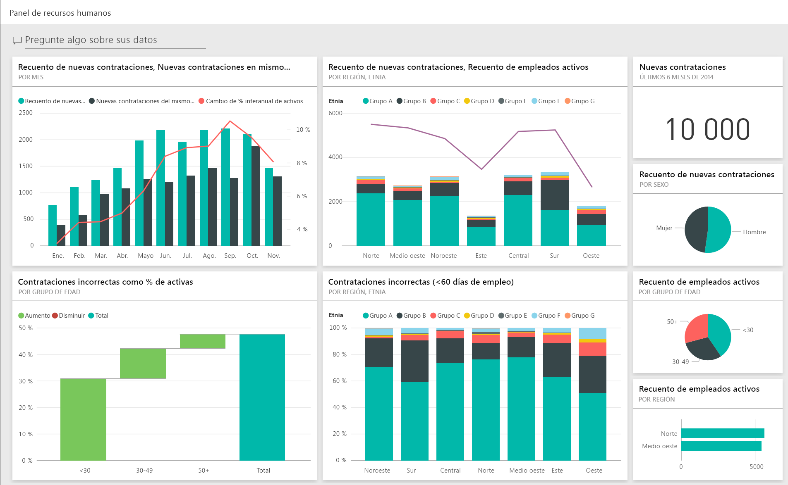
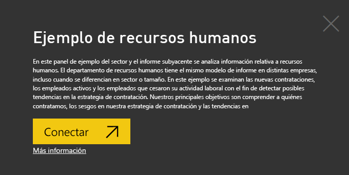
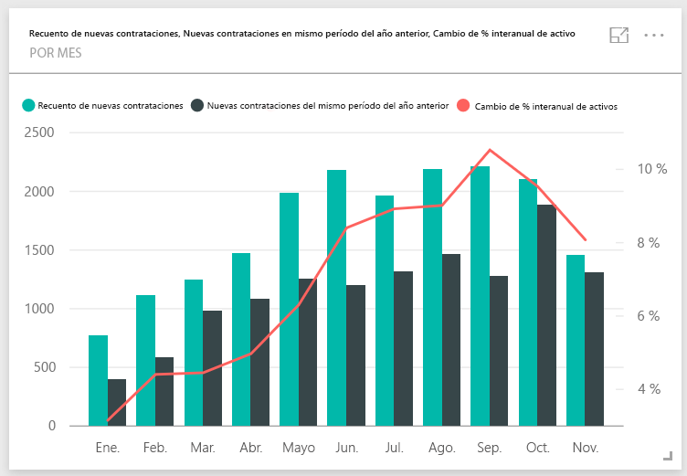
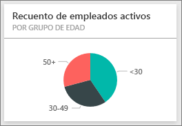
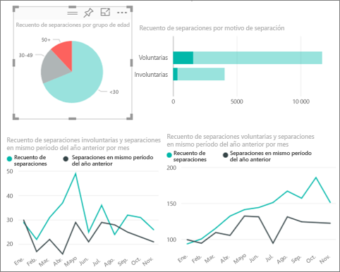
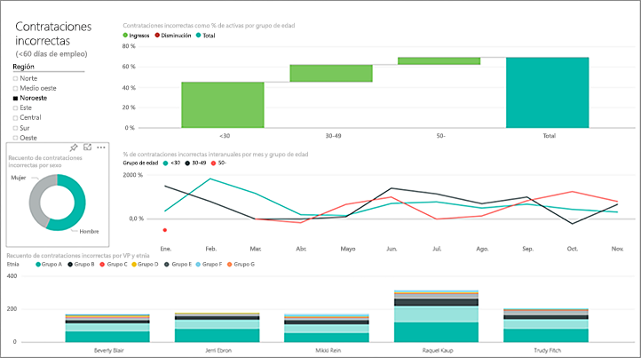
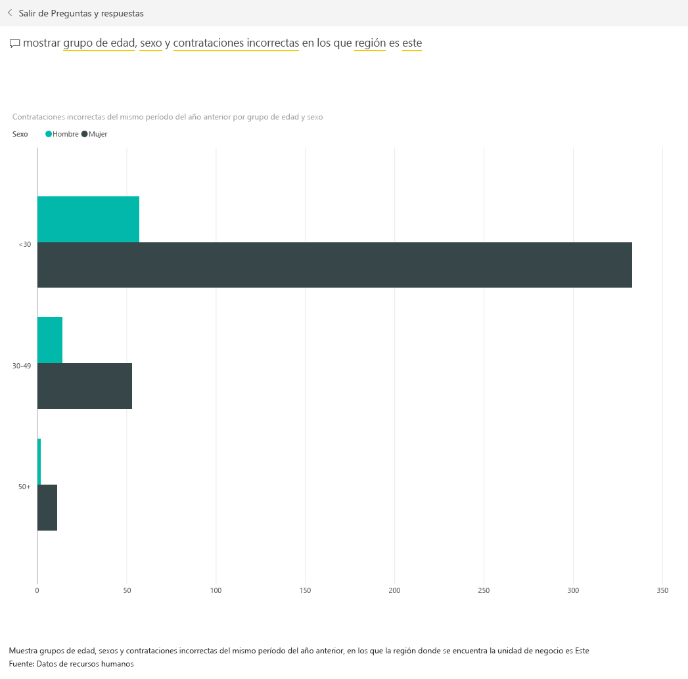

# Ejemplo de recursos humanos para Power BI: un paseo

## Introducción al Ejemplo de recursos humanos
El departamento de recursos humanos tiene el mismo modelo de informe en distintas empresas, incluso cuando se diferencian en sector o tamaño. En este ejemplo se examinan las nuevas contrataciones, los empleados activos y los empleados que cesaron su actividad laboral con el fin de detectar posibles tendencias en la estrategia de contratación. Nuestros principales objetivos son comprender:

* A quiénes contratamos
* Los prejuicios en nuestra estrategia de contratación
* Las tendencias en los ceses de actividad laboral voluntarios

Este ejemplo forma parte de una serie en la que se muestra cómo puede usar Power BI con datos, informes y paneles empresariales. Estos son datos reales y anónimos de obviEnce ([www.obvience.com)](http://www.obvience.com/). Los datos están disponibles en varios formatos: paquete de contenido o app, libro de Excel o archivo .pbix de Power BI Desktop. Para más información, consulte [Conjuntos de datos de ejemplo](sample-datasets.md).

## Requisitos previos

 Para poder usar el ejemplo, primero debe descargarlo como un [paquete de contenido](https://docs.microsoft.com/en-us/power-bi/sample-human-resources#get-the-content-pack-for-this-sample), un [archivo .pbix](http://download.microsoft.com/download/6/9/5/69503155-05A5-483E-829A-F7B5F3DD5D27/Human Resources Sample PBIX.pbix) o un [libro de Excel](http://go.microsoft.com/fwlink/?LinkId=529780).

### Obtención del paquete de contenido de este ejemplo

1. Abra el servicio Power BI (app.powerbi.com) e inicie sesión.
2. En la esquina inferior izquierda, seleccione **Obtener datos**.
   
    
3. En la página que aparece, seleccione el icono **Ejemplos**.
   
   
4. Seleccione el **Ejemplo de recursos humanos** y elija **Conectar**.  
   
   
5. Power BI importa el paquete de contenido y agrega un nuevo panel, informe y conjunto de datos en el área de trabajo actual. El contenido nuevo viene indicado con un asterisco amarillo. 
   
   
  
### Obtención del archivo .pbix de este ejemplo

Como alternativa, puede descargar el ejemplo como un archivo .pbix, que está diseñado para su uso con Power BI Desktop. 

 * [Ejemplo de recursos humanos](http://download.microsoft.com/download/6/9/5/69503155-05A5-483E-829A-F7B5F3DD5D27/Human Resources Sample PBIX.pbix)

### Obtención del libro de Excel de este ejemplo
También puede [descargar únicamente el conjunto de datos (libro de Excel)](http://go.microsoft.com/fwlink/?LinkId=529780) para este ejemplo. El libro contiene hojas de Power View que puede ver y modificar. Para ver los datos sin procesar seleccione **Power Pivot > Administrar**.

## Nuevas contrataciones
En primer lugar, veamos las nuevas contrataciones.

1. En el área de trabajo, seleccione la pestaña **Paneles** y abra el panel de recursos humanos.
2. En el panel, seleccione el icono **New Hire Count, New Hires Same Period Last Year, Actives YoY % Change** **By Month**.  
     

   Se abre el informe Ejemplo de recursos humanos en la página **New Hires** .  

   

Tenga en cuenta lo siguiente:

* El gráfico combinado **New Hire Count, New Hires SPLY and Actives YoY % Change by Month** muestra que contratamos un mayor número de empleados cada mes de este año en comparación con el año anterior &#151; (bastantes más algunos meses).
* En el gráfico combinado **New Hire Count and Active Employee Count by Region and Ethnicity**, observe que estamos contratando menos empleados en la región **East** .
* El gráfico de cascada **New Hires YoY Var by Age Group** muestra que se contratan principalmente empleados jóvenes. Esto puede deberse a la naturaleza de los trabajos, sobretodo a tiempo parcial.
* El gráfico circular **New Hire Count by Gender** muestra una división bastante uniforme.

¿Puede extraer alguna idea clara; por ejemplo, una región donde la división por género no sea uniforme? Haga clic en los diferentes grupos de edad y géneros de los gráficos para explorar las relaciones entre edad, género, región y grupo étnico.

Seleccione el nombre del panel en la barra de navegación superior para volver al panel.

## Comparación de empleados activos y antiguos
Vamos a examinar los datos de los empleados actualmente activos y de aquellos que ya no trabajan para la empresa.

En el panel, seleccione el icono **Active Employee Count by Age Group** .  

El informe Ejemplo de recursos humanos se abre en la página **Active Employees vs. Separations**.  

**Elementos de interés**:

* Los gráficos combinados de la izquierda muestran los cambios interanuales de empleados activos y ceses de actividad laboral. Tenemos más activos este año debido a la rápida contratación, pero también menos ceses de actividad laboral que el año pasado.
* En agosto, teníamos más ceses de actividad laboral en comparación con otros meses. Seleccione los diferentes grupos de edad, géneros o regiones para ver si puede encontrar valores atípicos.
* Si se examinan los gráficos circulares, se puede ver que hay una división bastante uniforme en nuestros empleados activos por género y grupo de edad. Seleccione los diferentes grupos de edad para las diferencias de género divididas por edad. ¿Tenemos una división uniforme por género en cada grupo de edad?

## Motivos de cese de actividad laboral
Echemos un vistazo al informe en la Vista de edición. Seleccione **Editar informe** en la esquina superior izquierda.

Cambie los gráficos circulares para mostrar los datos de cese de actividad laboral en lugar de los empleados activos.

1. Seleccione el gráfico circular **Active Employee Count by Age Group** .
2. En **Fields**, seleccione la flecha situada junto a **Employees** para expandir la tabla Employees. Desactive la casilla junto a **Active Employee Count** para quitar ese campo.
3. Active la casilla junto a **Separation Count** de la tabla Employees para agregarla al cuadro **Values** del conjunto de campos.
4. De vuelta en el lienzo del informe, seleccione la barra **Voluntary** del gráfico de barras **Separation Count by Separation Reason**. Se resaltan los empleados que se fueron voluntariamente en los otros objetos visuales del informe.
5. Haga clic en el segmento 50+ del gráfico circular Separation Count by Age Group.

   Examine el gráfico de líneas Ceses de actividad laboral por motivo en la esquina inferior derecha. Este gráfico se filtra para mostrar los ceses de actividad laboral voluntarios.  
   

   ¿Observa la tendencia en el grupo de edad de Más de 50? Durante la última parte del año, más empleados de más de 50 años dejaron la empresa de forma voluntaria. Esta sería un área que habría que investigar a fondo con más datos.
6. Puede seguir los mismos pasos con el gráfico circular **Active Employee Count by Gender** y cambiar a ceses de actividad laboral en lugar de empleados activos. Examine los datos de los ceses de actividad laboral voluntarios por género para ver si extrae algunas otras ideas importantes.
7. Haga clic en **Power BI** en la barra de navegación superior para volver al panel. Puede guardar los cambios realizados en el informe si lo desea.

## Contrataciones incorrectas
La última área para explorar son las contrataciones incorrectas. Las contrataciones incorrectas se definen como aquellos empleados que no duraron más de 60 días. Contratamos rápidamente. ¿Estamos contratación a buenos candidatos?

1. Seleccione el icono del panel **Bad Hires as % of Actives by Age Group** . Se abre el informe en la página 3, "Contrataciones incorrectas".

     
2. Active la casilla **Northwest** del segmento Region de la izquierda y el segmento **Male** del gráfico de anillos Bad Hire Count by Gender.  Examine los demás gráficos de la página "Contrataciones incorrectas". Hay más contrataciones incorrectas de hombres que de mujeres y muchas del Grupo A.
     
3. Si examinamos el gráfico de anillos **Bad Hires by Gender** y hacemos clic en el segmento **Region** , observamos que la región East es la única con más contrataciones incorrectas de mujeres que de hombres.  
4. Seleccione el nombre del panel en la barra de navegación superior para volver al panel.

## Formulación de una pregunta en el cuadro de preguntas y respuestas
El [cuadro de pregunta y respuestas](power-bi-tutorial-q-and-a.md) es donde se escribe una pregunta con lenguaje natural. Preguntas y respuestas reconoce las palabras que escribe y determina la ubicación del conjunto de datos donde se encuentra la respuesta.

1. Haga clic en el cuadro de pregunta de Preguntas y respuestas. Observe que, incluso antes de empezar a escribir, el cuadro de Preguntas y respuestas contiene sugerencias:

   
2. Puede elegir una de estas sugerencias, o escribir: **show age group, gender and bad hires SPLY where region is east**.  

   

   Observe que la mayoría de las contrataciones incorrectas de mujeres pertenecen a menores de 30 años.

Se trata de un entorno seguro en el que experimentar. Siempre puede elegir no guardar los cambios. Si los guarda, siempre puede ir a **Obtener datos** para obtener una copia nueva de este ejemplo.

## Pasos siguientes: conectarse a sus propios datos
Esperamos que este paseo le haya mostrado cómo los paneles, la sección de preguntas y respuestas y los informes de Power BI pueden proporcionar ideas claras sobre los datos de recursos humanos. Ahora es su turno: conéctese a sus propios datos Con Power BI puede conectarse a una gran variedad de orígenes de datos. Más información sobre [cómo empezar a usar Power BI](service-get-started.md).  
