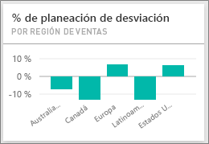
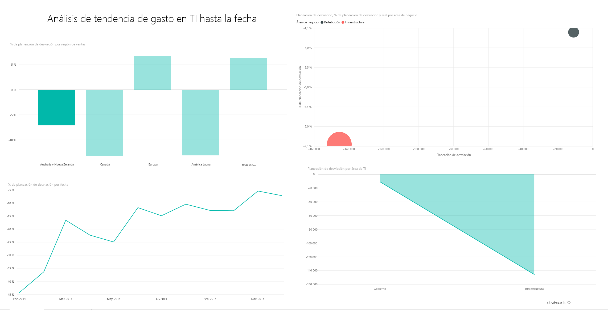
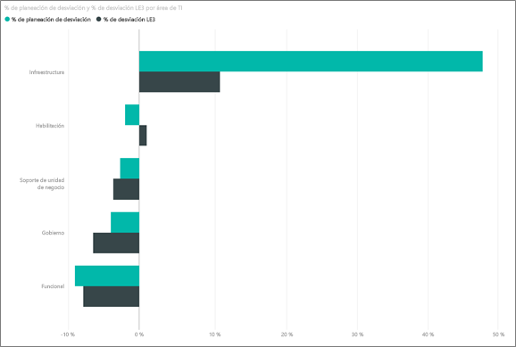
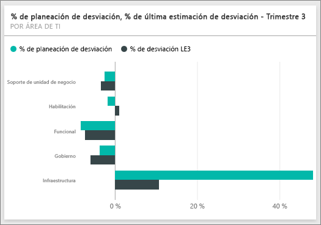
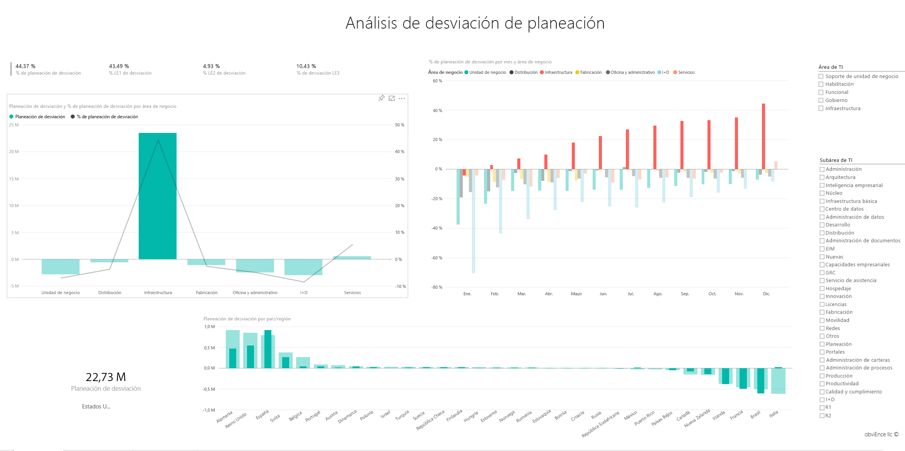

# Ejemplo de análisis de gasto en TI para Power BI: un paseo
El [paquete de contenido](service-organizational-content-pack-introduction.md) del análisis de gastos de TI (panel, informe y conjunto de datos) analiza los costos planeados frente a los costos reales de un departamento de TI. Esta comparación nos ayuda a comprender la calidad del planeamiento anual y de la investigación de las áreas con enormes desviaciones del planeamiento que ha realizado la empresa. La empresa de este ejemplo pasa por un ciclo de planeamiento anual y produce trimestralmente un nuevo último cálculo que ayude a analizar los cambios del gasto en TI durante el año fiscal.

Este ejemplo forma parte de una serie en la que se muestra cómo puede usar Power BI con datos, informes y paneles empresariales. Estos son datos reales y anónimos de obviEnce (<http://obvience.com/>).

>[!Note] 
Puede [descargar solo el conjunto de datos (libro de Excel) para este ejemplo](http://go.microsoft.com/fwlink/?LinkId=529783). El libro contiene hojas de Power View que puede ver y modificar. Para ver los datos sin procesar. Seleccione **Power Pivot > Administrar**.

## El panel de ejemplo de análisis de gasto en TI
Los dos iconos de números del panel, el **% de desviación del planeamiento** y el **% de desviación del último cálculo del tercer trimestre**nos aportan una visión general de la calidad de nuestro trabajo con respecto al planeamiento y el cálculo del último trimestre (LE3 = último cálculo del tercer trimestre). En términos generales, tenemos una desviación del 6 % del planeamiento. Exploremos la causa de esta desviación: cuándo, dónde y qué categoría.

## Página de "Análisis de tendencia de gasto en TI hasta la fecha" 
Al seleccionar el icono del panel **% de desviación del planeamiento por región de venta**, irá a la página "Análisis de tendencias de gasto en TI" del informe de ejemplo de análisis de gastos de TI. Vemos de un vistazo que tenemos una desviación positiva en Estados Unidos y Europa y una desviación negativa en Canadá, Latinoamérica y Australia. EE. UU. tenía alrededor de un 6 % de desviación positiva en el último cálculo, mientras que Australia tiene alrededor de un 7 % de desviación negativa en el último cálculo.

Pero si solo miramos este gráfico y sacamos conclusiones podemos equivocarnos. Tenemos que analizar los importes reales para poner las cosas en perspectiva.

1. Seleccione **Australia y Nueva Zelanda** en el gráfico de % de desviación del planeamiento según la región de ventas y observe el gráfico de áreas de la desviación del planeamiento por TI. 
   
   
2. Ahora seleccione **EE. UU.**Para hacerse una idea, Australia supone una parte muy reducida de nuestro gasto general en comparación con EE. UU.
   
    Por este motivo, lo restringimos a EE. UU. ¿Y ahora qué? Veamos qué categoría en EE. UU. está causando la desviación.

## Pregunte sobre los datos
1. Seleccione **Ejemplo de análisis de gasto de TI** en la barra de navegación superior para volver a los paneles.
2. Escriba en el cuadro de pregunta "mostrar gráfico de barras de las áreas de TI, % de desviación del planeamiento y % de desviación del último cálculo del tercer trimestre".
   
    
   
   En la primera área de TI, **Infraestructura**, el porcentaje cambió radicalmente entre la desviación del planeamiento inicial y el último cálculo de la desviación del planeamiento.

## Página "gasto hasta la fecha por elementos de costo"
Vuelva al panel y observe el icono del panel **% de desviación del planeamiento, % de desviación del último cálculo del tercer trimestre** .

La infraestructura destaca con una gran desviación positiva del planeamiento.

1. Haga clic en este icono para ir a la página "gastos hasta la fecha por elementos de costo" del informe de ejemplo de análisis de gasto en TI.
2. Haga clic en la barra **Infraestructura** del gráfico "% de desviación del planeamiento y % de desviación del último cálculo del tercer trimestre por área de TI" en la parte inferior izquierda y observe la desviación del planeamiento en "% de desviación del planeamiento por región de ventas" a la izquierda.
   
    
3. Haga clic en el nombre de cada Grupo de elementos de costo en la segmentación para encontrar el elemento de costo con una gran desviación.
4. Tras seleccionar **Otros** , haga clic en **Infraestructura** en el Área de TI y haga clic en las subáreas en la segmentación de Subárea de TI para encontrar la subárea con la mayor desviación.  
   
   Vemos una gran desviación en **Redes**.
   
   Aparentemente, la empresa decidió proporcionar a sus empleados servicios telefónicos como beneficio, pero este movimiento no estaba planeado. 

## Página "Análisis de desviación del planeamiento"
En el informe, haga clic en la pestaña "Análisis de la desviación del planeamiento" en la parte inferior del informe para ir a la página 3 del informe.

En el gráfico combinado "desviación del planeamiento y % de desviación del planeamiento por área de negocio" de la izquierda, haga clic en la columna Infraestructura para resaltar los valores de la infraestructura en el resto de la página.

Observe que en el gráfico de "% de desviación del planeamiento por mes y área de negocio" la infraestructura empezó a experimentar una desviación positiva en febrero que luego continuó aumentando. Además, observe cómo la varianza para planear el valor de la infraestructura varía según el país, en comparación con el valor de todas las áreas de negocios. Use las segmentaciones "Área de TI" y "Subáreas de TI" a la derecha para filtrar los valores del resto de la página en lugar de resaltarlos. Haga clic en las diferentes Áreas de TI de la derecha para explorar los datos de otra forma. También puede hacer clic en Subáreas de TI y ver la desviación en ese nivel.

## Editar el informe
Haga clic en **Editar informe** en la esquina superior izquierda y explore la Vista de edición.

* Vea cómo se realizan las páginas: los campos de cada gráfico y los filtros de las páginas.
* Agregue páginas y gráficos basados en los mismos datos.
* Cambie el tipo de visualización de cada gráfico.
* Ánclelos al panel.

Se trata de un entorno seguro en el que experimentar. Siempre puede elegir no guardar los cambios. Pero si los guarda, siempre puede ir a Obtener datos para obtener una copia nueva de este ejemplo.

## Pasos siguientes: conectarse a sus propios datos
Esperamos que este paseo le haya mostrado cómo los paneles de Power BI, Preguntas y respuestas y los informes pueden ofrecer recomendaciones sobre los datos de gasto en TI. Ahora es su turno: conéctese a sus propios datos Con Power BI puede conectarse a una gran variedad de orígenes de datos. Más información sobre [cómo empezar a usar Power BI](service-get-started.md).

