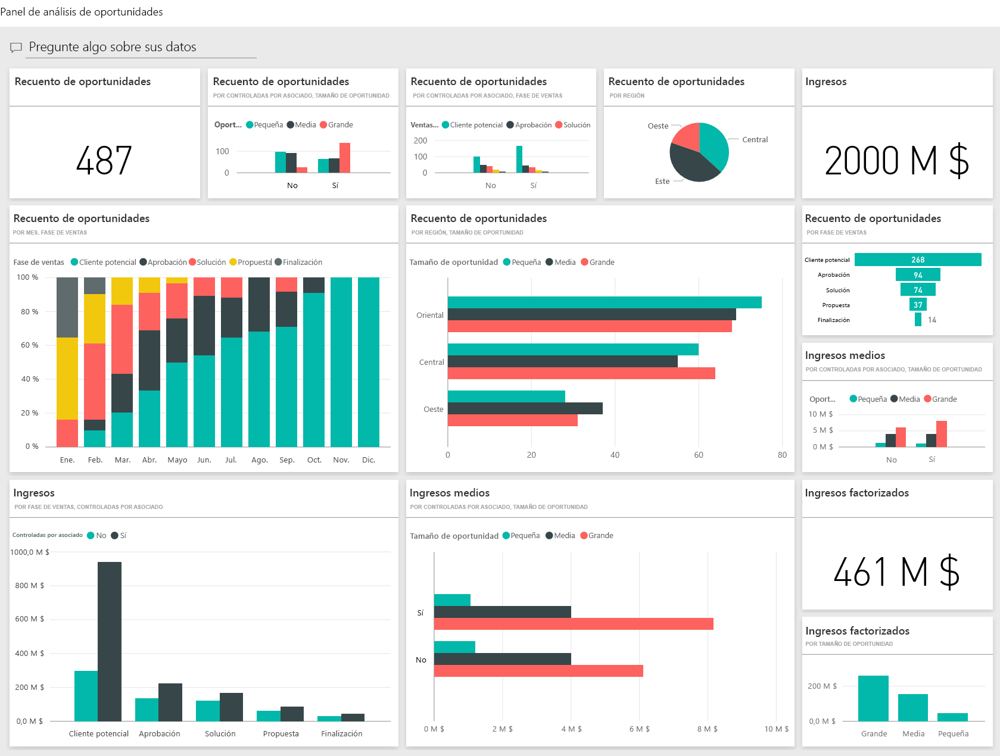
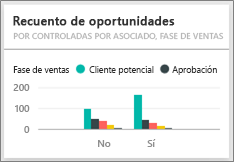

# Ejemplo de análisis de oportunidades para Power BI: un paseo
El **ejemplo de seguimiento de oportunidades** contiene un panel (y un informe asociado) para una empresa de software que tiene dos canales de ventas: el de la *venta directa* y *a través de asociados*. La jefa de ventas creó este panel para hacer un seguimiento de las oportunidades y los ingresos por región, tamaño del acuerdo y canal.

Se basa en dos medidas de ingresos:

* **Ingresos** : la estimación de los ingresos que calcula el vendedor.
* **Ingresos factorizados** : se calculan aplicando la fórmula Ingresos x % de probabilidad y generalmente se aceptan como predicción más exacta de los ingresos por ventas reales. La ***fase de ventas*** actual del acuerdo es el factor que determina la probabilidad.
  * Cliente potencial: 10 %  
  * Aprobación: 20 %  
  * Solución: 40 %  
  * Propuesta: 60 %  
  * Finalización: 80 %

Este ejemplo forma parte de una serie en la que se muestra cómo puede usar Power BI con datos, informes y paneles empresariales. Estos son datos reales y anónimos de obviEnce ([www.obvience.com)](http://www.obvience.com/).

También puede [descargar únicamente el conjunto de datos (libro de Excel) para este ejemplo](http://go.microsoft.com/fwlink/?LinkId=529782).  

## ¿Qué indica el panel?
La jefa de ventas creó un panel para realizar el seguimiento de las métricas que considera más importantes. Cuando ve algo interesante, puede seleccionar un icono para profundizar en los datos.

1. Los ingresos de la empresa ascienden a los 2.000 millones de dólares y, los ingresos factorizados, a 461.
2. El recuento de oportunidades y los ingresos siguen un patrón de embudo conocido, en el que los totales van disminuyendo en cada una de las fases subsiguientes.
3. La mayoría de nuestras oportunidades se encuentran en la región Este. 
4. Las oportunidades grandes generan más ingresos que las medianas o las pequeñas.
5. Los acuerdos grandes con los asociados generan más ingresos: 8 millones de dólares de media, frente a los 6 millones de las ventas directas. 

Puesto que el esfuerzo para cerrar un acuerdo es el mismo, independientemente de si este se clasifica como grande, mediano o pequeño, nuestra empresa debe profundizar en los datos para obtener más información sobre las grandes oportunidades. 

Seleccione el icono **Recuento de oportunidades por fase de ventas controlada por los asociados** para abrir la página 1 del informe.  

## Consultar las páginas del informe
### La página 1 del informe se titula "Información general sobre el recuento de oportunidades".

* El Este es la mayor región en cuanto a recuentos de oportunidades.  
* En el gráfico circular, seleccione una región para filtrar la página. En cada una de las regiones, los asociados buscan oportunidades considerablemente mayores.   
* El gráfico de columnas del recuento de oportunidades por su tamaño y por el control de los asociados muestra claramente que son estos quienes controlan la mayor parte de las grandes oportunidades, y que no ocurre lo mismo con las pequeñas y las medianas oportunidades. 
* Seleccione las distintas fases de ventas en el gráfico de barras de la parte inferior izquierda para ver la diferencia en el recuento regional. Observe que, aunque el Este es nuestra mayor región en lo concerniente a recuentos, en las fases de solución, propuesta y finalización, las tres regiones registran recuentos comparables. Esto significa que cerramos un porcentaje mayor de acuerdos en el Centro y el Oeste. 

### La página 2 del informe se titula "Información general sobre los ingresos".
En esta página se examinan los datos de manera similar, pero desde la perspectiva de los ingresos (no de los recuentos).  

* El Este es la región más grande, no solo en lo que respecta al recuento de oportunidades, sino también a ingresos.  
* Si aplica el filtro Controlado por los asociados (seleccione **Sí** en la leyenda de la esquina superior derecha), aparecerán unos ingresos de 1.500 y 294 millones de dólares. Compare esto con los 644.000 y los 166 millones de dólares correspondientes a los ingresos que controlan los no asociados.  
* Los ingresos medios de las cuentas grandes son mayores (8 millones) en el caso de las oportunidades controladas por los asociados (los ingresos medios de los negocios no controlados por los asociados no superan los 6 millones).  
* En el caso de los negocios controlados por los asociados, los ingresos medios de las grandes oportunidades casi duplican los correspondientes a las oportunidades de tamaño medio (4 millones).  
* Los ingresos medios de los negocios pequeños y medianos son comparables en ambos tipos de negocios (los que están controlados por los asociados y los que no).   

Claramente, nuestros asociados están obteniendo mejores resultados con las ventas a los clientes.  Tendría sentido canalizar más acuerdos a través de nuestros asociados.

### La página 3 del informe se titula "Recuentos por fase y región".
En esta página se examinan datos similares, desglosados por región y fase.  

* Si aplica el filtro Este (seleccione **Este** en el gráfico circular), verá que las oportunidades de la zona se dividen en dos grupos (las que están controladas por los asociados y las que no) de dimensiones prácticamente idénticas. 
* Las grandes oportunidades son más comunes en la región Central, las pequeñas en la región Este y, las medianas, en la región Oeste. 

### La página 4 del informe se titula "Próximas oportunidades".
Una vez más se analizan factores similares, pero esta vez desde la perspectiva de la fecha y la hora.  

Nuestra directora financiera usa esta página para administrar la carga de trabajo. La posibilidad de consultar las oportunidades de ingresos por fase de ventas y mes le permite efectuar una planeación adecuada.

* Los ingresos medios más elevados son los de la fase de finalización. Es prioritario cerrar estos acuerdos.
* Si aplica el filtro de un mes (seleccionando el nombre del mes en la segmentación de la izquierda), verá que enero cuenta con una proporción elevada de grandes acuerdos en la fase de finalización, con unos ingresos factorizados de 75 millones de dólares. Febrero, en cambio, cuenta principalmente con acuerdos medianos en la fase de solución y propuesta.
* En general, las cifras de los ingresos factorizados fluctúan en función de la fase de ventas, el número de oportunidades y el tamaño del acuerdo. Para obtener más información detallada, filtre los factores con el panel de filtros de la derecha.

Se trata de un entorno seguro en el que experimentar. Siempre puede elegir no guardar los cambios. Pero si los guarda, en **Obtener datos** podrá obtener una nueva copia de este ejemplo siempre que lo desee.

## Pasos siguientes: conectarse a sus propios datos
Esperamos que en este paseo haya aprendido cómo los paneles de Power BI, Preguntas y respuestas y los informes pueden ofrecerle información sobre los datos para el seguimiento de oportunidades. Ahora es su turno: conéctese a sus propios datos. Con Power BI puede conectarse a una gran variedad de orígenes de datos. Más información sobre [cómo empezar a usar Power BI](service-get-started.md).

[Descargar ejemplos](sample-datasets.md)  

