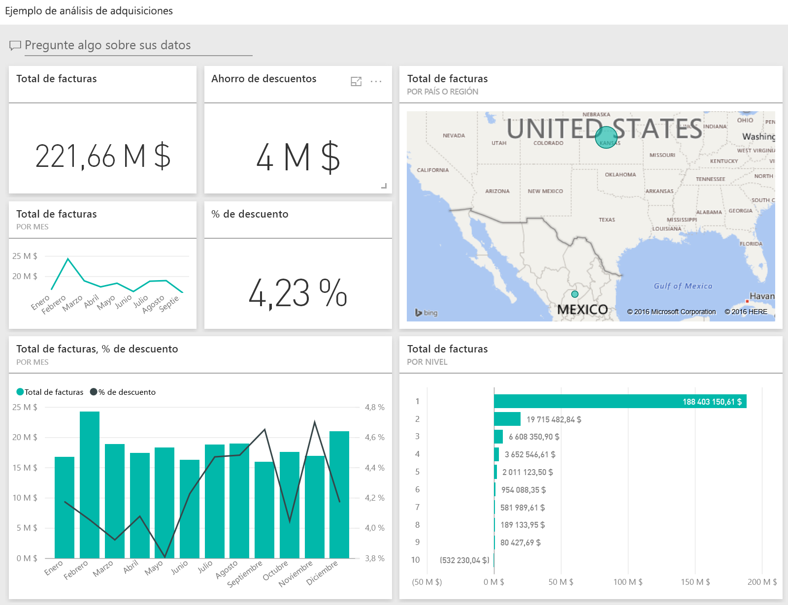
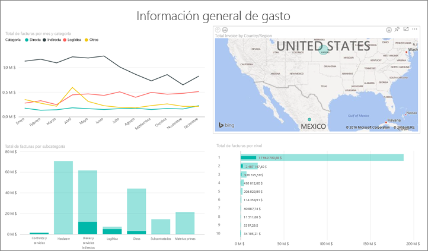
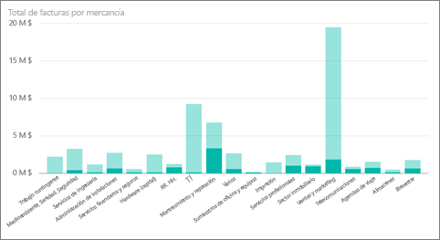
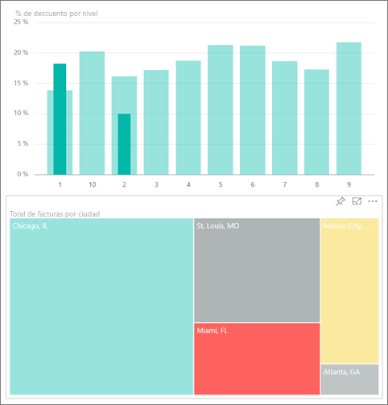
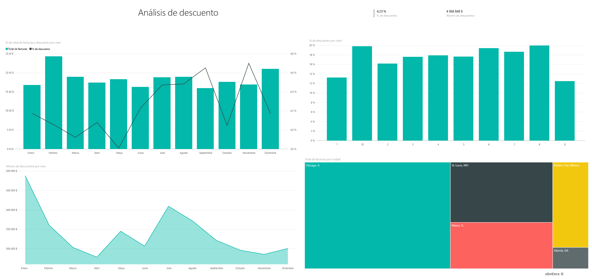
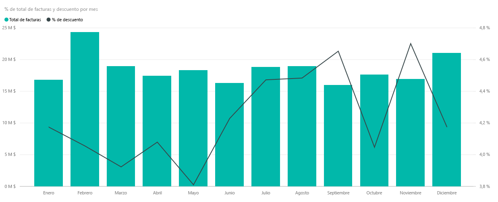
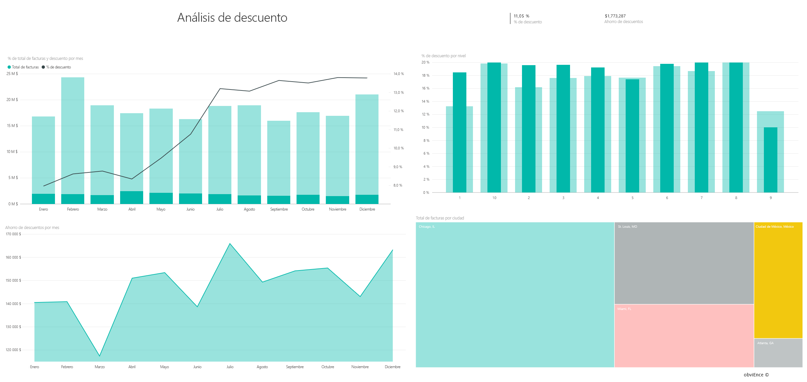

# Ejemplo de análisis de compra para Power BI: un paseo
En este panel de ejemplo del sector y en el informe subyacente se analizan los gastos que tiene una empresa de fabricación en proveedores por categoría y ubicación. En el ejemplo, exploramos estas áreas:

* Quiénes son los mejores proveedores
* En qué categorías se realiza el mayor gasto
* Qué proveedores nos ofrecen el mayor descuento y cuándo

Este ejemplo forma parte de una serie en la que se muestra cómo puede usar Power BI con datos, informes y paneles empresariales. Estos son datos reales y anónimos de obviEnce ([www.obvience.com)](http://www.obvience.com/).

¿Desea seguir adelante? En el [servicio Power BI](https://powerbi.com), vaya a **Obtener datos > Ejemplos > Ejemplo de análisis de adquisiciones > Conectar** para obtener su propia copia del ejemplo.

[!Note] También puede [descargar únicamente el conjunto de datos (libro de Excel)](http://go.microsoft.com/fwlink/?LinkId=529784) para este ejemplo. El libro contiene hojas de Power View que puede ver y modificar. Para ver los datos sin procesar seleccione **Power Pivot > Administrar**.

## Tendencias de gastos
Veamos primero las tendencias de gastos por categoría y ubicación.  

1. En el área de trabajo, abra la pestaña **Paneles** y seleccione el panel de análisis de adquisiciones.
2. Seleccione el icono del panel **Total factura por país o región**. Se abre la página "Resume de gastos" del informe "Ejemplo de análisis de compras".
   
    

Aspectos a tener en cuenta:

* En el gráfico de líneas **Total Invoice by Month and Category** : la categoría **Direct** presenta gastos bastante constantes, **Logistics** experimenta un pico en diciembre y **Other** , un pico en febrero.
* En el mapa **Total Invoice by Country/Region** : la mayor parte de los gastos corresponden a Estados Unidos.
* En el gráfico de columnas **Total Invoice by Sub Category**, las categorías que muestran unos gastos mayores son **Hardware** y **Indirect Goods & Services**.
* En el gráfico de barras Total Invoice by Tier: la mayor parte de los negocios se llevan a cabo con nuestros proveedores de nivel 1 (10 principales). Esto ayuda a administrar mejor las relaciones con los proveedores.

## Gastos de México
Vamos a examinar las áreas de gasto en México.

1. En el gráfico circular, seleccione la burbuja **México** en el mapa. Observe que, en el gráfico de columnas "Total Invoice by Sub Category", la mayoría de los datos se encuentran en la subcategoría **Indirect Goods & Services**.
   
   
2. Explore en profundidad la columna **Indirect Goods & Services**:
   
   * Seleccione la flecha de exploración en profundidad  de la esquina superior derecha del gráfico.
   * Seleccione la columna **Indirect Goods & Services**.
     
      El gasto más elevado de esta categoría es, con diferencia, el de Sales & Marketing.
   * Seleccione **Mexico** en el mapa de nuevo.
     
      El gasto más elevado de esta categoría en México corresponde a Maintenance & Repair.
     
      
3. Seleccione la flecha arriba de la esquina superior izquierda del gráfico para volver a agrupar los datos.
4. Seleccione de nuevo la flecha para desactivar la exploración en profundidad.  
5. Seleccione **Power BI** en la barra de navegación superior para volver al área de trabajo.

## Evaluar las diferentes ciudades
Se puede usar el resaltado para evaluar diferentes ciudades.

1. Seleccione el icono del panel **Total factura y % descuento por mes**. El informe se abre en la página "Análisis de descuento".
2. Seleccione las distintas ciudades en el gráfico de rectángulos **Total Invoice by City** para ver cómo se comparan. Casi todas las facturas de Miami son de proveedores del nivel 1.
   
   

## Descuentos de proveedor
Vamos a examinar los descuentos disponibles de los proveedores, así como los períodos de tiempo en los que conseguimos mayores descuentos 

En concreto, estas preguntas:

* ¿Varían los descuentos cada mes o son siempre los mismos?
* ¿Obtienen algunas ciudades más descuentos que otras?

### Descuento por mes
Si examinamos el gráfico combinado **Total Invoice and Discount % by Month** , vemos que **febrero** es el mes más ocupado y **septiembre** el menos ocupado. Ahora examinemos el porcentaje de descuento durante estos meses.
Observe que cuando el volumen crece, el descuento se reduce y que cuando el volumen baja, el descuento aumenta. Cuando más descuento necesitemos, peor es el trato que obtenemos.

### Descuento por ciudad
Otra área para explorar es el descuento por ciudad. Seleccione cada ciudad en el gráfico de rectángulos y vea cómo cambian los demás gráficos. 

* St. Louis, Missouri experimentó un aumento importante en el total de la factura en febrero y un importante retroceso en los ahorros por descuentos en abril.
* Ciudad de México, México tiene el mayor % de descuento (11,05 %) y Atlanta, GA el menor (0,08 %).

### Editar el informe
Seleccione **Editar informe** en la esquina superior izquierda y examínelo en la Vista de edición.

* Vea cómo se crean las páginas.
* Agregue páginas y gráficos basados en los mismos datos.
* Cambie el tipo de visualización de un gráfico; por ejemplo, cambie el gráfico de rectángulos por un gráfico de anillos.
* Ánclelos al panel.

Se trata de un entorno seguro en el que experimentar. Siempre puede elegir no guardar los cambios. Si los guarda, siempre puede ir a **Obtener datos** para obtener una copia nueva de este ejemplo.

## Pasos siguientes: conectarse a sus propios datos
Esperamos que este paseo le haya mostrado cómo los paneles y los informes de Power BI pueden proporcionar ideas claras sobre los datos de adquisiciones. Ahora es su turno: conéctese a sus propios datos. Con Power BI puede conectarse a una gran variedad de orígenes de datos. Más información sobre [cómo empezar a usar Power BI](service-get-started.md).

