# Ejemplo de análisis de venta directa para Power BI: un paseo

Este panel de ejemplo del sector y el informe subyacente analizan datos de venta directa de artículos vendidos en varias tiendas y distritos. Las métricas comparan el rendimiento de este año con el del año pasado en estas áreas: ventas, unidades, margen bruto y varianza, así como análisis de nuevas tiendas. Estos son datos reales y anónimos de obviEnce ([www.obvience.com](http://www.obvience.com)).

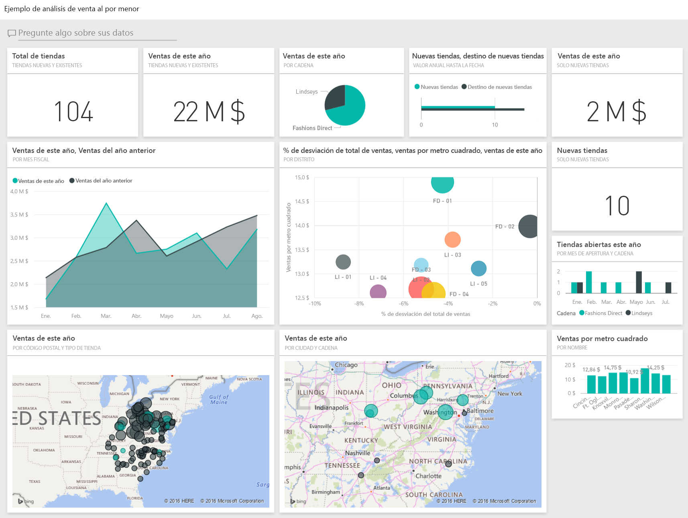

## Requisitos previos

 Para poder usar el ejemplo, primero debe descargarlo como un paquete de contenido, un archivo .pbix o un libro de Excel.

### Obtención del paquete de contenido de este ejemplo

1. Abra el servicio Power BI (app.powerbi.com) e inicie sesión.
2. En la esquina inferior izquierda, seleccione **Obtener datos**.
   
    
3. En la página que aparece, seleccione el icono **Ejemplos**.
   
   
4. Seleccione el **Ejemplo de análisis de minoristas** y elija **Conectar**.  
  
   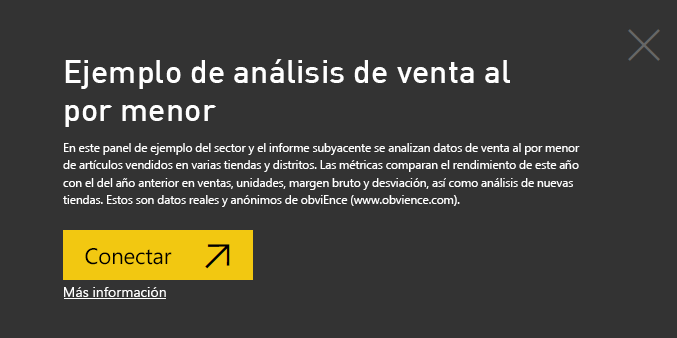
   
5. Power BI importa el paquete de contenido y agrega un nuevo panel, informe y conjunto de datos en el área de trabajo actual. El contenido nuevo viene indicado con un asterisco amarillo. 
   
   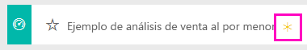
  
### Obtención del archivo .pbix de este ejemplo

Como alternativa, puede descargar el ejemplo como un archivo .pbix, que está diseñado para su uso con Power BI Desktop. 

 * [Ejemplo de análisis de venta directa](http://download.microsoft.com/download/9/6/D/96DDC2FF-2568-491D-AAFA-AFDD6F763AE3/Retail%20Analysis%20Sample%20PBIX.pbix)

### Obtención del libro de Excel de este ejemplo
También puede [descargar únicamente el conjunto de datos (libro de Excel)](http://go.microsoft.com/fwlink/?LinkId=529778) para este ejemplo. El libro contiene hojas de Power View que puede ver y modificar. Para ver los datos sin procesar seleccione **Power Pivot > Administrar**.

## Iniciar el panel y abrir el informe
1. En el panel, seleccione el icono "Tiendas totales":

   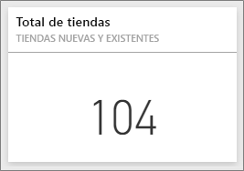  

   Esto le llevará a la página "Información general de las ventas de la tienda" en el informe. Verá que tenemos 104 tiendas en total, 10 de las cuales son nuevas. Tenemos dos cadenas, Fashions Direct y Lindseys. Las tiendas Fashions Direct son más grandes de media.
2. En el gráfico circular, seleccione **Fashions Direct**.

   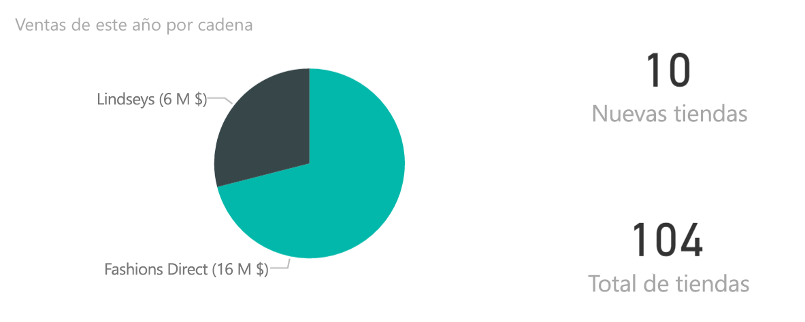  

   Observe el resultado del gráfico de burbujas:

   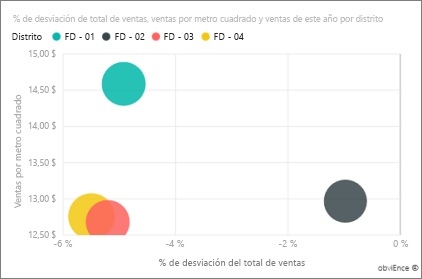  

   El distrito FD-01 tiene el mayor promedio de ventas por pie cuadrado, FD-02 tiene la desviación más baja en ventas en comparación con el año pasado, FD-03 y 04 FD son los que menos cumplen.
3. Seleccione las burbujas individuales o en los otros gráficos para ver de forma transversal el impacto de las selecciones resaltado.
4. Para volver al panel, seleccione su nombre en la barra de navegación superior (rutas de navegación).

   
5. En el panel, seleccione el icono con las "Ventas de este año".

   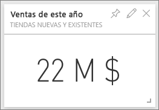

   Esto equivale a escribir "Ventas de este año" en el cuadro de pregunta.

   Verá esta pantalla:

   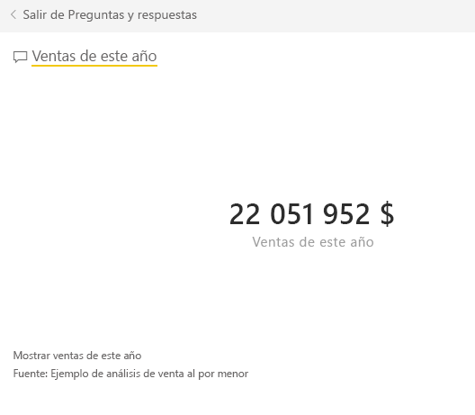

## Revisar un icono creado con Preguntas y respuestas de Power BI
Seamos más específicos.

1. Agregue "ventas de este año **por distrito**" a la pregunta. Observe el resultado: la respuesta se coloca automáticamente en un gráfico de barras y sugiere otras expresiones:

   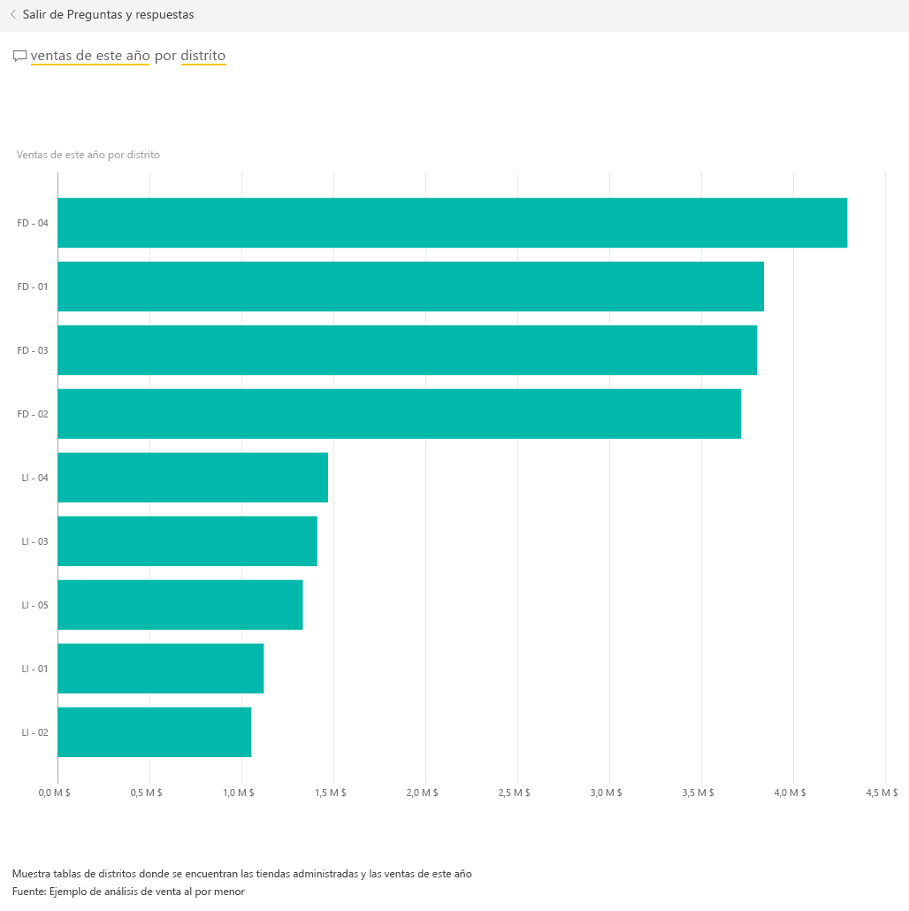
2. Ahora, cambie la pregunta a "ventas de este año **por código postal y cadena**".

   Observe cómo responde a la pregunta con los gráficos adecuados a medida que la escribe.
3. Experimente con más preguntas y observe qué tipo de resultados obtiene.
4. Cuando esté listo, vuelva al panel.

## Explorar los datos en profundidad
Ahora vamos a explorar en un nivel más detallado, observando el rendimiento de los distritos.

1. En el panel, seleccione el icono que compara las ventas de este año con las del año pasado.

   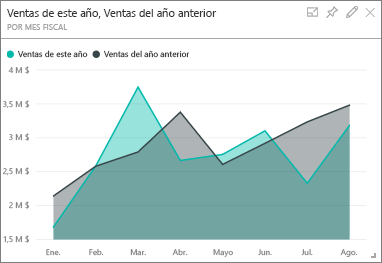

   Observe la gran variabilidad del % de desviación del año anterior, con unos meses de enero, abril y julio especialmente malos.

   

   Veamos si podemos delimitar dónde pueden encontrarse los problemas.
2. Seleccione el gráfico de burbujas y elija **020-Hombres**.

   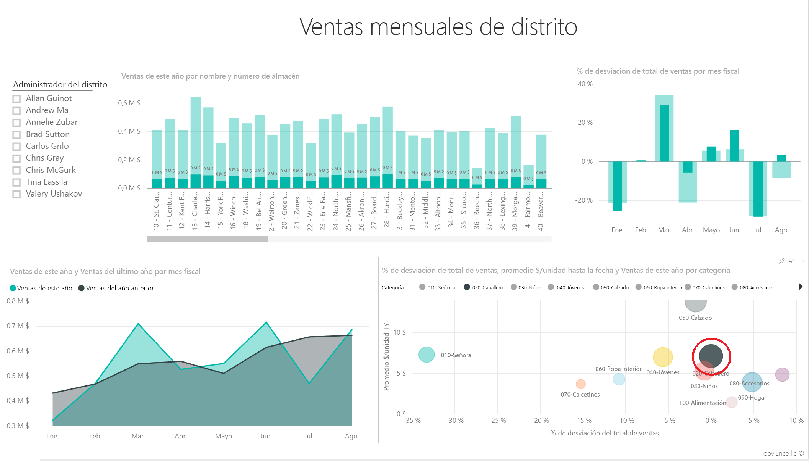  

   Observe que la categoría de hombres no se ha visto tan severamente afectada en abril como el total del negocio, pero enero y julio siguieron siendo meses problemáticos.
3. Ahora, seleccione la **burbuja de 010-Mujeres**.

   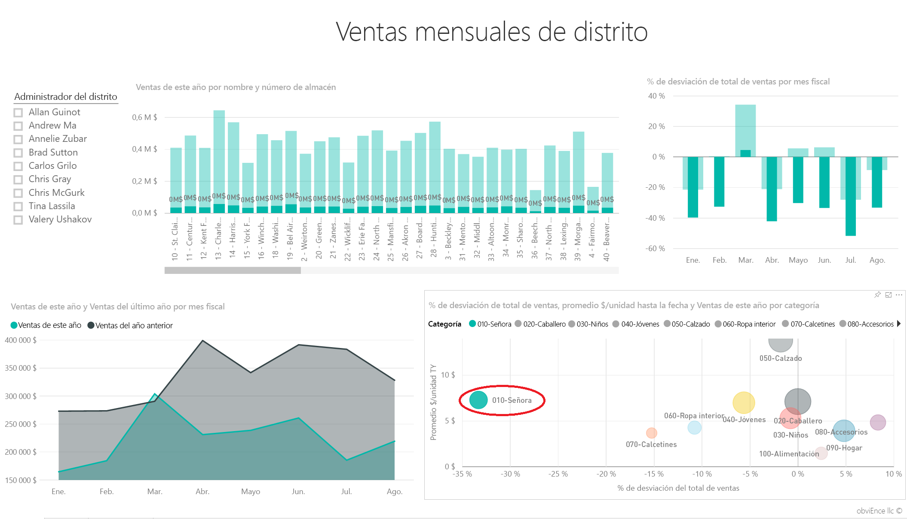

   Observe que la categoría de mujeres tuvo un rendimiento mucho peor que el total del negocio a lo largo de todos los meses y mucho peor en casi todos los meses en comparación con el año anterior.
4. Seleccione la burbuja de nuevo para borrar el filtro.

## Probar la segmentación
Echemos un vistazo al progreso de los distritos específicos.

1. Seleccione Allan Guinot en la segmentación de la parte superior izquierda.

   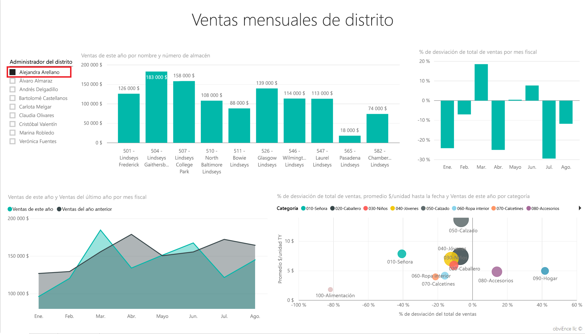

   Observe que el distrito de Allan tuvo un rendimiento mayor el año pasado en marzo y junio.
2. Ahora, con Allan aún seleccionado, haga clic en la burbuja de Mujeres.

   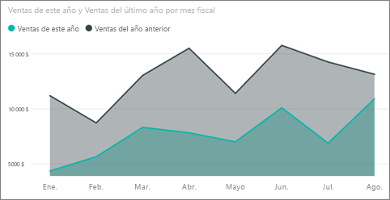

   Observe que en la categoría de las mujeres, su distrito nunca ha alcanzado el volumen del año pasado.
3. Explore los demás administradores y categorías del distrito: ¿qué otra información útil pueden encontrar?
4. Cuando esté listo, vuelva al panel.

## ¿Qué nos indican los datos sobre el crecimiento de ventas de este año?
La última área que deseamos explorar es nuestro crecimiento: las nuevas tiendas que se han abierto este año.

1. Seleccione el icono "Tiendas abiertas este año".

   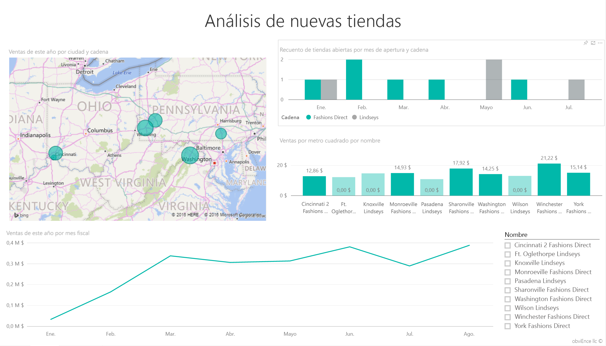

   Como puede deducirse a partir del icono: se abrieron más tiendas Fashions Direct este año que tiendas Lindseys.
2. Observe el gráfico "Ventas por pie cuadrado por nombre":

   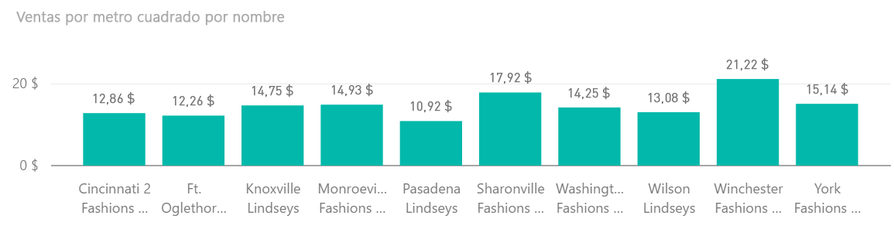

    Hay algo de diferencia en el promedio de ventas por pie cuadrado a lo largo de las tiendas nuevas.
3. Haga clic en el elemento de la leyenda de Fashions Direct en el gráfico superior derecho. Observe que, incluso para la misma cadena, la mejor tienda (Winchester Fashions Direct) supera significativamente a la peor tienda (Cincinnati 2 Fashions Direct): 21,22 $ frente a 12,86 $, respectivamente.

   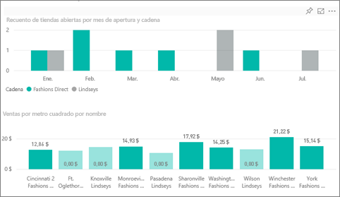
4. Haga clic en Winchester Fashions Direct en la segmentación y observe el gráfico de líneas. Las primeras cifras de ventas se notificaron en febrero.
5. Haga clic en Cincinnati 2 Fashions Direct en la segmentación y verá en el gráfico de líneas que se ha abierto en junio y que parece ser la tienda con peor rendimiento.
6. Como antes, explore haciendo clic en las otras barras, líneas y burbujas a lo largo de los gráficos y vea qué información útil puede obtener.

Se trata de un entorno seguro en el que experimentar. Siempre puede elegir no guardar los cambios. Pero si los guarda, siempre puede ir a Obtener datos para obtener una copia nueva de este ejemplo.

## Conexión con los datos
Esperamos que este paseo le haya mostrado cómo los paneles de Power BI, Preguntas y respuestas y los informes pueden ofrecer recomendaciones sobre los datos de venta directa. Ahora es su turno: conéctese a sus propios datos. Con Power BI puede conectarse a una gran variedad de orígenes de datos. Más información sobre [cómo empezar a usar Power BI](service-get-started.md).

## Pasos siguientes
* [Descargar el paquete de contenido de ejemplo de análisis de venta directa](sample-tutorial-connect-to-the-samples.md)    
* [Descargar el libro de Excel para este ejemplo de Power BI](http://go.microsoft.com/fwlink/?LinkId=529778)    
* [Obtener datos (para Power BI)](service-get-data.md)    
* [Power BI: Conceptos básicos](service-basic-concepts.md)    
* ¿Tiene más preguntas? [Pruebe la comunidad de Power BI](http://community.powerbi.com/)
