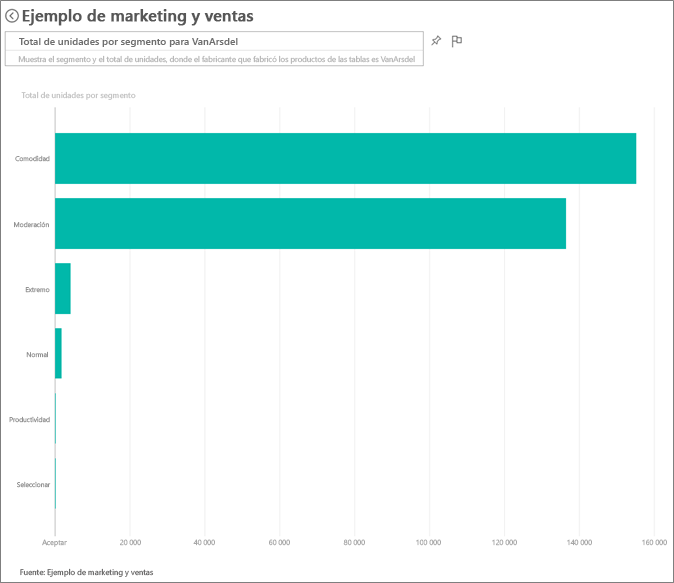
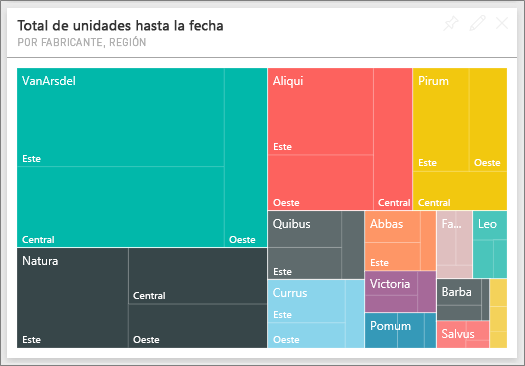
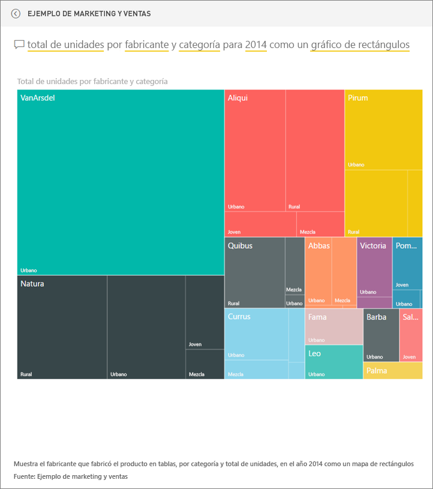
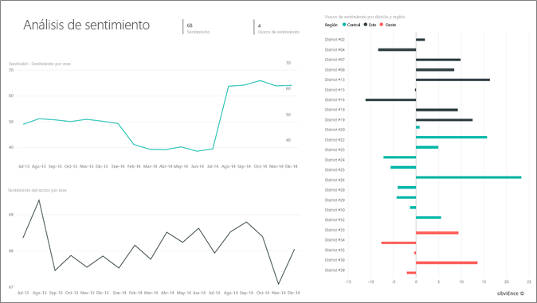
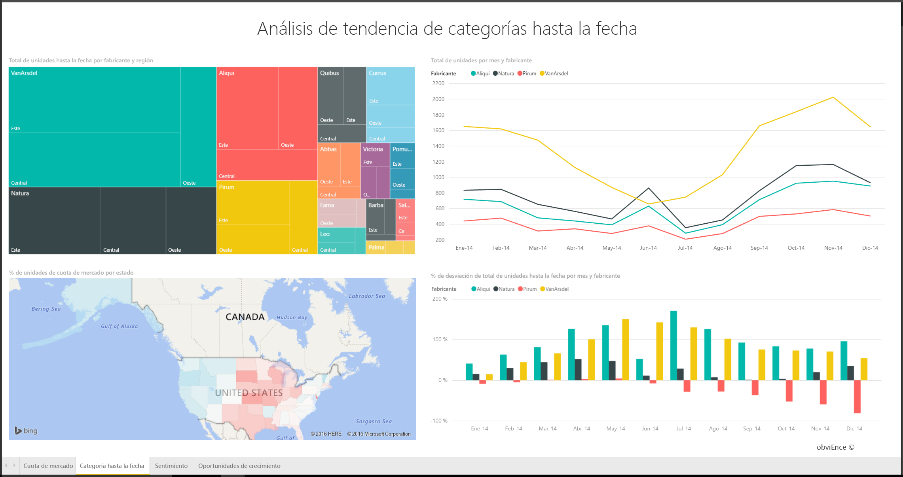
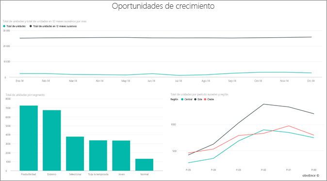

# Ejemplo de ventas y marketing para Power BI: un paseo
El **Ejemplo de ventas y marketing** muestra un panel y un informe de una empresa de fabricación ficticia denominada VanArsdel Ltd. Este panel lo creó el director de marketing (CMO) de VanArsdel para disponer de información actualizada sobre el sector, y la cuota de mercado, el volumen de productos, las ventas y las opiniones sobre su compañía.

Aunque la competencia de VanArsdel es notable, sigue siendo líder del mercado en su sector. El director de marketing desea aumentar la cuota de mercado y descubrir nuevas oportunidades de crecimiento. Sin embargo, por alguna razón, la cuota de mercado de VanArsdel comenzó a disminuir y sufrió importantes caídas en junio.

Este ejemplo forma parte de una serie en la que se muestra cómo puede usar Power BI con datos, informes y paneles empresariales. Estos son datos reales y anónimos de obviEnce (www.obvience.com).

También puede [descargar únicamente el conjunto de datos (libro de Excel) para este ejemplo](http://go.microsoft.com/fwlink/?LinkId=529785).

## ¿Qué indica el panel?
Comencemos nuestro paseo por el panel. Revisaremos los iconos que el director de marketing decidió anclar. Vemos información sobre la cuota de mercado, las ventas y las opiniones sobre la empresa. Además, podemos ver datos desglosados por región, hora y competencia.

* Los iconos con números de la columna de la izquierda muestran el volumen de ventas del sector el año pasado (50.000), la cuota de mercado (32,86 %), el volumen de ventas (16.000), la puntuación de las opiniones (68), la brecha de las opiniones (4) y el total de unidades vendidas (1 millón).`
* El gráfico de líneas superior muestra la fluctuación de la cuota de mercado a lo largo del tiempo. La cuota de mercado sufrió una fuerte caída en junio. Asimismo, la cuota de R12M (12 meses consecutivos) que se había mantenido en aumento durante cierto tiempo, comenzó a estancarse.
* Nuestro mayor competidor es Aliqui (como puede verse en el icono central con el gráfico de columnas).
* La mayor parte de nuestro negocio se encuentra en las regiones del Este y del Centro.
* El gráfico de líneas de la parte inferior muestra que nuestra caída de junio no es estacional, ya que ninguno de nuestros competidores muestra la misma tendencia.
* Los dos iconos "Total de unidades" muestran las unidades vendidas, por segmento, y por región o fabricante. Los mayores segmentos de mercado de nuestro sector son la **Productividad** y la **Comodidad**.

### Profundizar un poco más con Preguntas y respuestas
#### ¿Qué segmentos impulsan nuestras ventas? ¿Coincide con la tendencia del sector?
1. Seleccione el icono "Total de unidades en general por segmento" para abrir Preguntas y respuestas.
2. Escriba **para VanArsdel** al final de la consulta existente. Preguntas y respuestas interpreta la pregunta y muestra un gráfico actualizado con la respuesta. Nuestro volumen de productos procede de las categorías Comodidad y Moderación.
   
   
3. Nuestra cuota en las categorías **Moderación** y **Comodidad** es muy alta. Son los segmentos en los que competimos.
4. Vuelva al panel seleccionando el nombre del panel en la barra de navegación superior (rutas).

#### ¿Qué aspecto tiene la cuota de mercado del total de unidades por categoría (frente a región)?
1. Observe el icono "Total de unidades hasta la fecha por fabricante y región". ¿Cuál es el aspecto de la cuota de mercado del total de unidades por categoría? 
   
   
2. En el cuadro de preguntas de la parte superior del panel, escriba la pregunta **Total de unidades por fabricante y categoría en 2014 como gráfico de rectángulos**. Observe cómo se actualiza la visualización a medida que escribe la pregunta.
   
3. Para comparar las conclusiones, ancle el gráfico en el panel. Resulta muy interesante descubrir que, en 2014, VanArsdel solo vendió productos pertenecientes a la categoría **Urbano** .
4. Vuelva al panel.

Los paneles también constituyen una puerta de entrada a los informes.  Si un icono se creó a partir de un informe subyacente, al hacer clic en dicho icono, se abrirá el informe. 

En nuestro panel, la línea de R12M (12 meses consecutivos) muestra que nuestra cuota de mercado ya no aumenta a lo largo del tiempo (de hecho, incluso disminuye un poco). ¿Y por qué se produjo una fuerte caída de la cuota de mercado en junio? Si desea investigar en profundidad, haga clic en esta visualización para abrir el informe subyacente.

### Nuestro informe tiene cuatro páginas
#### La página 1 del informe se centra en la cuota de mercado de VanArsdel.

1. Observe el gráfico de columnas "Total de unidades por mes e isVanArsdel" de la parte inferior. La columna en color negro representa a VanArsdel (nuestros productos) y la verde es la competencia. La competencia no experimenta la caída de junio de 2014 que sufre VanArsdel.
2. El gráfico de barras "Total de volumen de categorías por segmento" del centro de la parte derecha está filtrado para muestrar los dos segmentos principales de VanArsdel. Observe cómo se creó este filtro:  
   
   a.  Expanda el panel de filtros de la derecha.  
   b.  Haga clic para seleccionar la visualización.  
   c.  En Filtros de nivel visual, fíjese en que **Segmento** está filtrado para incluir solo **Comodidad** y **Moderación**.  
   d.  Para modificar el filtro, seleccione Segmento para expandir esa sección y active **Productividad** para agregar también ese segmento.  
3. En "Total de unidades por mes e isVanArsdel", haga clic en "Sí" (en color negro en la leyenda) para establecer un filtro cruzado en la página por VanArsdel. Observe que no competimos en el segmento Productividad.
4. Vuelva a hacer clic en "Sí" (en color negro) para quitar el filtro.
5. Observe el gráfico de líneas. Muestra nuestra cuota de mercado mensual y las cuotas de mercado de 12 meses consecutivos. Los datos de los 12 meses consecutivos ayudan a matizar las fluctuaciones mensuales y muestran las tendencias a largo plazo. Seleccione Comodidad y, a continuación, Moderación en el gráfico de barras para ver cuánto fluctúa cada segmento en la cuota de mercado. El segmento Moderación muestra mucha más fluctuación en la cuota de mercado que el segmento Comodidad.

Seguimos intentando descubrir la razón por la que la cuota de mercado cayó tanto en junio. Comprobemos las opiniones.

#### La página 3 de nuestro informe se centra en las opiniones.

Twitter, Facebook, los blogs, los artículos, etc., influyen en la opinión que se muestra en los dos gráficos de líneas. El gráfico Opiniones de la parte superior izquierda muestra que la opinión de nuestros productos era bastante neutra hasta febrero. A continuación, se inició una fuerte caída en febrero que tocó fondo en junio. ¿Qué ocurrió para que se produjese esta caída en las opiniones? Debemos buscar orígenes externos. En febrero, varios artículos y publicaciones en blogs calificaron el servicio de atención al cliente de VanArsdel como el peor del sector. Esta mala prensa tuvo una correlación directa con las opiniones de los clientes y las ventas. VanArsdel trabajó duramente para mejorar el servicio de atención al cliente, y los clientes y el sector tomaron nota. En julio, empezaron a aumentar las opiniones positivas y se alcanzó un récord sin precedentes desde la década de 1960. Esta mejora de las opiniones puede verse reflejada en "Total de unidades por mes", en las páginas 1 y 3. ¿Quizás esto explica parcialmente la caída de nuestra cuota de mercado en junio?

La brecha de las opiniones es otra área que conviene explorar. ¿Qué distritos presentan una mayor brecha, cómo puede aprovechar esta realidad la administración y de qué forma puede reproducirse en otros distritos?

#### La página 2 de nuestro informe se centra en la Tendencia de categoría hasta la fecha.

* De todas las empresas de esta categoría, VanArsdel es la mayor, y nuestros principales competidores son Natura, Aliqui y Pirium. No los perderemos de vista.
* Aliqui está creciendo, pero su volumen de productos sigue siendo bajo en comparación con el nuestro.
* El gráfico de rectángulos muestra a VanArsdel en verde. En el Este los clientes nos prefieren a nosotros, en el Centro vamos bien y en el Oeste nuestra cuota es la más baja.
* La geografía repercute en las unidades vendidas. El Este es la región principal para la mayoría de los fabricantes y VanArsdel también tiene una fuerte presencia en la región central.
* En el gráfico "Total de unidades hasta la fecha, % de desviación por mes y fabricante" de la parte inferior derecha tenemos una desviación positiva, lo que es buena señal. Obtuvimos mejores resultados que el año pasado, pero también encontramos otro competidor: Aliqui.

#### La página 4 de nuestro informe se centra en el análisis de productos de la competencia.

* El gráfico de abajo a la izquierda muestra todos los segmentos de categorías, excepto los dos segmentos más fuertes de VanArsdel. Si filtra por categorías haciendo clic en las barras, podrá identificar las posibles áreas de expansión de VanArsdel. Los segmentos **Extremo** y **Productividad** están creciendo más rápido que otros.
* Sin embargo, no competimos en estos segmentos. Si deseamos entrar en estas áreas, podemos usar nuestros datos para ver qué segmentos son populares en cada región. También podemos investigar otras cuestiones, como qué región está creciendo más rápido y quién sería nuestro mayor competidor en ese segmento.
* ¿Recuerda la caída de nuestra cuota de mercado en junio? Junio es un mes muy importante para el segmento Productividad, en el que no competimos en absoluto. Esto podría explicar la caída de nuestra cuota de mercado en junio.

Si filtra las visualizaciones por VanArsdel, segmento, mes y región, podrá descubrir las oportunidades de crecimiento de VanArsdel.

Se trata de un entorno seguro en el que experimentar. Siempre puede elegir no guardar los cambios. Pero si los guarda, en **Obtener datos** podrá obtener una nueva copia de este ejemplo siempre que lo desee.

## Pasos siguientes: conectarse a sus propios datos
Esperamos que este paseo le haya mostrado cómo los paneles de Power BI, Preguntas y respuestas y los informes pueden ofrecerle información detallada sobre los datos de ventas y marketing. Ahora es su turno: conéctese a sus propios datos. Con Power BI puede conectarse a una gran variedad de orígenes de datos. Más información sobre [cómo empezar a usar Power BI](service-get-started.md).  

