# Ejemplo de análisis de calidad de proveedores para Power BI: un paseo
Este panel de ejemplo del sector y el informe subyacente se centran en uno de los desafíos habituales de la cadena de suministro: el análisis de calidad del proveedor.
Hay dos métricas principales en juego en este análisis: el número total de defectos y el tiempo de inactividad total que estos defectos han provocado. Este ejemplo tiene dos objetivos principales:

* Comprender quiénes son los mejores y los peores proveedores desde el punto de vista de la calidad
* Identificar las plantas que son más eficaces a la hora de encontrar y rechazar defectos, con el fin de minimizar los tiempos de inactividad

Este ejemplo forma parte de una serie en la que se muestra cómo puede usar Power BI con datos, informes y paneles empresariales.
Estos son datos reales y anónimos de obviEnce ([www.obvience.com](http://www.obvience.com/)).

También puede [descargar únicamente el conjunto de datos (libro de Excel) para este ejemplo](http://go.microsoft.com/fwlink/?LinkId=529779). 

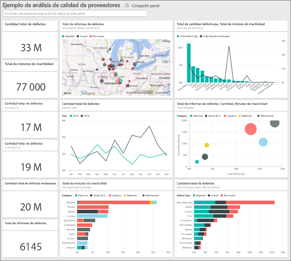

## Tiempos de inactividad causados por materiales defectuosos
Vamos a analizar el tiempo de inactividad causado por los materiales defectuosos y a detectar qué proveedores son responsables.  

1. En el panel, seleccione el icono de número **Cantidad total de defectos** o el icono de número **Total de minutos de tiempo de inactividad** .  
   
     
   
   El informe "Ejemplo de análisis de calidad de proveedores" se abre en la página "Análisis del tiempo de inactividad". Observe que tenemos un total de 33 millones de piezas defectuosas y que el tiempo de inactividad total causado por estas piezas es de 77.000 minutos. Algunos materiales tienen menos unidades defectuosas, pero pueden provocar retrasos importantes y mayores tiempos de inactividad. Veámoslo en la página de informes.  
2. Si examinamos la línea **Total de minutos de tiempo de inactividad** del gráfico combinado **Defectos y tiempo de inactividad (min) por tipo de material** , vemos que los materiales corrugados provocan los mayores tiempos de inactividad.  
3. Seleccione la columna **Corrugado** del mismo gráfico combinado para ver qué plantas resultan más afectadas por este defecto y qué proveedor es el responsable.  
   
     
4. Seleccione plantas individuales en el mapa para ver qué proveedor o material es responsable del tiempo de inactividad en cada planta.

### ¿Cuáles son los peores proveedores?
 Queremos encontrar a los ocho peores proveedores y determinar de qué porcentaje del tiempo de inactividad son responsables. Podemos hacerlo convirtiendo el gráfico de área **Tiempo de inactividad (min) por proveedor** en un gráfico de rectángulos.  

1. En la página 3 del informe, "Análisis del tiempo de inactividad", seleccione **Editar informe** en la esquina superior izquierda.  
2. Seleccione el gráfico de área **Tiempo de inactividad (min) por proveedor** y, en el panel de visualizaciones, seleccione Gráfico de rectángulos.  
   
   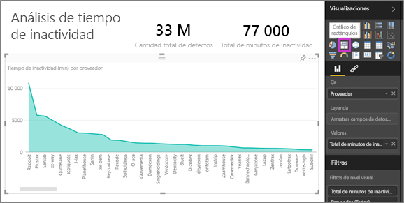  
   
    El gráfico de rectángulos define automáticamente el campo **Proveedor** como **Grupo**.  
   
    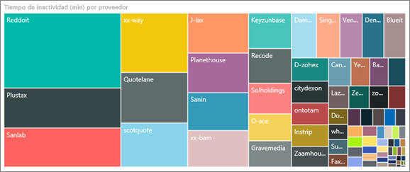  
   
   En este gráfico de rectángulos, podemos ver que los ocho principales proveedores son los ocho bloques de la izquierda del gráfico. También podemos ver que representan aproximadamente el 50 % del total de minutos de tiempo de inactividad.  
3. Seleccione **Ejemplo de análisis de calidad de proveedores** en la barra de navegación superior para volver al panel.

### Comparar plantas
Ahora veamos qué planta trabaja mejor a la hora de gestionar el material defectuoso, reduciendo así el tiempo de inactividad.  

1. Seleccione el icono del mapa **Total de informes de defectos por planta y tipo de defecto** .  
   
    El informe se abre en la página "Calidad de proveedores".  
   
   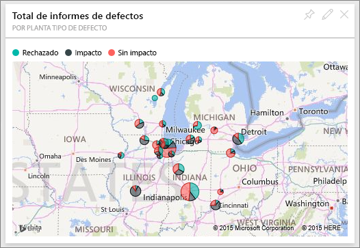  
2. En la leyenda del mapa, seleccione el círculo **Impacto** .  
   
    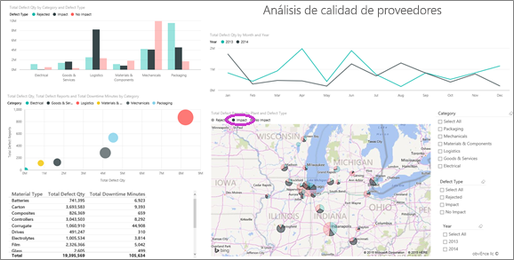  
   
    Observe que, en el gráfico de burbujas, **Logística** es la categoría con más problemas: es la más importante en cuanto a los totales de defectos, informes de defectos y minutos de tiempo de inactividad. Veamos esta categoría de forma más detallada.  
3. Seleccione la burbuja Logística en el gráfico de burbujas y observe las plantas de Springfield (Illinois) y Naperville (Illinois). Naperville parece haber mejorado la gestión de los suministros defectuosos, ya que tiene un alto número de rechazos y pocos impactos, en comparación con el elevado número de impactos de Springfield.  
   
   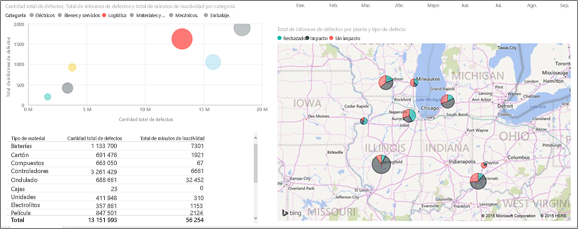  
4. Seleccione **Ejemplo de análisis de calidad de proveedores** en la barra de navegación superior para volver al área de trabajo activa.

## ¿Qué tipo de material se gestiona mejor?
El tipo material que se gestiona mejor es el que presenta un menor tiempo de inactividad o un impacto nulo, independientemente de la cantidad de defectos.

* En el panel, examine el icono **Total Defect Quantity by Material Type, Defect Type**.
  
  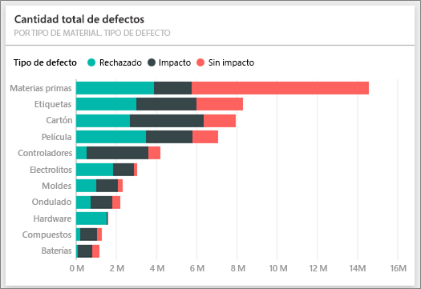

Fíjese en que la categoría **Materias primas** tiene muchos defectos totales, pero la mayoría se rechazan o no tienen ningún impacto.

Comprobemos ahora que las materias primas no provocan grandes tiempos de inactividad, a pesar del elevado número de defectos encontrados.

* En el panel, examine el icono **Cantidad total de defectos y total de minutos de tiempo de inactividad por tipo de material** .
  
  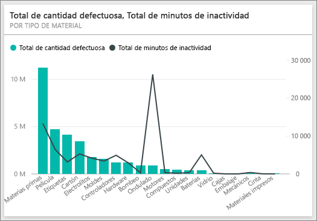

Aparentemente, las materias primas se gestionan bien: tienen más defectos, pero un total menor de minutos de tiempo de inactividad.

### Comparar los defectos con el tiempo de inactividad por año
1. Seleccione el icono del mapa **Total de informes de defectos por planta y tipo de defecto** para abrir el informe por la primera página: Calidad de proveedores.
2. Observe que **Cantidad de defectos** es mayor en 2014 que en 2013.  
   
    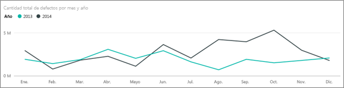  
3. ¿Significa eso que más defectos conllevan más tiempo de inactividad? Podemos hacer preguntas en el cuadro de Preguntas y respuestas para averiguarlo.  
4. Seleccione **Ejemplo de análisis de calidad de proveedores** en la barra de navegación superior para volver al panel.  
5. Puesto que sabemos que las materias primas tienen el mayor número de defectos, escriba en el cuadro de preguntas "Mostrar tipos de materiales, año y cantidad total de defectos".  
   
    Había muchos más defectos en las materias primas en 2014 que en 2013.  
   
    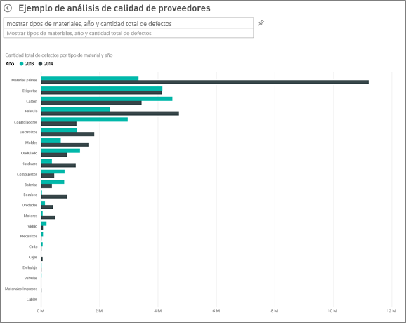  
6. Ahora cambie la pregunta para "Mostrar tipos de materiales, año y total de minutos de tiempo de inactividad".  
   
   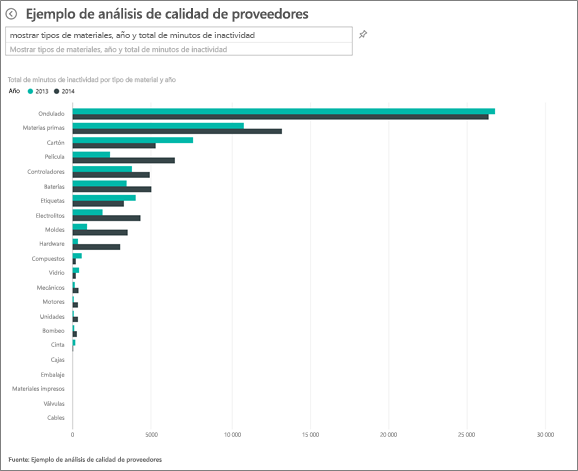

El tiempo de inactividad de las materias primas era aproximadamente el mismo en 2013 y 2014, aunque hubo muchos más defectos en las materias primas en 2014.

Eso significa que el mayor número de defectos en las materias primas registrado en 2014 no provocó tiempos significativamente mayores de inactividad en las materias primas ese mismo año.

### Comparar los defectos con el tiempo de inactividad mes a mes
Echemos un vistazo ahora a otro icono del panel relacionado con la cantidad total de defectos.  

1. Seleccione la flecha Atrás  en la esquina superior izquierda, sobre el cuadro de preguntas, para volver al panel.  
   
    Si examina detenidamente el icono **Cantidad total de defectos por mes y año** , verá que la primera mitad de 2014 tenía un número similar de defectos al de 2013 pero, en la segunda mitad de 2014, el número de defectos aumentó considerablemente.  
   
    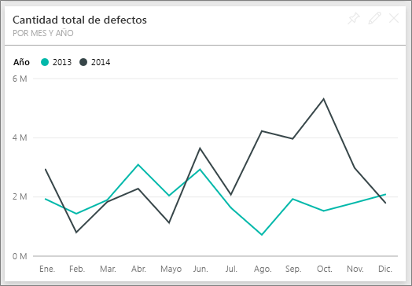  
   
    Veamos si este incremento en la cantidad de defectos provocó un aumento semejante en los minutos de tiempo de inactividad.  
2. En el cuadro de preguntas, escriba "Total de minutos de tiempo de inactividad por mes y año en gráfico de líneas".  
   
   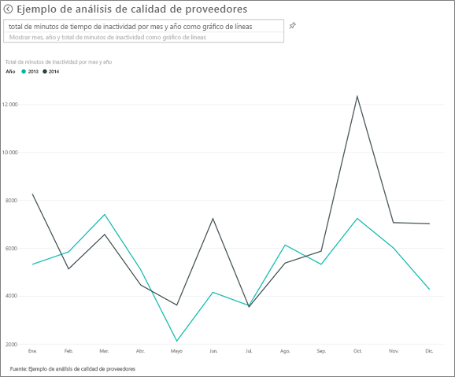
   
   Efectivamente, se aprecia un aumento en los minutos de tiempo de inactividad en junio y octubre. Pero, aparte de eso, el aumento en el número de defectos no provocó tiempos de inactividad mucho mayores. Esto demuestra que los defectos se están gestionando bien.  
3. Para anclar este gráfico en el panel, seleccione el icono de anclaje  situado a la derecha del cuadro de preguntas.  
4. Para explorar los meses de valores atípicos, consulte los minutos de tiempo de inactividad en octubre por tipo de material, ubicación de la planta, categoría, etc. Para ello, formule preguntas como "Total de minutos de tiempo de inactividad en octubre por planta".    
5. Seleccione la flecha Atrás  en la esquina superior izquierda, sobre el cuadro de preguntas, para volver al panel.

Se trata de un entorno seguro en el que experimentar. Siempre puede elegir no guardar los cambios. Pero si los guarda, en **Obtener datos** podrá obtener una nueva copia de este ejemplo siempre que lo desee.

## Pasos siguientes: conectarse a sus propios datos
Esperamos que este paseo le haya mostrado cómo los paneles de Power BI, Preguntas y respuestas y los informes pueden proporcionar información detallada sobre los datos de calidad de proveedores. Ahora es su turno: conéctese a sus propios datos. Con Power BI puede conectarse a una gran variedad de orígenes de datos. Más información sobre [cómo empezar a usar Power BI](service-get-started.md).

