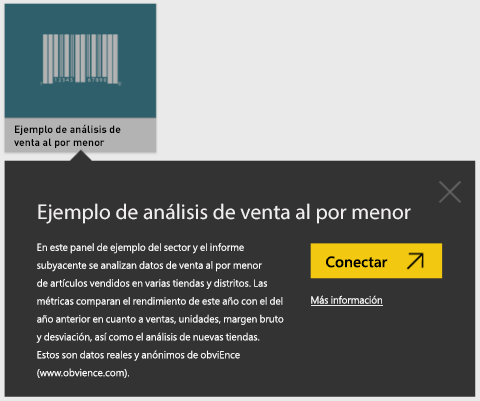
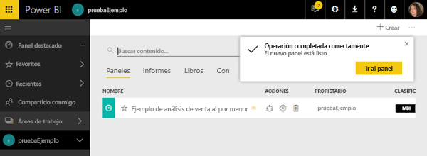
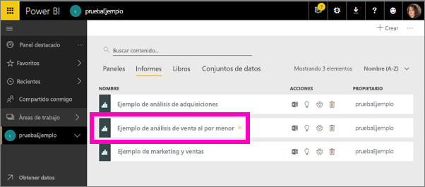
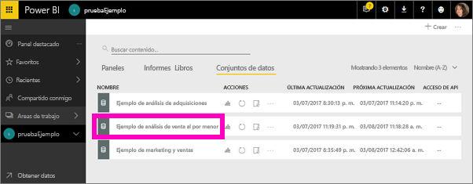
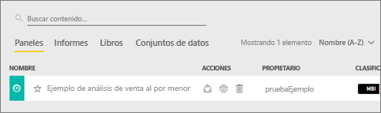
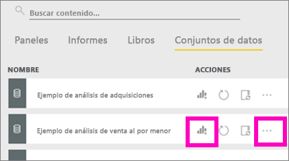
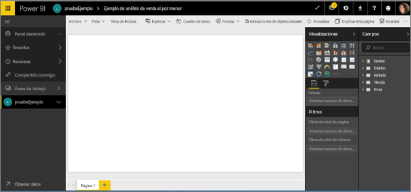

# Tutorial: Uso de los ejemplos de Power BI
<!-- Shared newnav Include -->
[!INCLUDE [newnavbydefault](./includes/newnavbydefault.md)]

Se recomienda empezar por el artículo [Conjuntos de datos de ejemplo para Power BI](sample-datasets.md). En ese artículo aprenderá todo acerca de los ejemplos: cómo obtenerlos, dónde guardarlos, cómo usarlos y algunas de las cosas que nos explica cada ejemplo. A continuación, cuando ya conozca los conceptos básicos, vuelva a este Tutorial.   

## Acerca de este tutorial
Este tutorial le enseña cómo importar los paquetes de contenido de ejemplo, agregarlos al servicio Power BI y abrir el contenido. Un *paquete de contenido* es un tipo de ejemplo en el que el conjunto de datos está integrado en un panel y un informe. Los paquetes de contenido de ejemplo se descargan desde Power BI mediante **Obtener datos**.

> [!NOTE]
> Este tutorial se aplica al servicio Power BI y no a Power BI Desktop.
> 
> 

El paquete de contenido *Ejemplo de análisis de minoristas* que se usa en este tutorial se compone de un panel, un informe y un conjunto de datos.
Para familiarizarse con este paquete de contenido particular y su escenario, quizás quiera [realice un recorrido por el ejemplo de análisis de minoristas](sample-retail-analysis.md) antes de comenzar.

## Obtener datos (en este caso, obtener un paquete de contenido de ejemplo)
1. Abra el servicio Power BI e inicie sesión en él (app.powerbi.com).
2. Seleccione un área de trabajo y cree un nuevo panel.  
   
    
3. Llámelo **Ejemplo Análisis de venta directa**.
   
   
4. Seleccione **Obtener datos** en la parte inferior del panel de navegación izquierdo. Si no ve la opción **Obtener datos**, seleccione  para expandir el panel de navegación.
   
   
5. Seleccione **Ejemplos**.  
   
   
6. Seleccione el *Ejemplo Análisis de venta directa* y elija **Conectar**.   
   
   

## ¿Qué se importó exactamente?
Con los paquetes de contenido de ejemplo, cuando selecciona **Conectar**, Power BI realmente crea una copia de ese paquete de contenido y la almacena en la nube. Como la persona que creó el paquete de contenido incluyó un conjunto de datos, un informe y un panel, eso es justamente lo que obtendrá si hace clic en **Conectar**.

1. Power BI crea el nuevo panel y lo muestra en la pestaña **Paneles**. El asterisco amarillo le indicará que es nuevo.
   
   
2. Abra la pestaña **Informes**.  Aquí verá un nuevo informe denominado *Ejemplo Análisis de venta directa*.
   
   
   
   Compruebe la pestaña **Conjuntos de datos**.  Allí verá un conjunto de datos nuevo.
   
   

## Explorar el contenido nuevo
Ahora, explore el panel, el conjunto de datos y los informes por su cuenta. Hay muchas maneras diferentes de navegar por los paneles, informes y conjuntos de datos, pero solo una de ellas se describe a continuación.  

> [!TIP]
> ¿Quiere primero algo de orientación?  Consulte el [paseo por el ejemplo de análisis de venta directa](sample-retail-analysis.md) para ver un tutorial detallado sobre este ejemplo.
> 
> 

1. Vuelva a la pestaña **Paneles** y seleccione el panel *Ejemplo Análisis de venta directa* para abrirlo.    
   
   
2. El panel se abre.  Cuenta con una serie de iconos de visualización.
   
   
3. Seleccione uno de los iconos para abrir el informe subyacente.  En este ejemplo, se seleccionará el gráfico de áreas (resaltado en rosa en la imagen anterior). El informe se abre en la página que contiene ese gráfico de áreas.
   
    
   
   > [!NOTE]
   > Si el icono se ha creado mediante [Preguntas y respuestas de Power BI](service-q-and-a.md), se abrirá la página de Preguntas y respuestas en su lugar.
   > 
   > 
4. De vuelta en la pestaña **Conjuntos de datos**, tiene varias opciones para explorar el conjunto de datos.  No podrá abrirla y ver todas las filas y columnas (como podría hacer en Power BI Desktop o Excel).  Cuando un usuario comparte un paquete de contenido con sus compañeros, normalmente lo que desea es compartir la información, no dar a sus compañeros acceso directo a los datos. Pero eso no significa que no pueda explorar el conjunto de datos.  
   
   
   
   * Una manera de explorarlo es mediante la creación de sus propios informes y visualizaciones desde cero.  Seleccione el icono de gráfico  para abrir el conjunto de datos en el modo de edición del informe.
     
       
   * Otra manera de explorar el conjunto de datos es ejecutar [Información rápida](service-insights.md). Seleccione el botón de puntos suspensivos (...) y elija **Obtener información**. Cuando la información ya está lista, seleccione **Ver información**.
     
       

## Pasos siguientes
[Conceptos básicos de Power BI](service-basic-concepts.md)

[Ejemplos del servicio Power BI](sample-datasets.md)

[Orígenes de datos de Power BI](service-get-data.md)

¿Tiene más preguntas? [Pruebe la comunidad de Power BI](http://community.powerbi.com/)

