# Administración de la capacidad en Power BI Premium y Power BI Embedded
Aprenda a administrar la capacidad de Power BI Premium y Power BI Embedded que ofrece recursos dedicados para su contenido.

La capacidad es el núcleo de las ofertas Power BI Premium y Power BI Embedded.

## ¿Cuál es la capacidad?
La capacidad es el conjunto de recursos reservados para uso exclusivo por parte del usuario. Tener su propia capacidad le permite publicar paneles, informes y conjuntos de datos para los usuarios de su organización sin tener que adquirir licencias para ellos. También garantiza un rendimiento confiable y continuo del contenido hospedado en la capacidad.

La capacidad es totalmente transparente para los usuarios finales. Ellos continuarán usando Power BI o su aplicación como de costumbre. No tienen que saber que parte (o todo) el contenido está hospedado en su capacidad dedicada. Para los usuarios, todo funciona exactamente igual que antes.

[!INCLUDE [powerbi-premium-illustration](./includes/powerbi-premium-illustration.md)]

Para más información, consulte [What is Power BI Pro?](service-premium.md) (¿Qué es Power BI Premium?).

## Comprar capacidad
Para aprovechar las ventajas de la capacidad dedicada, debe comprar una suscripción a Power BI Premium en el centro de administración de Office 365, o crear un recurso de Power BI Embedded en Microsoft Azure Portal. Para más información, consulte los artículos siguientes:

* **Power BI Premium:** [Adquisición de Power BI Premium](service-admin-premium-purchase.md)
* **Power BI Embedded**: [Creación de una capacidad de Power BI Embedded en Azure Portal](https://docs.microsoft.com/en-us/azure/power-bi-embedded/create-capacity)

Al adquirir SKU de Power BI Premium, su inquilino recibirá el número correspondiente de núcleos virtuales para usarlos en la capacidad de ejecución. Por ejemplo, si compra una SKU P3 de Power BI Premium, proporciona al inquilino 32 núcleos virtuales.

> [!NOTE]
> Tendrá 30 días de acceso completo una vez caducada su suscripción, pero después el contenido volverá a una capacidad compartida. Los modelos superiores a 1 GB no se admitirán con una licencia compartida normal.
>

## Administradores de capacidad
> [!NOTE]
> Los administradores de capacidad, para la capacidad de Power BI Embedded, se definen en Microsoft Azure Portal.
> 
> 

Cuando se le designa como administrador de una capacidad, tiene el control total sobre esta capacidad y sobre sus características administrativas. En el portal de administración de Power BI, puede agregar más administradores de capacidad (solo en Power BI Premium) o proporcionar a los usuarios permisos de asignación de capacidad. Puede asignar áreas de trabajo en masa a una capacidad y ver las métricas de uso de una capacidad.

Cada capacidad tiene sus propios administradores. Definir un administrador de capacidad para una capacidad no le concede acceso a todas las capacidades de la organización. De forma predeterminada, los administradores de capacidad no tienen acceso a todas las áreas de administración de Power BI, por ejemplo, las métricas de uso, los registros de auditoría o la configuración de inquilinos. Además, los administradores de capacidad no tiene permiso para configurar nuevas capacidades ni cambiar las SKU de las capacidades existentes. Solo los administradores globales o los administradores de servicios de Power BI tienen acceso a esos elementos.

Todos los administradores de Office 365 Global y Power BI son automáticamente administradores tanto de la capacidad de Power BI Premium como de Power BI Embedded.

## Administración de la capacidad
Después de comprar nodos de capacidad en Office 365, deberá configurar una nueva capacidad. Esto se hace mediante el [portal de administración de Power BI](service-admin-portal.md). En el portal de administración, verá una sección llamada **Configuración de la capacidad**. Aquí es donde puede administrar las capacidades de Power BI Premium de la organización.

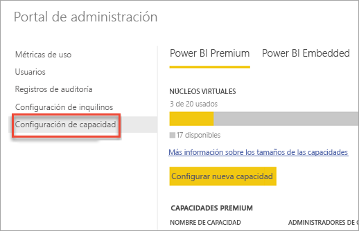

Al seleccionar **Configuración de la capacidad**, la pantalla de administración de la capacidad se abrirá en Power BI Premium de forma predeterminada.

### Configuración de una nueva capacidad (Power BI Premium)
El número de núcleos virtuales reflejará la cantidad utilizada y la cantidad disponible para crear capacidades. El número de núcleos virtuales disponibles para su organización se basa en las SKU Premium que haya adquirido. Por ejemplo, si compra una SKU P3 y una SKU P2, habría 48 núcleos disponibles (32 de P3 y 16 de P2).

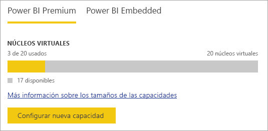

Si tiene núcleos virtuales disponibles, puede configurar la nueva capacidad de la siguiente manera.

1. Seleccione **Configurar nueva capacidad**.
2. Otorgue un **nombre** a la capacidad.
3. Defina quién es el administrador de esta capacidad.
   
    No es necesario que los administradores de capacidad sean administradores de Power BI o administradores globales de Office 365. Para más información, consulte [Administradores de capacidad de Power BI Premium](#capacity-admins).
4. Seleccione el tamaño de la capacidad. Las opciones disponibles dependen de cuántos núcleos virtuales disponibles haya. No se puede seleccionar una opción mayor que lo que hay disponible.
   
    
5. Seleccione **Configurar**.

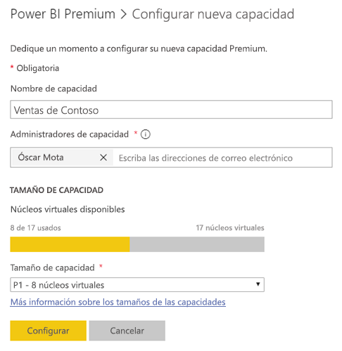

Los administradores de capacidad, así como los administradores de Power BI y los administradores globales de Office 365, podrán ver posteriormente la capacidad en el portal de administración.

### Configuración de capacidad
En la pantalla de administración de la capacidad Premium, puede seleccionar el **icono de engranaje (configuración)** en Acciones. Esto le permitirá cambiar el nombre de una capacidad o eliminarla. También indicará quiénes son los administradores del servicio, la SKU o el tamaño de la capacidad, y en qué región está.

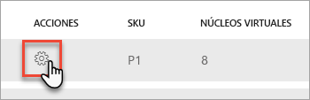

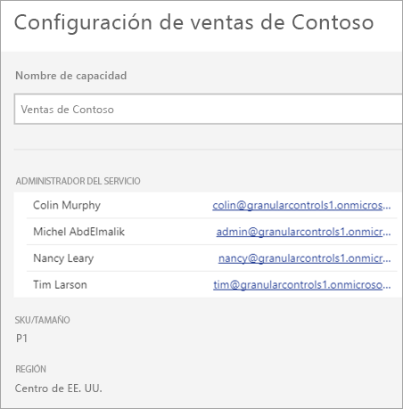

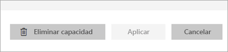

> [!NOTE]
> La configuración de la capacidad de Power BI Embedded se administra en Microsoft Azure Portal.
> 
> 

### Cambio del tamaño de la capacidad (Power BI Premium)
Para cambiar el tamaño de la capacidad de Power BI Premium, los administradores de Power BI y los administradores globales de Office 365 pueden seleccionar **Cambiar tamaño de capacidad**. Los administradores de capacidad que no sean administradores de Power BI o administradores globales de Office 365 no tendrán esta opción.

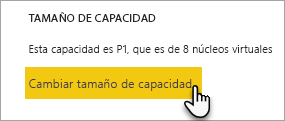

La pantalla **Cambiar tamaño de capacidad** permite aumentar o reducir el tamaño de la capacidad si tiene los recursos disponibles. Los administradores pueden crear, cambiar el tamaño y eliminar nodos libremente, siempre y cuando tengan el número necesario de núcleos virtuales. 

Las SKU P no se pueden reducir a SKU EM. Al mantener el puntero sobre las opciones deshabilitadas, verá una explicación.

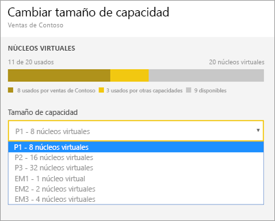

### Asignación de capacidad
Para administrar una capacidad, puede seleccionar el nombre de la misma. Después de hacerlo, irá a la pantalla de administración de la capacidad.

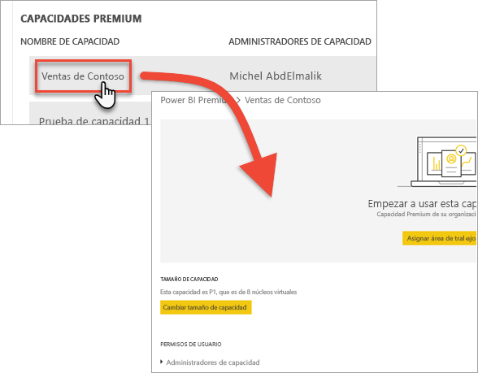

Si no se han asignado áreas de trabajo a la capacidad, verá un mensaje que le permite **Asignar áreas de trabajo**.

#### Permisos de usuario
Puede asignar **Administradores de capacidad** adicionales a las capacidades de Power BI Premium. También puede asignar usuarios que tendrán administradores de capacidad adicionales, así como asignar los usuarios que tendrán **permisos de asignación de capacidad**. Los usuarios con permisos de asignación pueden asignar un área de trabajo de aplicación a la capacidad si son administradores de esa área de trabajo. También pueden asignar *Mi área de trabajo* personal a la capacidad. Los usuarios con permisos de asignación no tendrán acceso al portal de administración.

> [!NOTE]
> Para la capacidad de Power BI Embedded, los administradores de capacidad se asignan en Microsoft Azure Portal.
> 
> 

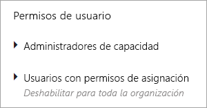

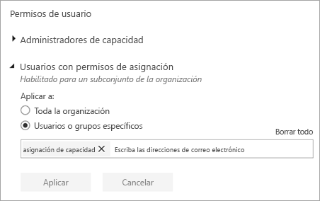

## Mediciones de uso (Power BI Premium)
Para cada capacidad, podrá usar las mediciones de uso de la CPU, la memoria y de Direct Query. Cada KPI consta de tres niveles, **Bueno (verde)**, **Marginal (amarillo)** y **Crítico (rojo)**. Se recomienda supervisar estas métricas para asegurarse de que los usuarios experimenten un buen rendimiento al usar el contenido Premium.

**El uso de la capacidad de Power BI Embedded se supervisa en Azure Portal.**

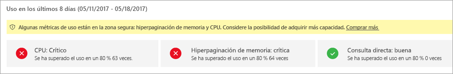

| Métrica | Descripción |
| --- | --- |
| CPU |Uso de CPU de los núcleos. |
| Memoria |Representa la presión de memoria de los núcleos de back-end. Concretamente, se trata de una métrica que indica con qué frecuencia se desalojan los modelos de la memoria debido a la presión que resulta del uso de varios modelos. |
| DQ/s |* Se limita el número total de consultas de DirectQuery y consultas de conexión dinámica por segundo. * Los límites son 30/s para P1, 60/s para P2 y 120/s para P3. * Las consultas de DirectQuery y las de conexión dinámica valen lo mismo en relación con las limitaciones anteriores. Por ejemplo, si tiene 15 consultas de DirectQuery y 15 de conexiones dinámicas en un segundo, habrá alcanzado el límite. * Esto se aplica igualmente a las conexiones en la nube y a las locales. |

Cuando estas métricas son marginales o críticas, los usuarios pueden experimentar una degradación del rendimiento de los informes y de la capacidad de actualización, especialmente durante los períodos de carga máxima.

Las métricas reflejan la utilización durante la semana anterior y están diseñadas para hacer un recuento de las instancias en las que se superó la capacidad y en las que, consecuentemente, se proporcionó a los usuarios un rendimiento inferior al óptimo.

Cada período de *utilización superior al 80%* debe considerarse un posible caso de degradación del rendimiento. Si hay demasiados casos, esto puede indicar problemas de rendimiento significativos para los usuarios.

## Asignación de un área de trabajo a una capacidad
Hay varias maneras de asignar un área de trabajo a una capacidad.

### Administración de la capacidad en el portal de administración
Los administradores de capacidad, junto con los administradores de Power BI y los administradores globales de Office 365 pueden asignar en masa áreas de trabajo en la sección de administración de la capacidad Premium del portal de administración. Al administrar una capacidad, se muestra una sección **Áreas de trabajo** que le permite asignar áreas de trabajo.

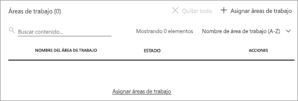

1. Seleccione **Asignar áreas de trabajo**. Esta opción aparece en varios lugares y realizan siempre la misma tarea.
2. Seleccione las **áreas de trabajo de toda la organización** o **áreas de trabajo específicas por usuario**.
   
   | Selección | Descripción |
   | --- | --- |
   | **Áreas de trabajo de toda la organización** |Asignar áreas de trabajo de toda la organización a la capacidad Premium hará que se asignen todas las áreas de trabajo de la aplicación y las áreas de trabajo personales de la organización, a esta capacidad Premium. Además, todos los usuarios actuales y los futuros tendrán permiso para reasignar las áreas de trabajo individuales a esta capacidad. |
   | **Áreas de trabajo específicas por usuario** |Al asignar áreas de trabajo por usuario o grupo, todas las áreas de trabajo que pertenecen a esos usuarios se asignan a la capacidad Premium, incluida el área de trabajo personal del usuario. Estos usuarios obtendrán automáticamente permisos de asignación de área de trabajo. Esto incluye las áreas de trabajo ya asignadas a una capacidad diferente. |
3. Seleccione **Aplicar**.

Esta opción no le permite asignar áreas de trabajo específicas a una capacidad.

### Configuración del área de trabajo de la aplicación
También puede asignar un área de trabajo de la aplicación a una capacidad Premium desde la configuración de esa área de trabajo. Para asignar un área de trabajo de la aplicación a una capacidad Premium, haga lo siguiente.

Para mover un área de trabajo a una capacidad, debe tener permisos de administrador sobre esa área de trabajo, así como permisos de asignación de capacidad para esa capacidad. Tenga en cuenta que los administradores de áreas de trabajo siempre pueden quitar un área de trabajo de la capacidad Premium.

1. Edite un área de trabajo de la aplicación seleccionando el icono de **puntos suspensivos (...)** y seleccionando **Editar área de trabajo**.
   
    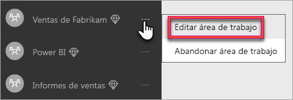
2. En **Editar área de trabajo**, expanda **Avanzado**.
3. Si ha concedido permisos de asignación de capacidad a cualquier capacidad, podrá activar la opción **Premium** para esta área de trabajo.
4. Seleccione la capacidad que desea asignar a esta área de trabajo de la aplicación.
   
    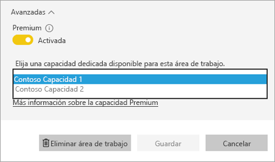
5. Seleccione **Guardar**.

Una vez guardada, el área de trabajo y todo lo que contiene, se moverá a la capacidad Premium sin que los usuarios finales experimenten ninguna interrupción.

## Aspecto de Premium para los usuarios
En la mayoría de los casos, los usuarios no necesitan saber siquiera que están en una capacidad Premium. Sus paneles e informes, simplemente funcionan. Como ayuda visual, podrá ver un icono de diamante junto a las áreas de trabajo que están en una capacidad Premium. 

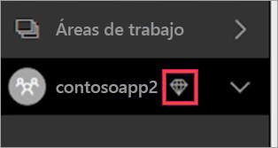

## Clave de producto de Power BI Report Server
En la pestaña **Configuración de la capacidad** del portal de administración de Power BI, tendrá acceso a la clave de producto de Power BI Report Server. Esta opción solo estará disponible para los administradores globales o los usuarios a quienes se haya asignado el rol de administrador del servicio Power BI, si ha comprado una SKU de Power BI Premium.

Al seleccionar **Clave del servidor de informes de Power BI**, se mostrará un cuadro de diálogo con su clave de producto. Puede copiarla y usarla en la instalación.

Para más información, consulte [Instalar un servidor de informes de Power BI](report-server/install-report-server.md).

## Pasos siguientes
Compartir aplicaciones publicadas con usuarios con acceso gratuito al asignar el área de trabajo a una capacidad Premium. Para más información, consulte [Creación y distribución de una aplicación en Power BI](service-create-distribute-apps.md).

¿Tiene más preguntas? [Pruebe a preguntar a la comunidad de Power BI](http://community.powerbi.com/)

