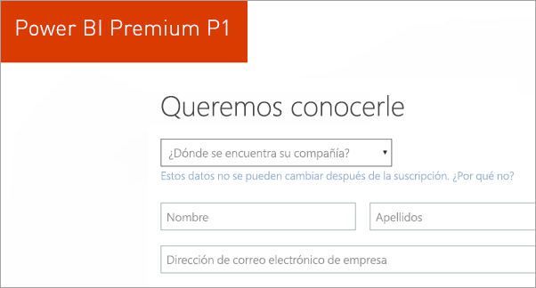
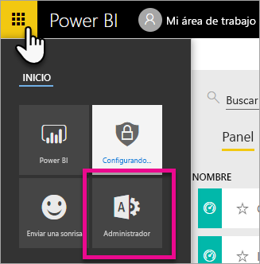
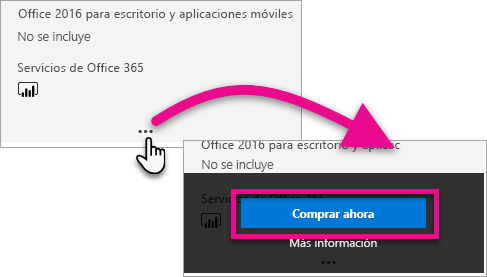
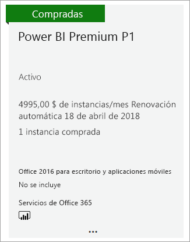
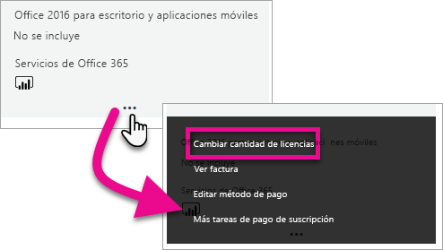
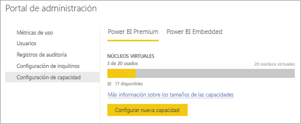
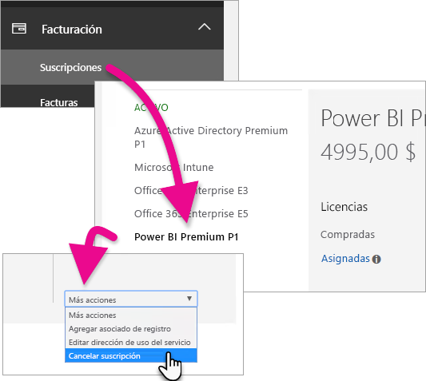
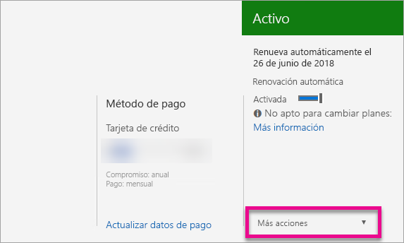

# Adquisición de Power BI Premium
Obtenga información sobre cómo adquirir la capacidad de Power BI Premium para su organización.

<iframe width="640" height="360" src="https://www.youtube.com/embed/NkvYs5Qp4iA?rel=0&amp;showinfo=0" frameborder="0" allowfullscreen></iframe>

Puede adquirir un nodo de la capacidad de Power BI Premium en el Centro de administración de Office 365. También puede disponer de cualquier combinación de SKU de la capacidad Premium (P1 a P3) en la organización. Ofrecen diferentes funcionalidades de recursos.

Para obtener más información sobre qué es Power BI Premium, vea [¿Qué es Power BI Premium?](service-premium.md) Para ver los precios actuales de Power BI, consulte la [página de precios de Power BI](https://powerbi.microsoft.com/pricing/). También puede planear los costos de Power BI Premium mediante el uso de la [Calculadora de Power BI Premium](https://powerbi.microsoft.com/calculator/).

> [!IMPORTANT]
> Los autores de contenido aún necesitarán una licencia de Power BI Pro, incluso si se adquiere Power BI Premium.
> 
> 

## Creación de un nuevo inquilino con Power BI Premium P1
Si no tiene ningún inquilino y desea crear uno, puede adquirir Power BI Premium a la vez. El vínculo siguiente le guiará por el proceso de creación de un inquilino para su uso con Office 365 y le permitirá adquirir Power BI Premium. Deberá adquirir una licencia de Power BI Pro para un usuario una vez creado el inquilino. Al crear el inquilino, será automáticamente el administrador global para ese inquilino.

Para realizar esta adquisición, consulte [Oferta de Power BI Premium P1](https://signup.microsoft.com/Signup?OfferId=b3ec5615-cc11-48de-967d-8d79f7cb0af1).

## Adquisición de la capacidad de Power BI Premium para una organización existente
Si tiene una organización existente, deberá ser un administrador global o un administrador de facturación para poder comprar suscripciones y licencias. Para obtener más información, vea [Acerca de los roles de administrador de Office 365](https://support.office.com/article/About-Office-365-admin-roles-da585eea-f576-4f55-a1e0-87090b6aaa9d).

Para adquirir una capacidad Premium, debe hacer lo siguiente.

1. En el servicio Power BI, seleccione el **selector de aplicaciones de Office 365** > **Administración**. O bien, puede ir al Centro de administración de Office 365. Para ello, vaya a https://portal.office.com y seleccione **Administración**.
   
    
2. Seleccione **Facturación** > **Servicios de compra**.
3. En **Otros planes**, busque las ofertas de Power BI Premium. En la lista aparecerá como P1 a P3, EM3 y P1 (mes a mes).
4. Mantenga el puntero sobre los **puntos suspensivos (...)** y después seleccione **Comprar ahora**.
   
    
5. Siga estos pasos para completar la compra.

También puede seleccionar los siguientes vínculos que le llevarán directamente a las páginas de compra de esos elementos. Para obtener más información sobre estas SKU, consulte [¿Qué es Power BI Premium?](service-premium.md#premiumskus)

***Debe ser un administrador global o de facturación*** dentro del inquilino para poder comprar una SKU de Power BI Premium. Si selecciona los siguientes vínculos sin ser un administrador, se producirá un error.

| Vínculos directos de compra |
| --- |
| [SKU EM3 (mes a mes)](https://portal.office.com/commerce/completeorder.aspx?OfferId=4004702D-749C-4F74-BF47-3048F1833780&adminportal=1) |
| [SKU de P1](https://portal.office.com/commerce/completeorder.aspx?OfferId=b3ec5615-cc11-48de-967d-8d79f7cb0af1&adminportal=1) |
| [SKU P1 (mes a mes)](https://portal.office.com/commerce/completeorder.aspx?OfferId=E4C8EDD3-74A1-4D42-A738-C647972FBE81&adminportal=1) |
| [SKU de P2](https://portal.office.com/commerce/completeorder.aspx?OfferId=062F2AA7-B4BC-4B0E-980F-2072102D8605&adminportal=1) |
| [SKU de P3](https://portal.office.com/commerce/completeorder.aspx?OfferId=40c7d673-375c-42a1-84ca-f993a524fed0&adminportal=1) |

Después de completar la compra, la pantalla de servicios de compra mostrará que el elemento se ha adquirido y que está activo.

Ahora puede administrar esta capacidad en el Centro de administración de Power BI. Para más información, vea [Administración de Power BI Premium](service-admin-premium-manage.md).

## Compra de más capacidades
Si es administrador, en la sección **Configuración de Premium** del Portal de administración de Power BI, verá un botón **Comprar más**. Este botón lo remitirá al portal de Office 365. Una vez que esté en el Centro de administración de Office 365, puede hacer lo siguiente.

1. Seleccione **Facturación** > **Servicios de compra**.
2. Busque el elemento adicional de Power BI Premium que desea comprar debajo de **Otros planes**.
3. Mantenga el puntero sobre los **puntos suspensivos (...)** y después seleccione **Cambiar la cantidad de licencias**.
   
    
4. Cambie el número de instancias que desea tener de este elemento. Seleccione **Enviar** cuando haya terminado.
   
   > [!IMPORTANT]
   > Si selecciona **Enviar**, se realizarán cargos en la tarjeta de crédito registrada.
   > 
   > 

En la página **Servicios de compra** se indicará el número de instancias de las que dispone. En el portal de administración de Power BI, en **Configuración de la capacidad**, los núcleos virtuales disponibles reflejan la nueva capacidad adquirida.

Ahora puede administrar esta capacidad en el Centro de administración de Power BI. Para más información, vea [Administración de Power BI Premium](service-admin-premium-manage.md).

## Cancelación de la suscripción
Puede cancelar su suscripción desde el centro de administración de Office 365. Para cancelar una suscripción Premium, realice lo siguiente:

1. Vaya al centro de administración de Office 365.
2. Seleccione **Facturación** > **Suscripciones**.
3. Seleccione la suscripción de Power BI Premium en la lista.
4. En la lista desplegable **Más acciones**, seleccione **Cancelar suscripción**.
   
    
5. La página **Cancelar suscripción** indicará si debe o no pagar un [cargo por cancelación anticipada](https://support.office.com/article/early-termination-fees-6487d4de-401a-466f-8bc3-c0beb5cc40d3). Esta página también le permitirá saber cuándo se eliminarán los datos de la suscripción.
6. Lea la información y, si desea continuar, seleccione **Cancelar suscripción**.

## Pasos siguientes
[Página de precios de Power BI](https://powerbi.microsoft.com/pricing/)  
[Calculadora de Power BI Premium](https://powerbi.microsoft.com/calculator/)  
[¿Qué es Power BI Premium?](service-premium.md)  
[Administración de Power BI Premium](service-admin-premium-manage.md)  
[Preguntas más frecuentes sobre Power BI Premium](service-premium-faq.md)  
[Notas de la versión de Power BI Premium](service-premium-release-notes.md)  
[Notas del producto de Microsoft Power BI Premium](https://aka.ms/pbipremiumwhitepaper)  
[Notas del producto de la planeación de una implementación de Power BI Enterprise](https://aka.ms/pbienterprisedeploy)  
[Portal de administración de Power BI](service-admin-portal.md)  
[Administración de Power BI en su organización](service-admin-administering-power-bi-in-your-organization.md)  

¿Tiene más preguntas? [Pruebe a preguntar a la comunidad de Power BI](http://community.powerbi.com/)

