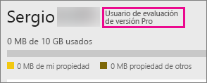

# Adquisición de Power BI Pro
Power BI Pro está destinado a aquellos usuarios que publican informes, comparten paneles, colaboran con compañeros en áreas de trabajo y se ocupan de otras actividades relacionadas, como la capacidad de:

* Analizar datos en Excel o Power BI Desktop
* Compartir con el soporte técnico de aplicaciones web de Excel
* Compartir paneles y colaborar con áreas de trabajo de aplicaciones
* Ver el contenido compartido
* Integrar contenido con Microsoft Teams

Los administradores de TI tienen algunas opciones para usar Power BI Pro dentro de su organización. Puede adquirir Power BI Pro directamente en el Centro de administración de Office 365 o a través de su asociado o representante de Microsoft. En este artículo veremos las dos opciones de prueba disponibles para Power BI Pro y, después, cómo comprar Power BI Pro como organización.

Para más información sobre Power BI Premium, y cómo Power BI Pro se integra en la oferta Premium, consulte [¿Qué es Power BI Premium?](service-premium.md)

## Precios
Para obtener información actualizada sobre los precios de Power BI Pro y una tabla con las características incluidas, consulte [Precios de Power BI](https://powerbi.microsoft.com/pricing/).

## Versión de prueba en servicio de Power BI Pro de 60 días para individuos
Después de registrarse para obtener una cuenta gratuita, también tiene la opción de probar Power BI Pro gratis durante 60 días. Tendrá acceso a todas las características de Power BI Pro durante el tiempo de la prueba. Power BI Pro incluye todas las características de la versión gratuita de Power BI y características adicionales de uso compartido y colaboración. Para más información, consulte los [precios de Power BI](https://powerbi.microsoft.com/pricing). Para probar una versión de prueba gratuita de 60 días de Power BI Pro, regístrese en Power BI y pruebe una de estas características de Power BI Pro:

* [Crear un área de trabajo de aplicación](service-create-distribute-apps.md)
* [Compartir un panel](service-share-dashboards.md)

Cuando pruebe cualquiera de estas características, se le pedirá que inicie su prueba gratuita. Para usarla, también puede ir al icono de engranaje y seleccionar **Administrar almacenamiento personal**. A continuación, seleccione **Probar Power BI Pro gratis** a la derecha.

Después, puede seleccionar **Iniciar período de prueba**.

> [!NOTE]
> Los usuarios que usen esta versión de evaluación del producto Power BI Pro no aparecen en el portal de administración de Office 365 como usuarios de  prueba de Power BI Pro (aparecen como usuarios gratuitos de Power BI). Sin embargo, aparecerán como usuarios de prueba de Power BI Pro en la página **Administrar almacenamiento** de Power BI.

> [!NOTE]
> Si es un administrador de TI y desea adquirir e implementar licencias de prueba de Power BI para varios usuarios de su organización sin que cada usuario tenga que aceptar los términos de la versión de prueba, puede registrarse para obtener una [suscripción de prueba a Power BI Pro](https://portal.office.com/Signup/MainSignup15.aspx?OfferId=d59682f3-3e3b-4686-9c00-7c7c1c736085&dl=POWER_BI_PRO). Deberá ser un administrador de facturación o de Office 365 Global, o bien deberá crear un nuevo inquilino para registrarse y obtener una versión de prueba para administradores. Consulte [Adquisición de Power BI Pro](service-admin-purchasing-power-bi-pro.md) para más información.

> [!NOTE]
> Con la disponibilidad de Power BI Premium y los cambios en la oferta gratuita de Power BI del 1 de junio de 2017, podría optar a una prueba extendida de Power BI Pro. Para más información, consulte [Extended Pro Trial activation](service-extended-pro-trial.md) (Activación de la extensión del período de prueba de Power BI Pro).

### Aspecto dentro del servicio
Cuando esté en el servicio, puede comprobar que tiene una cuenta de prueba de Power BI Pro; para ello, vaya al icono de **engranaje* y seleccione **Administrar almacenamiento personal**.

## Suscripción de prueba en Office 365
Puede obtener Power BI Pro como una versión de prueba para su organización. Cuando tenga la suscripción, puede asignar licencias de Power BI Pro a los usuarios. Para más información sobre cómo asignar licencias, consulte [Asignar licencias a usuarios en Office 365](https://support.office.com/article/Assign-or-unassign-licenses-for-Office-365-for-business-997596b5-4173-4627-b915-36abac6786dc).

> [!NOTE]
> Hay un límite de una prueba organizativa por inquilino. Esto significa que, si alguien ya ha aplicado la Prueba de Power BI Pro al inquilino, no puede volver a hacerlo. Si necesita ayuda con esto, puede ponerse en contacto con el [soporte de facturación de Office 365](https://support.office.microsoft.com/article/Contact-Office-365-for-business-support-Admin-Help-32a17ca7-6fa0-4870-8a8d-e25ba4ccfd4b?CorrelationId=552bbf37-214f-4202-80cb-b94240dcd671&ui=en-US&rs=en-US&ad=US#BKMK_call_support).
> 

1. Vaya al [Centro de administración de Office 365](https://portal.office.com/admin/default.aspx).
2. En el panel de navegación izquierdo, seleccione Facturación > Suscripciones.
3. Seleccione Agregar suscripciones + en el lado derecho.
4. En Otros planes, mantenga el mouse sobre los puntos suspensivos (...) de Power BI Pro y seleccione Iniciar prueba gratuita.
   
    
5. En la pantalla de confirmación del pedido, seleccione Probar ahora.
6. Seleccione Continuar en el recibo del pedido.

En **Facturación** > **Suscripciones**, verá que aparece **Prueba de Power BI Pro** con 25 licencias disponibles. Esta es una prueba de un mes.

### Aspecto dentro del servicio
Cuando esté en el servicio, puede comprobar que tiene una cuenta de Power BI Pro; para ello, vaya al icono de **engranaje** y seleccione **Administrar almacenamiento personal**. No habrá ninguna indicación de que se trata de un usuario de prueba.

## Compra de una suscripción en Office 365
Puede adquirir Power BI Pro para su organización en el Centro de administración de Office 365. Cuando tenga la suscripción, puede asignar licencias de Power BI Pro a los usuarios. Para más información sobre cómo asignar licencias, consulte [Asignar licencias a usuarios en Office 365](https://support.office.com/article/Assign-or-unassign-licenses-for-Office-365-for-business-997596b5-4173-4627-b915-36abac6786dc).

1. Vaya al [Centro de administración de Office 365](https://portal.office.com/admin/default.aspx).
2. En el panel de navegación izquierdo, seleccione Facturación > Suscripciones.
3. Seleccione Agregar suscripciones + en el lado derecho.
4. En Otros planes, mantenga el mouse sobre los puntos suspensivos (...) de Power BI Pro y seleccione Comprar ahora.
   
    
5. Escriba el número de licencias que desea agregar y seleccione Pagar ahora o Agregar al carro.
   
   > [!NOTE]
   > Puede agregar más después si es necesario.
   > 
   > 
6. Escriba la información necesaria en el proceso de pago de la compra.

> [!NOTE]
> Si ya tenía la Prueba de Power BI Pro, irá directamente a la pantalla de pago para especificar el número de licencias que quiere.
> 
> 

En **Facturación** > **Suscripciones**, verá que aparece **Power BI Pro**. Si más adelante decide que desea agregar más licencias, puede volver a **Agregar suscripciones** y seleccionar **Cambiar la cantidad de licencias**.

### Aspecto dentro del servicio
Cuando esté en el servicio, puede comprobar que tiene una cuenta de Power BI Pro; para ello, vaya al icono de **engranaje** y seleccione **Administrar almacenamiento personal**.

## Pasos siguientes
[Registro de autoservicio para Power BI](service-self-service-signup-for-power-bi.md)  
[Power BI (gratis) en su organización](service-admin-service-free-in-your-organization.md)  
[Extended Pro Trial activation](service-extended-pro-trial.md) (Activación de la extensión del período de prueba de Power BI Pro)  
[¿Qué es Power BI Premium?](service-premium.md)  
[Adquisición de Power BI Premium](service-admin-premium-purchase.md)  
[Notas del producto de Power BI Premium](https://aka.ms/pbipremiumwhitepaper)  

¿Tiene más preguntas? [Pruebe a preguntar a la comunidad de Power BI](http://community.powerbi.com/)

