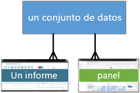
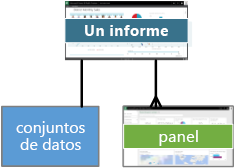
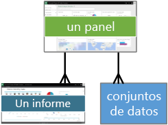
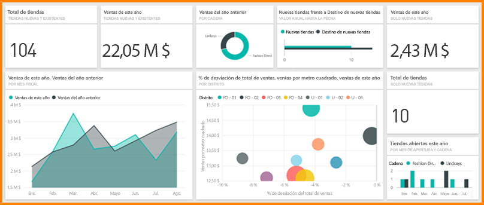

# Power BI: conceptos básicos del servicio Power BI
<!-- Shared newnav Include -->
[!INCLUDE [newnavbydefault](./includes/newnavbydefault.md)]

En este artículo se da por supuesto que ya se ha [registrado en Power BI](service-self-service-signup-for-power-bi.md) y ha [agregado algunos datos](service-get-data.md).

Cuando abra el servicio Power BI, verá que se muestra un ***panel***. Los paneles son algo que diferencian al servicio Power BI de Power BI Desktop.

Las principales características de la interfaz de usuario del servicio Power BI son las siguientes:

1. barra de navegación
2. Panel con iconos
3. Cuadro de pregunta de Preguntas y respuestas
4. Botones de ayuda y comentarios
5. Título del panel
6. Iniciador de aplicaciones de Office 365
7. Botones de la página principal de Power BI
8. Acciones adicionales del panel

Más adelante se explicará cada elemento de forma detallada, pero primero analicemos algunos conceptos de Power BI.

Es posible que quiera ver este video antes de leer el resto del artículo.  En el video, Will da un repaso a los conceptos básicos y muestra el servicio Power BI.

<iframe width="560" height="315" src="https://www.youtube.com/embed/B2vd4MQrz4M" frameborder="0" allowfullscreen></iframe>

## Conceptos de Power BI
Los tres pilares principales de Power BI son: ***paneles***, ***informes*** y ***conjuntos de datos***. No se pueden tener paneles ni informes sin datos (bueno, se pueden tener paneles vacíos e informes vacíos, pero no serán muy útiles hasta que tengan datos), por eso comenzaremos con **conjuntos de datos**.

## Conjuntos de datos
Un *conjunto de datos* es una colección de datos que *importa* o a lo que se *conecta*. Power BI permite importar y conectar con todos los tipos de conjuntos de datos y ponerlos todos en un solo lugar.  

En la barra de navegación, los conjuntos de datos a los que se ha conectado o que ha importado aparecen bajo el encabezado **Conjuntos de datos**. Cada conjunto de datos de la lista representa un origen de datos, por ejemplo, un libro de Excel en OneDrive, un conjunto de datos tabulares locales de SSAS o una base de datos de Salesforce. Hay muchos orígenes de datos compatibles diferentes y estamos agregando nuevos todo el tiempo. [Consulte la lista de tipos de conjuntos de datos que se pueden usar con Power BI.](service-get-data.md)

**Un único** conjunto de datos...

* se puede usar una y otra vez.
* se puede usar en muchos informes diferentes.
* Las visualizaciones de ese conjunto de datos se pueden mostrar en muchos paneles diferentes.
  
  

Para [importar o conectarse a un conjunto de datos](service-get-data.md), seleccione **Obtener datos** (en la parte inferior de la barra de navegación) o seleccione el icono de signo más junto al encabezado **Conjuntos de datos**. Siga las instrucciones para importar o conectarse al origen específico y agregue el conjunto de datos al área de trabajo. Los nuevos conjuntos de datos aparecen en la barra de navegación izquierda con un asterisco amarillo. El trabajo que realice en Power BI no cambiará el conjunto de datos subyacente.

Si [forma parte de un ***área de trabajo de la aplicación***](service-collaborate-power-bi-workspace.md), los conjuntos de datos agregadas por un miembro del área de trabajo están disponibles para los demás miembros del área de trabajo.

Los conjuntos de datos se pueden actualizar, cambiar de nombre, explorar, usar para crear informes y quitar. Para explorar un conjunto de datos, selecciónelo. Lo que realmente está haciendo es abrir el conjunto de datos en el editor de informes, donde puede empezar realmente a profundizar en los datos y a crear visualizaciones. Ahora vamos a pasar al tema siguiente: informes.

### Análisis en profundidad:
* [¿Qué es Power BI Premium?](service-premium.md)
* [Obtener datos para Power BI](service-get-data.md)
* [Conjuntos de datos y paquetes de contenido de ejemplo para Power BI](sample-datasets.md)

## Informes
Un informe de Power BI es una o varias páginas de visualizaciones (tablas y gráficos, como gráficos de líneas, gráficos circulares, gráficos de rectángulos y mucho más). A las visualizaciones también se les denomina ***objetos visuales***. Todas las visualizaciones de un informe proceden de un único conjunto de datos. Los informes pueden crearse desde cero en Power BI, pueden importarse con paneles que los compañeros comparten con usted o pueden crearse al conectarse a conjuntos de datos desde Excel, Power BI Desktop, bases de datos, aplicaciones SaaS y [paquetes de contenido](service-organizational-content-pack-introduction.md).  Por ejemplo, cuando se conecta a un libro de Excel que contiene hojas de Power View, Power BI crea un informe basado en dichas hojas. Y cuando se conecta a una aplicación de SaaS, Power BI importa un informe previamente creado.

Hay dos maneras de ver los informes e interactuar con ellos: la [Vista de lectura](service-report-open-in-reading-view.md) y la [Vista de edición](service-interact-with-a-report-in-editing-view.md).  Solo la persona que creó el informe, los copropietarios y los usuarios con permisos tienen acceso a todas las funcionalidades de exploración, diseño, creación y uso compartido de la ***Vista de edición*** para el informe. Y las personas con las que comparten el informe pueden explorarlo e interactuar con él mediante la ***Vista de lectura***.   

En el panel de navegación, los informes se muestran bajo el encabezado **Informes**. Cada informe de la lista representa una o varias páginas de visualización, basadas en uno de los conjuntos de datos subyacentes. Para abrir un informe, selecciónelo. De forma predeterminada, el informe se abre en la Vista de lectura.  Simplemente seleccione **Editar informe** para abrirlo en la vista de edición (si tiene los permisos necesarios).  Si un panel compartido tiene informes, NO podrá ver el informe enumerado en la barra de navegación. En su lugar, abra los informes compartidos directamente desde el panel compartido; para ello, seleccione un icono de panel (veremos esto más adelante).

**UN** informe...

* se puede asociar con varios paneles (los iconos anclados desde ese informe pueden aparecer en varios paneles).
* se puede crear utilizando los datos de un conjunto de datos. (la excepción a esto es que Power BI Desktop puede combinar más de un conjunto de datos en un único informe, y ese informe se puede importar a Power BI).
  
  

## Paneles
Un *panel* es algo que usted crea o que un compañero de trabajo crea y comparte con usted. Es un lienzo individual que contiene uno o varios iconos y widgets. Cada icono muestra una [visualización](power-bi-report-visualizations.md) única creada a partir de un conjunto de datos y anclada al panel. Hay muchas maneras de agregar iconos al panel; demasiadas para tratarlas en este tema de información general. Para más información, vea [Iconos del panel en Power BI](service-dashboard-tiles.md). 

En la barra de navegación, “sus” paneles se enumeran debajo del encabezado **Paneles** . "Su" significa que tiene acceso a ellas, no necesariamente que los creara. Cada panel representa una vista personalizada de algún subconjunto de los conjuntos de datos subyacentes.  Si es el propietario del panel, también tendrá acceso a los conjuntos de datos subyacentes y aparecerán en la barra de navegación en **Conjuntos de datos**.  Si el panel es compartido, tiene un icono de uso compartido  junto a él y, dependiendo de cómo se comparta, podrá ver o no los conjuntos de datos subyacentes que aparecen en la barra de navegación.

> [!NOTE]
> El anclado y los iconos se tratan con más detalle más adelante, en la sección "Panel con iconos".
> 
> 

**UN** panel...

* puede mostrar visualizaciones de muchos conjuntos de datos diferentes
* puede mostrar visualizaciones de muchos informes diferentes
* puede mostrar visualizaciones ancladas desde otras herramientas (por ejemplo, Excel)
  
  

### Análisis en profundidad:
**Un panel se puede [crear desde cero](service-dashboard-create.md)**: se crea un nuevo panel en blanco y luego se obtienen algunos datos. 

**Usted o un compañero de trabajo pueden crear un panel[ y ](service-share-dashboards.md)compartirlo**; al aceptar la invitación, el panel compartido (y los informes y conjuntos de datos asociados) se agregan a la barra de navegación. Power BI Pro es necesario tanto para compartir un panel como para ver un panel compartido.

**Algunas veces los paneles se importan con el conjunto de datos o se crean cuando se conecta al conjunto de datos**. Por ejemplo, el asistente para **Obtener datos** de Salesforce le preguntará si desea crear un panel o un informe a partir del conjunto de datos. 

**¿Por qué se crean paneles?**  Estas son solo algunas de las razones:

* para observar de un solo vistazo toda la información necesaria para tomar decisiones
* para supervisar la información más importante sobre un negocio
* para garantizar que todos los compañeros estén en la misma sintonía, es decir, que vean y usen la misma información
* para supervisar el correcto funcionamiento de un negocio, producto, unidad de negocio, campaña de marketing, etc.
* para crear una vista personalizada de un panel más grande (con las métricas importantes para usted)

## Mi área de trabajo
Hemos vuelto a su panel y área de trabajo de Power BI. Echemos un vistazo más de cerca a las partes que componen la página de aterrizaje del servicio Power BI.

### 1. **Barra de navegación** (navbar)
Use la barra de navegación para moverse entre los bloques de creación de Power BI: paneles, informes y conjuntos de datos.  

  

* Seleccione **Obtener datos** para [agregar conjuntos de datos, informes y paneles a Power BI](service-get-data.md).
* Expanda y contraiga la barra de navegación con este icono .
* Use **Buscar** para buscar elementos específicos en la barra de navegación.
* Seleccione el icono de más  para crear un nuevo panel u obtener un nuevo conjunto de datos.
* Los **paneles, informes,** y **conjuntos de datos** están disponibles para su uso.  Los paneles compartidos son de solo lectura y muestran un icono de uso compartido .
* Los nombres de los paneles, informes y conjuntos de datos suelen coincidir con el nombre de archivo del conjunto de datos subyacente, pero es posible [modificarlos](service-rename.md).
* Haga clic en un panel, informe o conjunto de datos para mostrar el menú contextual. 
  
  

Haga un solo clic

* en un encabezado para contraerlo o expandirlo
* en un panel para mostrarlo
* en un informe para abrirlo en la Vista de lectura
* en un conjunto de datos para explorarlo

### 2. **Panel con iconos**
Los paneles se componen de [iconos](service-dashboard-tiles.md).  Los iconos se crean en la vista de edición del informe, en preguntas y respuestas, en otros paneles y se pueden anclar desde Excel, SSRS y muchos otros. Un tipo especial de icono, llamado [widget](service-dashboard-add-widget.md), se agrega directamente al panel. Los iconos que aparecen en un panel los colocó específicamente ahí el creador/propietario del informe.  La acción de agregar un icono a un panel se denomina *anclar*.

Para obtener más información, consulte **Paneles** (arriba).

### 3. **Cuadro de preguntas y respuestas**
Una manera de explorar los datos consiste en formular una pregunta y permitir que Preguntas y respuestas de Power BI proporcione una respuesta en la forma de una visualización. Preguntas y respuestas no puede usarse para agregar contenido a un informe, sino solo para agregar contenido, en forma de iconos, a los paneles.

Preguntas y respuestas busca una respuesta en los conjuntos de datos conectados al panel.  Un conjunto de datos conectado es aquel que tiene al menos un icono anclado a ese panel.

Tan pronto como empieza a escribir la pregunta, Preguntas y respuestas lo dirige a la página de Preguntas y respuestas. A medida que escribe, Preguntas y respuestas le ayuda a formular la pregunta correcta y a encontrar la mejor respuesta a través de sus funciones para reformular, autorellenar, hacer sugerencias y mucho más. Cuando tenga una visualización (respuesta) satisfactoria, la puede anclar al panel. Para más información, consulte [Preguntas y respuestas en Power BI](service-q-and-a.md).

### 4. **Pantalla completa, Notificaciones, Configuración, Descargas, Ayuda y Comentarios**
Los iconos en la esquina superior derecha son los recursos para las configuraciones, notificaciones, descargas, obtener ayuda y proporcionar comentarios al equipo de Power BI. Seleccione la flecha doble para abrir el panel en modo de **pantalla completa**.  

### 5. **Título del panel** (también conocido como Panel activo)
No siempre es fácil averiguar qué panel está activo.  El título del panel aparece en la página de vista de panel, en la página de Preguntas y respuestas, en la Vista de edición y la Vista de lectura del informe y al abrir un conjunto de datos.   

### 6. **Iniciador de aplicaciones de Office 365**
El iniciador de aplicaciones está diseñado para ayudarle a acceder a las aplicaciones de Office 365.

### 7. **Inicio de Power BI**
Selecciónelo para volver al último panel que haya visualizado.

   

### 8. **Opciones**
Este área de trabajo contiene iconos para interactuar con el panel.  Además de las opciones **Agregar icono**, **Favorito** y **Compartir**, al seleccionar el botón de puntos suspensivos se muestran opciones para duplicar, imprimir y actualizar el panel, entre otras.

   

## Pasos siguientes
[Introducción a Power BI](service-get-started.md)  
[Vídeos de Power BI](videos.md)  
[¿Qué es Power BI Premium?](service-premium.md)

¿Tiene más preguntas? [Pruebe a preguntar a la comunidad de Power BI](http://community.powerbi.com/)

