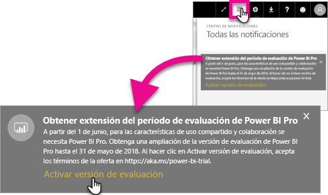
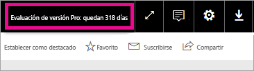

# Activación de prueba de Pro extendida
Desde el 1 de junio de 2017, todos los usuarios aptos podrán participar en la prueba de Power BI Pro extendida.

<iframe width="640" height="360" src="https://www.youtube.com/embed/tPsNoPyY9aA?showinfo=0" frameborder="0" allowfullscreen></iframe>

Como parte del [anuncio Premium de Power BI del 3 de mayo de 2017](https://powerbi.microsoft.com/blog/microsoft-accelerates-modern-bi-adoption-with-power-bi-premium/), Microsoft ha comunicado los cambios realizados en el servicio Power BI gratuito, en vigor desde el 1 de junio de 2017. Estos cambios incluyen ampliar el acceso a todos los orígenes de datos, extender los límites de almacenamiento del área de trabajo, y ampliar las tasas de actualización y transmisión al servicio gratuito, lo que le convierte en un equivalente de Power BI Pro.

También se ha anunciado que las características de uso compartido y colaboración serán exclusivas para los usuarios de Power BI Pro, incluidos el uso compartido del panel punto a punto, las áreas de trabajo de grupo (denominadas hasta ahora áreas de trabajo de aplicación), la exportación a PowerPoint y el análisis en Excel con aplicaciones de Power BI. La exportación a CSV o Excel y PowerPoint estaba calificada en la comunicación del 3 de mayo como una funcionalidad limitada a Power BI Pro, pero después de recibir comentarios de la comunidad de usuarios, se ha modificado la estrategia para que la funcionalidad esté disponible también para los usuarios del servicio gratuito.

A partir del 1 de junio de 2017, los usuarios existentes del servicio gratuito que han estado activos durante del año pasado (en fecha del 2 de mayo de 2017 o anterior) podrán optar a una prueba gratuita de 12 meses de Power BI Pro extendida. La oferta permitirá a los usuarios sacar partido de todas las funcionalidades de Power BI Pro el próximo año, en señal de agradecimiento a la comunidad y para proporcionar a los usuarios el tiempo necesario para adaptarse a los cambios.

El 1 de junio de 2017, los usuarios aptos recibirán una notificación, al iniciar sesión en el servicio, que les informará de la entrada en vigor de los cambios con un aviso para que se registren para la oferta de prueba de Power BI Pro extendida. El administrador de TI de un usuario no controla las notificaciones del producto; los administradores de TI tampoco tienen la capacidad de registrarse para la prueba de Power BI Pro extendida en nombre del usuario. Todo usuario apto deberá completar este proceso él mismo.

Los usuarios pueden optar por registrarse para la oferta en cualquier momento en el período de 12 meses, pero la prueba de Pro extendida concluirá para todos los usuarios el 31 de mayo de 2018, sea cual sea la fecha en la que hayan aceptado la oferta. En ese momento, los usuarios tendrán la opción de adquirir Power BI Pro o pasar a la versión gratuita de Power BI, sin las funcionalidades de uso compartido y colaboración, si deciden no hacer nada y no adquirir Power BI Pro.

No se están realizando cambios en Power BI Pro. Estos usuarios no se verán afectados y no recibirán notificaciones al iniciar sesión en el servicio el 1 de junio de 2017 o posteriormente. Los usuarios que descarten la oferta de prueba de Power BI Pro extendida o no sean aptos para la oferta continuarán utilizando la versión gratuita de Power BI sin las funcionalidades de uso compartido y colaboración. Pueden registrarse en cualquier momento para una versión de prueba de 60 días de Power BI Pro estándar visitando el [sitio web](https://powerbi.microsoft.com/get-started/) de Power BI.

## Requisitos para la prueba de Pro extendida
Su cuenta debe cumplir los siguientes requisitos para que pueda optar a la oferta de prueba de Pro extendida.

* Los usuarios de la versión gratuita de Power BI activos entre el 3 de mayo de 2016 y el 2 de mayo de 2017 son aptos para una prueba de Pro extendida.
* Los usuarios que hayan usado anteriormente o que utilicen actualmente la *versión de prueba de 60 días de Pro del producto* siguen siendo aptos para la prueba de Pro extendida.

> [!NOTE]
> Los usuarios que tengan licencias asignadas a partir de suscripciones de Power BI Pro o de prueba de Power BI Pro, dentro de Office 365, quedan excluidos de esta oferta.
> 
> 

## Activación
Hay dos formas de activar la prueba de Pro extendida. La primera es al iniciar sesión en Power BI. Si la ha rechazado, también tendrá otra posibilidad en el área de notificación.

> [!NOTE]
> Las comunicaciones sobre los productos no están controladas por el administrador y podrán acceder a ellas los usuarios aptos.
> 
> 

### Experiencia con el inicio de sesión
Al iniciar sesión en el servicio Power BI y si es apto, verá una notificación emergente. Al seleccionar **Activate Trial** (Activar prueba), comenzará la prueba de Pro extendida. No será necesario realizar ninguna otra acción.

Después, tendrá la capacidad para acceder a todos los paneles e informes compartidos existentes durante el período de prueba.

Si ha seleccionado **Not Now** (Ahora no), la prueba de Pro extendida se podrá activar en cualquier momento hasta el final del período de prueba, el 31 de mayo de 2018.

### Activación en una fecha posterior
Si ha descartado la ventana emergente seleccionando **Not Now** (Ahora no), la prueba de Pro extendida se podrá activar en cualquier momento hasta el final del período de prueba, el 31 de mayo de 2018. Esto se puede hacer en el **centro de notificaciones**.

En el centro de notificaciones, verá una notificación relativa a la prueba de Pro extendida. La notificación estará disponible hasta que el usuario la descarte.

En la notificación, puede seleccionar **Activate Trial** (Activar prueba) para empezar la prueba. No será necesario realizar ninguna otra acción.

Después, tendrá la capacidad para acceder a todos los paneles e informes compartidos existentes durante el período de prueba.

## Después de la activación
Después de la activación, podrá ver cuántos días le quedan del período de prueba en la esquina superior derecha.

Puede revisar los términos en [Términos y condiciones de la prueba ampliada de Power BI Pro](https://aka.ms/power-bi-trial). La prueba de Pro extendida funcionará hasta el 31 de mayo de 2018 para todos los usuarios aptos.

## Preguntas más frecuentes
**¿Qué ocurre con los nuevos usuarios que se registren después del 3 de mayo de 2017?**

Los usuarios que se registraron en la versión gratuita de Power BI el 3 de marzo de 2017 o con posterioridad a esta fecha, no pueden optar a la extensión de la prueba de Power BI Pro. Sin embargo, son aptos para la versión de prueba de 60 días de Power BI Pro estándar.

**¿Cómo averiguo qué personas de mi organización pueden optar a la prueba extendida de Power BI Pro?**

Aunque no es una manera directa de descubrirlo, puede ver el informe de Aplicaciones integradas de Azure Active Directory para Power BI a fin de comprobar quiénes han sido los usuarios activos dentro de su organización en los últimos 30 días. Esto le puede dar una idea de quién podría optar a la prueba. Para más información, consulte [Find Power BI users that have signed in](service-admin-access-usage.md) (Búsqueda de usuarios de Power BI que hayan iniciado sesión).

Esos usuarios activos en el período de elegibilidad, y aquellos con licencias gratuitas, recibirán la notificación emergente. 

> [!NOTE]
> El informe de Azure AD no indica si un usuario tiene la versión gratuita o dispone de Pro en Power BI. Solo informa qué usuarios se han conectado a Power BI y cuando inician sesión. Si un usuario aparece en este informe, no significa necesariamente que pueda optar a la prueba de Pro extendida.
> 
> 

**¿Pueden los administradores impedir que un usuario active la prueba de Pro extendida?**

No. Los administradores no pueden impedir que los usuarios activen la prueba de Pro extendida o la versión de prueba de 60 días durante el funcionamiento de Power BI Pro.

## Pasos siguientes
[Términos y condiciones de la prueba ampliada de Power BI Pro](https://aka.ms/power-bi-trial)  
[Acuerdo de servicio de Power BI para usuarios individuales](https://powerbi.microsoft.com/terms-of-service/)  
[Anuncio de Power BI Premium](https://aka.ms/pbipremium-announcement)  
[Find Power BI users that have signed in](service-admin-access-usage.md) (Búsqueda de usuarios de Power BI que hayan iniciado sesión)

¿Tiene más preguntas? [Pruebe a preguntar a la comunidad de Power BI](https://community.powerbi.com/)

