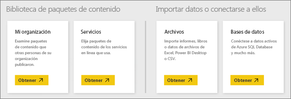

# Orígenes de datos del servicio Power BI
Los datos son la esencia de Power BI. Todo lo que ve al explorar datos, crear gráficos y paneles o plantear preguntas con Preguntas y respuestas, se basa en un conjunto de datos. Pero, ¿de dónde procede ese conjunto de datos? De un origen de datos.

En este artículo, vamos a examinar los distintos tipos de orígenes de datos a los que puede conectarse desde el servicio Power BI. Tenga en cuenta que hay muchos otros tipos de orígenes de datos de los que también puede obtener datos. Para trabajar con ellos podría ser necesario usar las características avanzadas de modelado y consulta de datos de Power BI Desktop o Excel. Los veremos más adelante. Por ahora, echemos un vistazo a los distintos tipos de orígenes de datos a los que puede conectarse directamente desde el sitio del servicio Power BI.

Para obtener datos desde cualquiera de estos orígenes de datos en Power BI, haga clic en **Mi área de trabajo** > **Obtener datos**.

## Archivos

**Excel** (.xlsx, xlxm): una característica única de Excel es que un libro puede tener los datos que ha escrito en hojas de cálculo o que ha consultado y cargado de orígenes de datos externos mediante Power Query (Obtener y transformar en Excel 2016) o Power Pivot. Puede importar datos de tablas de hojas de cálculo (los datos *deben* encontrarse en una tabla) o importar datos que están cargados en un modelo de datos. Para más información, consulte [Obtener datos desde archivos de Excel, Power BI Desktop y CSV en Power BI](service-get-data-from-files.md).

**Power BI Desktop** (.pbix): puede usar Power BI Desktop para consultar y cargar datos desde orígenes de datos externos y ampliar el modelo de datos con medidas y relaciones, así como crear informes. Puede importar el archivo de Power BI Desktop en el sitio de Power BI. Power BI Desktop es mejor para los usuarios más avanzados con buenos conocimientos de los conceptos de orígenes de datos, consultas y transformación de datos, y modelado de datos. Para más información, consulte [Conectarse a los datos en Power BI Desktop](desktop-connect-to-data.md).

**Valores separados por comas** (.csv): son archivos de texto simples con filas de datos. Cada fila puede contener uno o varios valores, separados por punto y coma. Por ejemplo, un .csv que contiene datos de nombre y dirección puede tener varias filas, cada una con valores de nombre, apellido, dirección, ciudad, estado y así sucesivamente. No puede importar datos en un archivo .csv, pero muchas aplicaciones, como Excel, pueden guardar datos de tabla simple como un archivo .csv.

Para otros tipos de archivo, como Tabla XML (.xml) o archivos de texto (.txt), puede usar primero Obtener y transformar para consultar, transformar y cargar los datos en un archivo de Excel o Power BI Desktop. Después, puede importar el archivo de Excel o Power BI Desktop en Power BI.

El lugar donde se almacenan los archivos supone una gran diferencia. OneDrive para la Empresa proporciona la máxima flexibilidad e integración con Power BI. Si guarda los archivos en la unidad local, no hay problema, pero si necesita actualizar los datos, hay unos pasos adicionales. Encontrará más detalles en los artículos a los que le llevan los vínculos.

## Paquetes de contenido

Los paquetes de contenido incluyen todos los datos e informes que necesita ya preparados. En Power BI, hay dos tipos de paquetes de contenido; los de servicios como Google Analytics, Marketo o Salesforce, y los creados y compartidos por otros usuarios de su organización.

**Servicios** : literalmente, existen decenas de servicios con paquetes de contenido para Power BI, y se agregan más continuamente. La mayoría de los servicios requiere que tenga una cuenta. Para más información, consulte [Conectar con servicios](service-connect-to-services.md).

**Organizativos** : si usted y otros usuarios de su organización tienen una cuenta de Power BI Pro, puede crear, compartir y usar paquetes de contenido. Para más información, consulte [Paquetes de contenido organizativos](service-organizational-content-pack-introduction.md).

## Bases de datos

**Bases de datos en la nube**: desde el servicio Power BI, puede conectar dinámicamente con Azure SQL Database, Azure SQL Data Warehouse, Spark en HDInsight de Azure y SQL Server Analysis Services mediante DirectQuery. Las conexiones desde Power BI a estas bases de datos son dinámicas, es decir, después de conectarse a Azure SQL Database, por ejemplo, y de comenzar a explorar sus datos mediante la creación de informes en Power BI, cada vez que segmente los datos o agregue otro campo a la visualización, se realiza una consulta directamente a la base de datos. Para más información, consulte [Azure y Power BI](service-azure-and-power-bi.md).

**Bases de datos locales** : desde el servicio Power BI, puede conectarse directamente a las bases de datos de modelo tabular de SQL Server Analysis Services. Se requiere Power BI Enterprise Gateway. Si no está seguro de cómo conectarse a la base de datos de modelo tabular de su organización, consulte con el administrador o el departamento de TI. Para más información, consulte [Datos tabulares de SQL Server Analysis Services en Power BI](sql-server-analysis-services-tabular-data.md).

Para otros tipos de bases de datos de su organización, deberá usar primero Power BI Desktop o Excel para conectarse a los datos, consultarlos y cargarlos en un modelo de datos. Después, puede importar el archivo en Power BI, donde se crea un conjunto de datos. Si configura la actualización programada, Power BI usará la información de conexión del archivo, además de las opciones que configure, para conectarse directamente al origen de datos y consultar las actualizaciones. Esas actualizaciones se cargan en el conjunto de datos en Power BI. Para más información, consulte [Conectarse a los datos en Power BI Desktop](desktop-connect-to-data.md).

## ¿Qué ocurre si mi datos proceden de un origen diferente?
Existen literalmente cientos de diferentes orígenes de datos que puede usar con Power BI. Pero independientemente de dónde se obtengan los datos, estos tienen que estar en un formato que el servicio Power BI pueda usar para crear informes y paneles, responder preguntas con Preguntas y respuestas, etc.

Algunos orígenes de datos ya tienen sus datos en un formato listo para el servicio Power BI, como los paquetes de contenido de proveedores como Google Analytics y Twilio. Las bases de datos de modelo tabular de SQL Server Analysis Services también están preparadas. Y puede conectar dinámicamente con bases de datos en la nube, tales como Azure SQL Database y Spark en HDInsight.

En otros casos, podría ser necesario consultar y cargar los datos que desee en un archivo. Por ejemplo, supongamos que tiene datos de logística en una base de datos de un almacén de datos en un servidor de su organización. En el servicio Power BI, no puede conectar directamente con esa base de datos y empezar a explorar sus datos (a menos que sea una base de datos de modelo tabular). Sin embargo, puede usar Power BI Desktop o Excel para consultar y cargar los datos de logística en un modelo de datos y, después, guardarlos como un archivo. Después, puede importar ese archivo en Power BI, donde se crea un conjunto de datos.

Probablemente esté pensando: "Pero los datos de logística de esa base de datos cambian cada día. ¿Cómo me aseguro de que el conjunto de datos en Power BI se actualiza?" La información de conexión del archivo de Excel o Power BI Desktop se importa en el conjunto de datos junto con los datos. Si configura una actualización programada o realiza una actualización manual del conjunto de datos, Power BI usará la información de conexión de este, además de un par de opciones de configuración más, para conectarse directamente a la base de datos, consultar las actualizaciones y cargarlas en el conjunto de datos. Es probable que se necesite Power BI Gateway para proteger las transferencias de datos entre el servidor local y Power BI. Las visualizaciones en los informes y los paneles se actualizan automáticamente.

Que no pueda conectar directamente con el origen de datos desde el servicio Power BI no significa que no pueda obtener esos datos en Power BI. Tal vez se requieran algunos pasos más y la ayuda del departamento de TI. Consulte [Orígenes de datos en Power BI Desktop](desktop-data-sources.md) para más información.

## Algunos detalles más
Verá que los términos "conjunto de datos" y "origen de datos" se usan mucho en Power BI. A menudo se usan como sinónimos, pero realmente son dos cosas distintas, aunque relacionadas.

Un ***conjunto de datos*** se crea automáticamente en Power BI al usar Obtener datos para conectarse a los datos e importarlos desde un paquete de contenido o archivo, o bien al conectarse a un origen de datos dinámico. Un conjunto de datos contiene información sobre el origen de datos, las credenciales de dicho origen y, con frecuencia, un subconjunto de datos copiados desde el origen de datos. En la mayoría de los casos, al crear visualizaciones en informes y paneles, se consultan los datos del conjunto de datos.

Un ***origen de datos*** es la ubicación de donde proceden realmente los datos del conjunto de datos. Por ejemplo, un servicio en línea como Google Analytics o QuickBooks, una base de datos en la nube como Azure SQL Database, o una base de datos o un archivo en un equipo local o servidor de su propia organización.

### Actualización de datos
Si guarda los archivos en la unidad local o en una unidad que se encuentre en cualquier otro lugar de la organización, es posible que Power BI Gateway sea necesario para actualizar el conjunto de datos en Power BI. Y el equipo donde se guarda el archivo debe estar encendido cuando se produce una actualización. También puede volver a importar el archivo o usar Publicar desde Excel o Power BI Desktop, pero no son procesos automatizados.

Si guarda los archivos en OneDrive para la Empresa o en sitios de grupo de SharePoint y después se conecta a Power BI, o los importa a él, el conjunto de datos, los informes y los paneles siempre estarán actualizados. Como OneDrive y Power BI están en la nube, Power BI puede conectarse directamente al archivo guardado, una vez cada hora aproximadamente, y comprobar si hay actualizaciones. Si encuentra alguna, el conjunto de datos y las visualizaciones se actualizan automáticamente.

Los paquetes de contenido de los servicios se actualizan automáticamente. En la mayoría de los casos, una vez al día. Puede actualizarlos manualmente, pero si ve o no los datos actualizados dependerá del proveedor de servicios. Los paquetes de contenido de otros usuarios de su organización dependerán de los orígenes de datos usados y de cómo configure la actualización la persona que creó el paquete de contenido.

Un elemento distintivo de Azure SQL Database, Azure SQL Data Warehouse y Spark en HDInsight de Azure es que son orígenes de datos en la nube. Puesto que el servicio Power BI también está en la nube, Power BI puede conectarse a ellos dinámicamente mediante DirectQuery. Lo que ve en Power BI está siempre sincronizado y no es necesario configurar la actualización.

Una característica única de SQL Server Analysis Services es que, cuando se conecta a él desde Power BI, es una conexión dinámica como una base de datos de Azure en la nube, pero la base de datos está en un servidor de su organización. Este tipo de conexión requiere Power BI Gateway, que normalmente lo configura un departamento de TI.

La actualización de los datos es una parte muy importante de Power BI, y es un tema demasiado extenso para tratarlo aquí. Si desea obtener una descripción completa, asegúrese de consultar [Actualizar datos en Power BI](refresh-data.md).

## Consideraciones y limitaciones
Las siguientes consideraciones y limitaciones se aplican a todos los orígenes de datos que se usan en el servicio Power BI. Hay otras limitaciones que se aplican a determinadas características, pero la siguiente lista se aplica globalmente al servicio Power BI:

* **Límite de tamaño del conjunto de datos**: todos los conjuntos de datos del servicio Power BI tienen un límite de 1 GB.
* **Límite de filas**: el número máximo de filas del conjunto de datos (si no se usa DirectQuery) es 2 mil millones, pero tres de esas filas están reservadas (lo que conlleva un número máximo utilizable de 1 999 999 997 filas); el número máximo de filas si se usa DirectQuery es 1 millón de filas.
* **Límite de columnas**: el número máximo de columnas que se permiten en un conjunto de datos, en todas las tablas del conjunto de datos, es 16 000 columnas. Esto se aplica al servicio Power BI y a los conjuntos de datos que se usan en Power BI Desktop. Power BI usa una columna interna del número de filas por cada tabla incluida en el conjunto de datos, lo que significa que el número máximo de columnas es 16 000, menos una por cada tabla que se use en el conjunto de datos.

