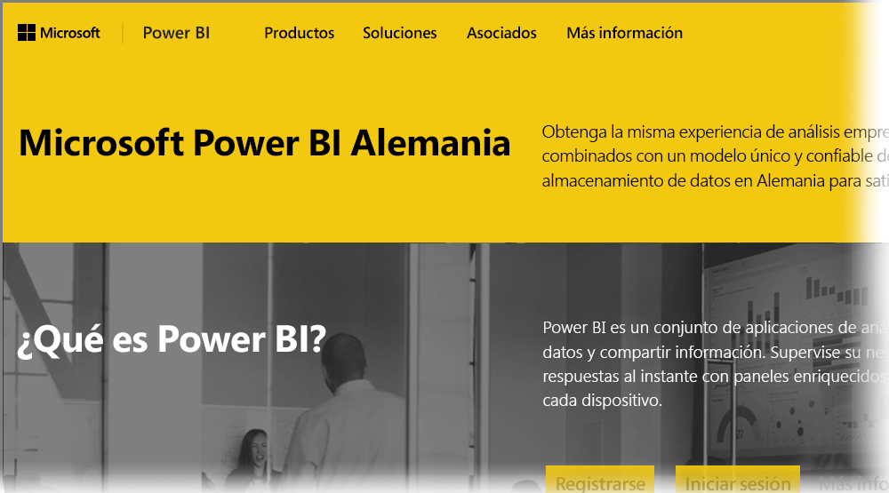

# Preguntas más frecuentes sobre Power BI para clientes en la nube de Alemania
El **servicio Power BI** tiene una versión disponible para los clientes de la Unión Europea o pertenecientes al Acuerdo Europeo de Libre Comercio (UE/AELC) a la que a menudo se hace referencia como Microsoft Cloud Deutschland (MCD). La versión del **servicio Power BI** que se describe en este artículo está diseñada específicamente para clientes de la UE/AELC y es distinta de la versión comercial del **servicio Power BI** o de los servicios Power BI proporcionados a clientes gubernamentales.

Las siguientes preguntas y respuestas proporcionan información importante para el servicio Power BI Pro en Microsoft Cloud Deutschland (MCD), que es la nube de servicio Power BI proporcionada específicamente para los clientes de la UE/AELC.

1. **¿Qué es el servicio Power BI para la nube de Alemania?**
   
   El servicio Power BI para clientes de la UE/AELC, que también se conoce como Microsoft Cloud Deutschland (MCD), es una nube de la UE/AELC compatible con el servicio Power BI proporcionado desde los centros de datos alemanes. Todos los datos de clientes del servicio Power BI para la nube de la UE/AELC se almacenan en Alemania con T-Systems actuando como administrador alemán independiente de confianza de los datos y con acceso físico y lógico a los datos controlados por las leyes alemanas. El servicio Power BI para la nube de la UE/AELC requiere una cuenta distinta e independiente de la versión comercial del servicio Power BI. Más información acerca de Microsoft Cloud Deutschland [aquí](https://www.microsoft.com/trustcenter/cloudservices/nationalcloud).
2. **¿Donde se puede encontrar información sobre precios y cómo suscribirse a la nube de Alemania de Power BI?**
   
   Puede encontrar una gran cantidad de información en la [página principal de la nube de Alemania de Power BI](https://powerbi.microsoft.com/power-bi-germany/), incluida la información sobre precios. En esa página también encontrará un vínculo para suscribirse a una versión de prueba de 30 días del **servicio Power BI Pro** con 25 licencias de usuario. Como parte de esta suscripción a la versión de prueba, tiene la posibilidad de adquirir o agregar licencias adicionales según sea necesario. También ofrecemos contrato Enterprise (EA) y precios para organismos gubernamentales o asociaciones sin ánimo de lucro. Para más información, póngase en contacto con el representante del cliente de Microsoft.
3. **Dispongo de un inquilino en la nube de Alemania como parte de las suscripciones de Azure Alemania y Office 365 Germany. ¿Puedo usar el inquilino existente para suscribirme a Power BI Alemania?**
   
   Sí. Como parte del proceso de suscripción, tendrá la posibilidad de iniciar sesión con una cuenta existente de administrador de inquilino en la nube de Alemania y de agregar licencias del servicio Power BI Pro a este inquilino. Tenga en cuenta que los inquilinos y las cuentas de usuario en la nube de Alemania son diferentes del servicio Power BI para la nube de Alemania.
4. **¿Hay algún servicio gratis en el servicio Power BI para la nube de Alemania?**
   
   No. No ofrecemos versiones de licencia gratis en el servicio Power BI para la nube de Alemania. Sin embargo, le animamos a que se suscriba a la [oferta de Power BI gratis en la nube pública](https://powerbi.microsoft.com/get-started/) si con esta se satisfacen sus necesidades empresariales.
5. **¿Puedo usar Power BI Desktop, Power BI Mobile, la puerta de enlace de datos local y Publisher para Excel con el servicio Power BI para la nube de Alemania?**
   
   Sí. Hemos actualizado nuestros productos para clientes de Power BI para que funcionen sin problemas con el servicio Power BI para la nube de Alemania. Inicie sesión con su cuenta del servicio Power BI para la nube de Alemania para empezar a usar los productos para clientes. Puede descargar la versión más reciente de los productos para clientes desde las ubicaciones siguientes:
   
   * [Power BI Desktop](https://powerbi.microsoft.com/desktop/)
   * [Power BI Mobile](https://powerbi.microsoft.com/mobile/)
   * [On-premises Data Gateway (Puerta de enlace de datos local)](https://powerbi.microsoft.com/gateway/)
   * [Power BI Publisher para Excel](https://powerbi.microsoft.com/excel-dashboard-publisher/)
6. **¿Existe alguna limitación de características en el servicio Power BI para la nube de Alemania?**
   
   Las siguientes características de servicio no están disponibles actualmente en el servicio Power BI para la nube de Alemania:
   
   * Publicar en web
   * Mapas de ArcGIS de Esri
   * Power BI Embedded (la concesión de licencias ISV de uso medido se ofrecerá a través de [Microsoft Azure Alemania](https://azure.microsoft.com/overview/clouds/germany/) en el futuro)
7. **¿Dónde puedo encontrar información de configuración específica del servicio Power BI para la nube de Alemania para su uso e integración en mis aplicaciones?**
   
   Hemos actualizado nuestros [ejemplos para desarrolladores de SaaS Embedding](https://github.com/Microsoft/PowerBI-Developer-Samples) con información de configuración específica para la nube de Alemania y otras nubes de Power BI. Mire la carpeta **Configuraciones de nube** para ver ejemplos de puntos de conexión de configuración específica de nube. En la tabla siguiente se enumeran varios puntos de conexión de configuración del servicio Power BI para la nube de Alemania (y para la nube pública como referencia cruzada).

| **Nombre del punto de conexión y uso** | **Dirección URL del servicio Power BI para la nube de Alemania?** | **Dirección URL equivalente en la nube pública (para referencias cruzadas)** |
| --- | --- | --- |
| Página principal, registro e inicio de sesión |[https://powerbi.microsoft.com/power-bi-germany/](https://powerbi.microsoft.com/power-bi-germany/) |[https://powerbi.microsoft.com/](https://powerbi.microsoft.com/) |
| Inicio de sesión directo en el servicio Power BI |[https://app.powerbi.de/?noSignUpCheck=1](https://app.powerbi.de/?noSignUpCheck=1) |[https://app.powerbi.com/?noSignUpCheck=1](https://app.powerbi.com/?noSignUpCheck=1) |
| API de servicio |[https://api.powerbi.de/](https://api.powerbi.de/) |[https://api.powerbi.com/](https://api.powerbi.com/) |
| Portal de Office para la administración de licencias de usuario, estado de mantenimiento del servicio y solicitudes de soporte técnico por parte de administradores |[https://portal.office.de/](https://portal.office.de/) |[https://portal.office.com/](https://portal.office.com/) |
| URI de autoridad de AAD |[https://login.microsoftonline.de/common/oauth2/authorize/](https://login.microsoftonline.de/common/oauth2/authorize/) |[https://login.microsoftonline.com/common/oauth2/authorize/](https://login.microsoftonline.com/common/oauth2/authorize/) |
| URI de recurso del servicio Power BI |[https://analysis.cloudapi.de/powerbi/api](https://analysis.cloudapi.de/powerbi/api) |[https://analysis.windows.net/powerbi/api](https://analysis.windows.net/powerbi/api) |
| Biblioteca de objetos visuales personalizados |[https://app.powerbi.de/visuals/](https://app.powerbi.de/visuals/) |[https://app.powerbi.com/visuals/](https://app.powerbi.com/visuals/) |
| Registrar una aplicación para Power BI (para Embedded) |[https://app.powerbi.de/apps](https://app.powerbi.de/apps) |[https://app.powerbi.com/apps](https://app.powerbi.com/apps) |
| Azure Portal (para Embedded) |[https://portal.microsoftazure.de/](https://portal.microsoftazure.de/) |[https://portal.azure.com/](https://portal.azure.com/) |
| Comunidad |[https://community.powerbi.com/](https://community.powerbi.com/) |[https://community.powerbi.com/](https://community.powerbi.com/) |

### Pasos siguientes
Se puede hacer todo tipo de cosas con Power BI. Para obtener más información, incluido un artículo en el que se muestra cómo registrarse en el servicio, consulte los recursos siguientes:

* [Aprendizaje guiado de Power BI](guided-learning/gettingstarted.yml#step-1)
* [Introducción al servicio Power BI](service-get-started.md)
* [Introducción a Power BI Desktop](desktop-getting-started.md)

