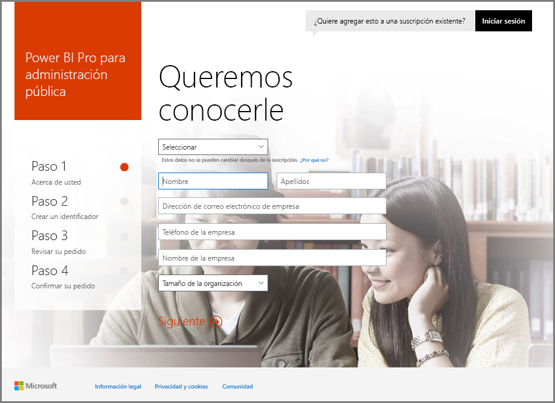
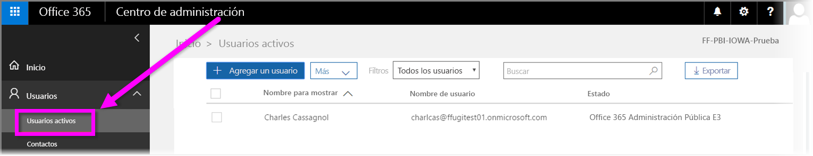

# Inscribir una organización de la Administración Pública de Estados Unidos en el servicio Power BI
El **servicio Power BI** tiene una versión disponible para clientes de la Administración Pública de Estados Unidos como parte de las suscripciones **Office 365 US Government Community**. La versión del **servicio Power BI** que se describe en este artículo está diseñada específicamente para clientes de la Administración Pública de Estados Unidos y es independiente de la versión comercial del **servicio Power BI**.

Para obtener más información sobre el **servicio Power BI** para la Administración Pública de Estados Unidos, incluidas sus características y limitaciones, consulte [Introducción a Power BI para clientes de la Administración Pública de Estados Unidos](service-govus-overview.md).

> [!NOTE]
> Este artículo está destinado a los administradores que tienen autoridad para registrar en Power BI su organización de la Administración Pública de Estados Unidos. Si es un usuario final, póngase en contacto con el administrador para obtener información sobre cómo obtener una suscripción a Power BI para la Administración Pública de Estados Unidos.
> 
> 

## Seleccionar el proceso de registro correcto para la organización de la Administración Pública de Estados Unidos
Su organización de la Administración Pública de Estados Unidos podría ser un cliente nuevo de la **nube de administración pública de Office** o tener ya una suscripción. En las secciones siguientes se detallan los pasos de inicio de sesión según su relación con la nube de administración pública de Office y Power BI. Estos pasos son diferentes en función de la suscripción existente.

Una vez que se ha registrado en Power BI US Government es posible que algunas características no funcionen hasta que un representante de ventas o de soporte técnico complete el proceso de incorporación. Para más información acerca de estas características, consulte [Introducción a Power BI para clientes de la Administración Pública de Estados Unidos](service-govus-overview.md). Para completar el proceso de incorporación para habilitar estas características, póngase en contacto con su representante de ventas o de soporte técnico.

### Organizaciones de la Administración Pública de Estados Unidos que son clientes nuevos de la nube de Office
Si su organización es un cliente nuevo de la **nube de administración pública de Office**, siga estos pasos:

> [!NOTE]
> Estos pasos debe realizarlos el administrador del portal.
> 
> 

1. Vaya a [https://products.office.com/en-us/government/office-365-web-services-for-government](https://products.office.com/en-us/government/office-365-web-services-for-government). 
    >[!NOTE]
    >Si no desea suscribirse a la nube de administración pública de Office en este momento, póngase en contacto con su representante de ventas.
2. Seleccione Office G3 y rellene el formulario para una prueba de Office.
3. Una vez que haya un cliente en la nube de Office continúe con los pasos siguientes para "Clientes existentes de la nube de administración pública de Office"

### Clientes existentes de la nube de administración pública de Office
Si su organización ya es cliente de la **nube de administración pública de Office**, pero no dispone de una suscripción a **Power BI** (gratuita o no), siga estos pasos:

> [!NOTE]
> Estos pasos debe realizarlos el administrador del portal.
> 
> 

1. Inicie sesión en su cuenta de la nube de administración pública de Office existente y vaya al portal de administración
2. Seleccione **Facturación**.
3. Seleccione **Comprar servicio**.
4. Seleccione la opción de Administración pública de Power BI Pro y elija entre **Probar** y **Comprar ahora**.
5. Complete el pedido.
6. Asigne usuarios a la cuenta.
   
   
7. Inicie sesión en el **servicio Power BI** para clientes de la Administración Pública de Estados Unidos en [https://app.powerbigov.us](https://app.powerbigov.us).

## Información de suscripción adicional
La siguiente es información adicional para la suscripción al servicio **Power BI para la Administración pública de Estados Unidos** en varios casos de migración de licencias.

### Incorporación de clientes con una versión de evaluación directa de Power BI a la versión Pro
* Haga clic en Facturación > Comprar servicio > Power BI Pro Gov y seleccione Comprar, no Probar
* Especifique la información necesaria y obtenga las licencias
* Quite la versión de Prueba de Power BI Pro o las licencias antiguas y asigne las nuevas a los usuarios
* Inicie sesión en [https://app.powerbigov.us](https://app.powerbigov.us)

### Incorporación de clientes con una versión de evaluación de distribuidor de Power BI a la versión Pro
Vaya a **Facturación > Suscripciones** y seleccione la suscripción **Power BI Pro para la Administración pública**. Allí verá:

* Disponible
* Asignado
* Vínculos para asignar a los usuarios
* Si sigue teniendo asignada la versión de evaluación:
  * Haga clic en **Asignado** en la suscripción de evaluación y quite los usuarios que desea agregar a la versión de pago.
  * Vaya a la suscripción de pago y asigne los usuarios.

### Instrucciones para la inclusión en la lista de permitidos
*La inclusión en la lista de permitidos* es un proceso que utiliza el equipo de ingenieros de Power BI para mover a los clientes del entorno de la nube comercial al entorno seguro de la nube de la Administración pública. Esto garantiza que las características disponibles en la nube de la Administración pública de Estados Unidos funcionarán según lo previsto. Todos los clientes del Gobierno de Estados Unidos (nuevos o existentes) que compran servicios de **Power BI** para la Administración pública de Estados Unidos por primera vez *deben* iniciar el proceso de creación de listas de permitidos siguiente. El proceso debe realizarse antes de la configuración o migración a **Power BI** para la Administración pública de Estados Unidos. 

Para que el inquilino esté *incluido en la lista de permitidos* de la nube de la Administración pública de Estados Unidos, rellene una incidencia de soporte técnico para realizar la solicitud en el vínculo siguiente. Tenga en cuenta que solo los administradores pueden realizar esta solicitud:

* [*Inclusión en la lista de permitidos*  de solicitudes de soporte técnico en línea](https://powerbi.microsoft.com/clouds/)
* Asegúrese de incluir el dominio que se vaya a *incluir en la lista de permitidos* y el correo electrónico del representante de Microsoft que esté trabajando con usted en el proceso.

El proceso de *inclusión en la listas de permitidos* tarda aproximadamente tres semanas, durante las cuales el equipo de ingeniería de Power BI realiza los cambios adecuados para asegurarse de que el inquilino funcione correctamente en la nube de la Administración Pública de Estados Unidos.

Los clientes que migran desde licencias **Gratis** de Power BI a **Power BI para la Administración Pública de Estados Unidos** (y, por definición, migran a las características de la licencia **Pro** asociada descritas anteriormente en este artículo) se encontrarán con los problemas descritos en la siguiente sección de este artículo, hasta que su inquilino *esté incluido en la lista de permitidos* por el equipo de ingeniería de Power BI.

### Licencias mixtas Gratis y Pro de los inquilinos de la Administración Pública de Estados Unidos
Si tiene ambas licencias, Gratis y Pro de la Administración Pública de Estados Unidos en su inquilino, ambas licencias continuarán presentes, pero una o la otra no funcionará correctamente. Si el inquilino realiza correctamente el proceso de *inclusión en la lista de permitidos*, ocurre lo siguiente:

* Los usuarios de la licencia Gratis ya no podrán iniciar sesión en Power BI con **Power BI Desktop** y experimentarán las lagunas de funcionalidad que se describen en la sección siguiente.
* Todos los clientes asignados a licencias Pro de la Administración Pública de Estados Unidos funcionarán según lo esperado, incluido el uso de puertas de enlace, Power BI Desktop y aplicaciones móviles.

Al utilizar una combinación de licencias Gratis y Pro en un inquilino de la Administración Pública de Estados Unidos y al pasar por el proceso de *inclusión en listas de permitidos*, se puede esperar lo siguiente:

**Antes de la *inclusión en la lista de permitidos***:

* Los usuarios con licencias Gratis se ejecutan en una nube comercial.
* Las licencias Pro para la Administración Pública de Estados Unidos se muestran en el portal y el administrador puede asignarlas a los usuarios. Los usuarios Pro para la Administración Pública de Estados Unidos no perderán los datos de sus licencias Gratis, cuando el administrador les asigna una licencia Pro de la Administración Pública de Estados Unidos. Los usuarios asignados acceden a las características de Power BI Pro para clientes de la Administración Pública de Estados Unidos, pero las siguientes lagunas de funcionalidad de la lista de viñetas siguiente existirán hasta que el inquilino esté correctamente *incluido en la lista de permitidos*:
  
  * Las ediciones Gateway, Mobile y Power BI Desktop no pueden autenticarse.
  * No se puede acceder a orígenes de datos comerciales de Azure.
  * Los archivos PBIX se deben cargar manualmente desde el servicio Power BI comercial.
  * Las aplicaciones móviles de Power BI no están disponibles.

**Después de su *inclusión en la lista de permitidos***:

* Los usuarios de la versión Gratis que ejecutan el servicio Power BI comercial pueden seguir haciéndolo, pero dejarán de autenticarse según lo previsto.
* Los usuarios Pro que ejecutan en la nube de la Administración Pública de Estados Unidos pueden usar el servicio **Power BI para clientes de la Administración Pública de Estados Unidos** como se esperaba.

Para identificar a los usuarios que ejecutan la licencia Gratis de Power BI en su inquilino, los administradores ejecutan el informe de licencias, después de lo cual los usuarios con licencia Gratis aparecerán como **Power BI estándar**.

## Pasos siguientes
Se puede hacer todo tipo de cosas con Power BI. Para obtener más información, incluido un artículo en el que se muestra cómo registrarse en el servicio, consulte los recursos siguientes:

* [Introducción a Power BI para la Administración Pública de Estados Unidos](service-govus-overview.md)
* [Aprendizaje guiado de Power BI](guided-learning/gettingstarted.yml#step-1)
* [Introducción al servicio Power BI](service-get-started.md)
* [Introducción a Power BI Desktop](desktop-getting-started.md)

