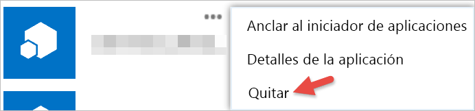

# Introducción a las aplicaciones de terceros
Con Power BI, puede usar una aplicación compilada por una empresa o por un individuo que no estén relacionados con Microsoft. Por ejemplo, podría usar una aplicación de terceros que integre los iconos de Power BI en una aplicación web compilada personalizada. Si usa una aplicación de terceros, se le pedirá que conceda a esa aplicación determinados permisos para la cuenta de Power BI y sus recursos. Es importante que solo conceda permisos a las aplicaciones de confianza. Los permisos de una aplicación pueden revocarse en cualquier momento. Consulte [Revocar permisos de una aplicación de terceros](#revoke).

Estos son los tipos de acceso que una aplicación puede solicitar.

## Permisos de aplicación de Power BI
* **Ver todos los paneles**
  
  * Este permiso permite a la aplicación ver todos los paneles a los que tiene acceso el usuario. Esto incluye los paneles de su propiedad, los que ha recibido en paquetes de contenido, los que se han compartido con usted y los que se encuentran en grupos a los que pertenece. La aplicación no puede modificar el panel. Entre otras cosas, una aplicación puede usar este permiso para insertar el contenido del panel en sus experiencias.
* **Ver todos los informes**
  
  * Este permiso permite a la aplicación ver todos los informes a los que tiene acceso el usuario. Esto incluye los informes de su propiedad, los que ha recibido en paquetes de contenido y los que se encuentran en grupos a los que pertenece. Dado que puede ver el informe, la aplicación también puede ver los datos que contiene. La aplicación no puede modificar los informes. Entre otras cosas, una aplicación puede usar este permiso para insertar el contenido del informe en sus experiencias.
* **Ver todos los conjuntos de datos**
  
  * Este permiso permite a la aplicación enumerar todos los conjuntos de datos a los que el usuario tiene acceso. Esto incluye los conjuntos de datos de su propiedad, los que ha recibido en paquetes de contenido y los que se encuentran en grupos a los que pertenece. Una aplicación puede ver los nombres de todos los conjuntos de datos, así como su estructura, incluidos los nombres de tabla y columna. Este permiso otorga derechos para leer los datos de un conjunto de datos. El permiso no permite a la aplicación agregar ni modificar un conjunto de datos.
* **Leer y escribir todos los conjuntos de datos**
  
  * Este permiso permite a la aplicación enumerar todos los conjuntos de datos a los que el usuario tiene acceso. Esto incluye los conjuntos de datos de su propiedad, los que ha recibido en paquetes de contenido y los que se encuentran en grupos a los que pertenece. Una aplicación puede ver los nombres de todos los conjuntos de datos, así como su estructura, incluidos los nombres de tabla y columna. Este permiso otorga derechos para leer y escribir datos de un conjunto de datos. La aplicación también puede crear un nuevo conjunto de datos o modificar los existentes. Una aplicación suele usar esta función para enviar datos directamente a Power BI.
* **Ver grupos de usuarios**
  
  * Este permiso permite a la aplicación enumerar todos los grupos de los que es miembro. Puede usar este permiso, junto con otros permisos descritos, para ver o actualizar el contenido de ese grupo en particular. La aplicación no puede modificar el grupo.

<a name="revoke"/>

## Revocar permisos de una aplicación de terceros
Puede revocar los permisos de una aplicación de terceros en el sitio web Mis aplicaciones de Office 365.

En el sitio web **Mis aplicaciones de Office 365** , aquí se muestra cómo revocar los permisos de terceros:

1. Vaya al sitio web [Mis aplicaciones de Office 365](https://portal.office.com/myapps).
2. En la página **Mis aplicaciones** , busque la aplicación de terceros.
3. Mantenga el mouse sobre el icono de la aplicación, haga clic en el botón **(...)** y luego en **Quitar**.
   
   

