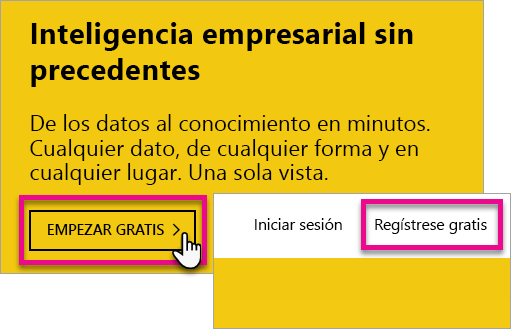
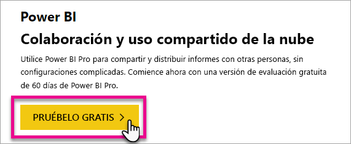
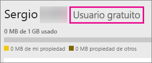
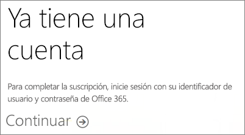

# Registro en Power BI como usuario individual
Obtenga información acerca de cómo registrarse en Power BI y empezar a usarlo para sus necesidades de informes y visualización.

Power BI puede convertirse en su herramienta personal de creación de informes y visualización, así como actuar como el motor de análisis y de decisión que impulsa proyectos en grupo, divisiones o empresas enteras.

Este artículo le guiará a través de las opciones sobre cómo registrarse y empezar a usar el servicio Power BI. Para obtener información sobre las diferencias entre Power BI gratuito y Pro, consulte esta [comparación entre las versiones gratis y Pro de Power BI](service-free-vs-pro.md).

## Tiene algunas opciones.
Como usuario individual tiene varias opciones para registrarse y comenzar a usar Power BI. Puede elegir registrarse gratis o bien puede comprar una suscripción de Power BI Pro. Si se registra para una cuenta gratuita, cuando esté activo en el servicio, puede optar a una evaluación gratuita de 60 días de Power BI Pro.

Si forma parte de una organización existente, que usa Office 365, todavía puede registrarse para una cuenta gratuita. El administrador de TI también dispone de algunas opciones para adquirir Power BI Pro y asignar licencias. Para más información acerca de las opciones que están disponibles como un administrador de TI, consulte [Adquisición de Power BI Pro](service-admin-purchasing-power-bi-pro.md).

> [!NOTE]
> Si trabaja en una organización, puede que el registro individual esté deshabilitado. Consulte [Se desactivó el registro individual](#individual-sign-up-has-been-turned-off) para obtener más información si obtiene un error que indica que se ha desactivado.
> 
> 

## Lo que necesita para registrarse
Para registrarse en Power BI, necesita un correo electrónico del trabajo. El correo electrónico personal no funcionará con el servicio Power BI.

<a name="what-email-address-can-be-used-with-power-bi"/>

### ¿Qué dirección de correo electrónico se puede usar con Power BI?
Power BI requiere el uso de una dirección de correo electrónico profesional o educativa para registrarse. Power BI no admite direcciones de correo electrónico de proveedores de telecomunicaciones o de servicios de correo electrónico de consumidor. Esto incluye outlook.com, hotmail.com o gmail.com, entre otras.

Si intenta registrarse con una dirección de correo electrónico personal, obtendrá un mensaje que indica que use una dirección de correo electrónico profesional o educativa.

> [!NOTE]
> Power BI no admite el registro de autoservicio de direcciones .gov o .mil en este momento. Póngase en contacto con el administrador de Office 365.
> 
> 

## ¿Qué necesito?
Para determinar lo que necesita, consulte lo que se incluye en cada tipo de licencia. Los usuarios con registro gratis disfrutan de la mayoría de las funciones de los servicios, a excepción de las características de colaboración y uso compartido. Los usuarios de Power BI Pro pueden hacer uso de todas las características del servicio, pero no es gratis. Si no necesita compartir el contenido, la opción Gratis puede ser la más adecuada. Puede obtener más información en la [página de precios de Power BI](https://powerbi.microsoft.com//pricing/).

En el resto de este artículo se describe cómo registrarse en cada opción.

## Registro en Power BI (gratis) como usuario individual
La forma más rápida de registrarse en Power BI es registrar una cuenta de Power BI (gratis). Esta cuenta no conlleva ningún costo y permite usar muchas de las características disponibles en el servicio.

> [!NOTE]
> Si recibe un mensaje que indica que ya está registrado, pruebe a acceder a https://app.powerbi.com e iniciar sesión.
> 
> 

Para registrarse en Power BI, puede hacer lo siguiente.

1. Vaya a [powerbi.com](https://powerbi.microsoft.com).
2. Seleccione **Comenzar gratis** o **Regístrese gratis**.
   
    
3. En la página de introducción, seleccione **Probar gratis >** en Power BI.
   
    
4. Escriba la dirección de correo electrónico con la que va a registrarse y, a continuación, seleccione **Registrarse**. Asegúrese de que su dirección de correo electrónico es válida para el registro. Para más información sobre la dirección de correo electrónico que puede usar, consulte [¿Qué dirección de correo electrónico se puede usar con Power BI?](#what-email-address-can-be-used-with-power-bi).
   
    
5. Obtendrá un mensaje indicándole que revise su correo electrónico.
   
    
6. Seleccione el vínculo en el mismo para verificar su dirección de correo electrónico. Esto le devolverá al flujo de registro. Quizás deba proporcionar información adicional sobre sí mismo.
7. Después, se le conducirá a https://app.powerbi.com y podrá empezar a usar Power BI gratis.

### Aspecto dentro del servicio
Cuando esté en el servicio, puede comprobar que tiene una cuenta gratuita; para ello, vaya al icono de **engranaje** y seleccione **Administrar almacenamiento personal**.

### ¿Qué ocurre si ya formo parte de una organización existente?
Si la cuenta forma parte de una organización existente, verá un mensaje que le pide que inicie sesión con esa cuenta. Seleccione **Continuar** e inicie sesión con su inicio de sesión de Office 365.

A continuación, verá un mensaje en el que se le pide que seleccione **Iniciar**.

## Prueba de 60 días de Power BI Pro en servicio
Después de registrarse para obtener una cuenta gratuita, también tiene la opción de probar Power BI Pro gratis durante 60 días. Tendrá acceso a todas las características de Power BI Pro durante el tiempo de la prueba. Power BI Pro incluye todas las características de la versión gratuita de Power BI y características adicionales de uso compartido y colaboración. Para más información, consulte los [precios de Power BI](https://powerbi.microsoft.com/pricing). Para probar una versión de prueba gratuita de 60 días de Power BI Pro, regístrese en Power BI y pruebe una de estas características de Power BI Pro:

* [Crear un área de trabajo de aplicación](service-create-distribute-apps.md)
* [Compartir un panel](service-share-dashboards.md)

Cuando pruebe cualquiera de estas características, se le pedirá que inicie su prueba gratuita. Para usarla, también puede ir al icono de engranaje y seleccionar **Administrar almacenamiento personal**. A continuación, seleccione **Probar Power BI Pro gratis** a la derecha.

Después, puede seleccionar **Iniciar período de prueba**.

>[!NOTE]
>Los usuarios que usen esta versión de evaluación del producto Power BI Pro no aparecen en el portal de administración de Office 365 como usuarios de  prueba de Power BI Pro (aparecen como usuarios gratuitos de Power BI). Sin embargo, aparecerán como usuarios de prueba de Power BI Pro en la página **Administrar almacenamiento** de Power BI.

>[!NOTE]
>Si es un administrador de TI y desea adquirir e implementar licencias de prueba de Power BI para varios usuarios de su organización sin que cada usuario tenga que aceptar los términos de la versión de prueba, puede registrarse para obtener una [suscripción de prueba a Power BI Pro](https://portal.office.com/Signup/MainSignup15.aspx?OfferId=d59682f3-3e3b-4686-9c00-7c7c1c736085&dl=POWER_BI_PRO). Deberá ser un administrador de facturación o de Office 365 Global, o bien deberá crear un nuevo inquilino para registrarse y obtener una versión de prueba para administradores. Consulte [Adquisición de Power BI Pro](service-admin-purchasing-power-bi-pro.md) para más información.
> 
> [!NOTE]
> Con la disponibilidad de Power BI Premium y los cambios en la oferta gratuita de Power BI del 1 de junio de 2017, podría optar a una prueba extendida de Power BI Pro. Para más información, consulte [Extended Pro Trial activation](service-extended-pro-trial.md) (Activación de la extensión del período de prueba de Power BI Pro).
> 
> 

### Aspecto dentro del servicio
Cuando esté en el servicio, puede comprobar que tiene una cuenta de prueba de Power BI Pro; para ello, vaya al icono de **engranaje* y seleccione **Administrar almacenamiento personal**.

## ¿Qué ocurre si quiero la versión completa de Power BI Pro?
No se puede obtener la licencia de Power BI Pro como usuario individual. Debe hablar con el administrador de TI para adquirir y asignar la licencia a su cuenta. Consulte [Adquisición de Power BI Pro](service-admin-purchasing-power-bi-pro.md) para más información.

## Solución de problemas
En muchos casos, el registro en Power BI se realiza mediante el sencillo proceso de registro de autoservicio. Sin embargo, hay varios motivos por los que es posible que no pueda completar la suscripción sin intervención del administrador.  En la tabla siguiente se resumen algunas de las razones más comunes por las que no puede completar la suscripción y las formas en que puede solucionar estos problemas.

| **Síntoma o mensaje de error** | **Causa y solución alternativa** |
| --- | --- |
| **Direcciones de correo electrónico (por ejemplo, nancy@gmail.com)** Recibirá un mensaje similar al siguiente durante la suscripción:    *Escribió una dirección de correo electrónico personal: escriba su dirección de correo electrónico del trabajo para que podamos almacenar con seguridad los datos de su compañía.*    o bien    *Escribió una dirección de correo electrónico personal. Escriba la dirección de trabajo para que podamos conectarle con otras personas de su empresa. Y no se preocupe. No compartiremos su dirección con nadie.* |Power BI no admite direcciones de correo electrónico de proveedores de telecomunicaciones o servicios de correo electrónico de consumidor.    Para completar la suscripción, inténtelo de nuevo usando una dirección de correo electrónico asignada, profesional o educativa.    Si todavía no puede suscribirse pero puede completar un proceso de instalación más avanzado, [regístrese para obtener una nueva suscripción de prueba de Office 365 y use ese correo electrónico para suscribirse](service-admin-signing-up-for-power-bi-with-a-new-office-365-trial.md). |
| **Suscripción de autoservicio deshabilitada** Recibirá un mensaje similar al siguiente durante la suscripción:    *No podemos completar la suscripción. El departamento de TI desactivó la suscripción de Microsoft Power BI. Póngase en contacto con ellos para completar la suscripción.*    o bien    *Escribió una dirección de correo electrónico personal. Escriba la dirección de trabajo para que podamos conectarle con otras personas de su empresa. Y no se preocupe. No compartiremos su dirección con nadie.* |El administrador de TI de su organización ha deshabilitado la suscripción de autoservicio para Power BI.    Para completar la suscripción, póngase en contacto con el Administrador de TI y pídale que siga las instrucciones en la página siguiente para permitir que los usuarios existentes se suscriban a Power BI y para permitir que los nuevos usuarios se unan a su inquilino existente.    También puede experimentar este problema si se suscribió a Office 365 a través de un asociado. [Más información](service-admin-syndication-partner.md)    [Power BI en su organización](https://support.office.com/en-ca/article/Power-BI-in-your-Organization-d7941332-8aec-4e5e-87e8-92073ce73dc5#BKMK_HowCanIAllowO365Tenant) |
| **La dirección de correo electrónico no es un identificador de Office 365** Recibirá un mensaje similar al siguiente durante la suscripción:    *No lo hemos encontrado en contoso.com.  ¿Usa un identificador diferente en el trabajo o en el colegio?    Pruebe a iniciar sesión con el identificador y, si no funciona, póngase en contacto con el departamento de TI.* |Su organización usa identificadores para iniciar sesión en Office 365 y otros servicios de Microsoft que son diferentes de su dirección de correo electrónico.  Por ejemplo, su dirección de correo electrónico podría ser Nancy.Smith@contoso.com pero el identificador es nancys@contoso.com.    Para completar la suscripción, use el identificador que la organización le ha asignado para iniciar sesión en Office 365 o en otros servicios de Microsoft.  Si no sabe cuál es, póngase en contacto con el administrador de TI.    Si todavía no puede suscribirse pero puede completar un proceso de instalación más avanzado, [regístrese para obtener una nueva suscripción de prueba de Office 365 y use esa dirección de correo electrónico para suscribirse](service-admin-signing-up-for-power-bi-with-a-new-office-365-trial.md). |

## Pasos siguientes
[Power BI (gratis) en su organización](service-admin-service-free-in-your-organization.md)  
[Adquisición de Power BI Pro](service-admin-purchasing-power-bi-pro.md)  
[Acuerdo de servicio de Power BI para usuarios individuales](https://powerbi.microsoft.com/terms-of-service/)  
[¿Qué es Power BI Premium?](service-premium.md)  
[Notas del producto de Power BI Premium](https://aka.ms/pbipremiumwhitepaper)  

¿Tiene más preguntas? [Pruebe a preguntar a la comunidad de Power BI](http://community.powerbi.com/)

